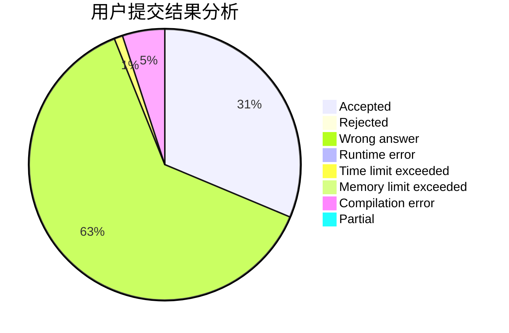
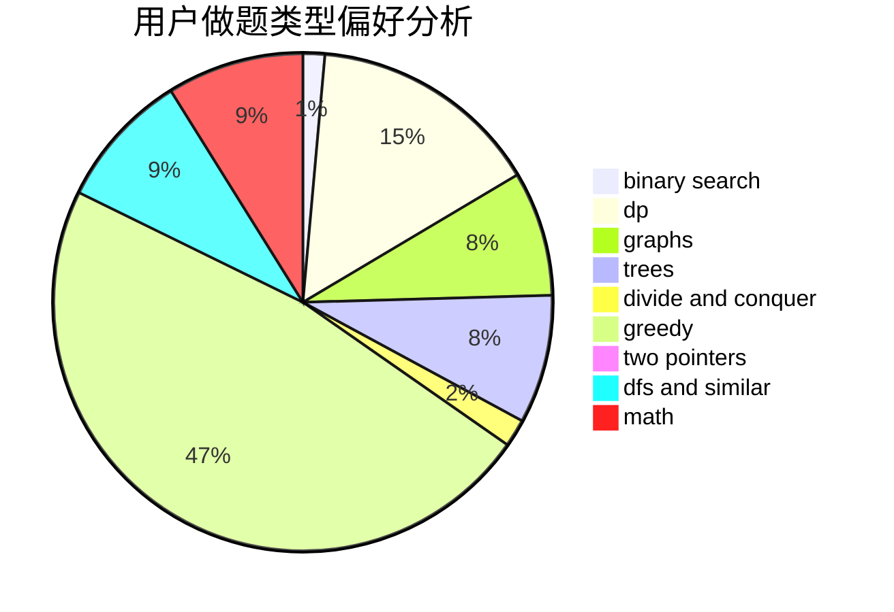

# LIKE0314

<!-- tabs:start -->

#### **用户提交结果分析**

#### **用户做题类型偏好分析**

<!-- tabs:end -->
# 推荐题目
[1349A](https://codeforces.com/contest/1349/problem/A)
[733A](https://codeforces.com/contest/733/problem/A)
[858A](https://codeforces.com/contest/858/problem/A)
[780C](https://codeforces.com/contest/780/problem/C)
[1291B](https://codeforces.com/contest/1291/problem/B)
[218B](https://codeforces.com/contest/218/problem/B)
[68A](https://codeforces.com/contest/68/problem/A)
[300C](https://codeforces.com/contest/300/problem/C)
[13783](https://codeforces.com/contest/1378/problem/3)
[228D](https://codeforces.com/contest/228/problem/D)
