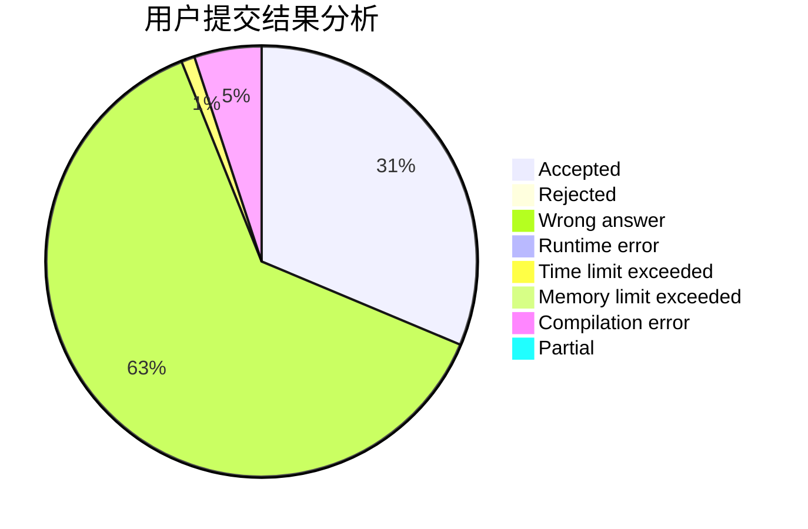
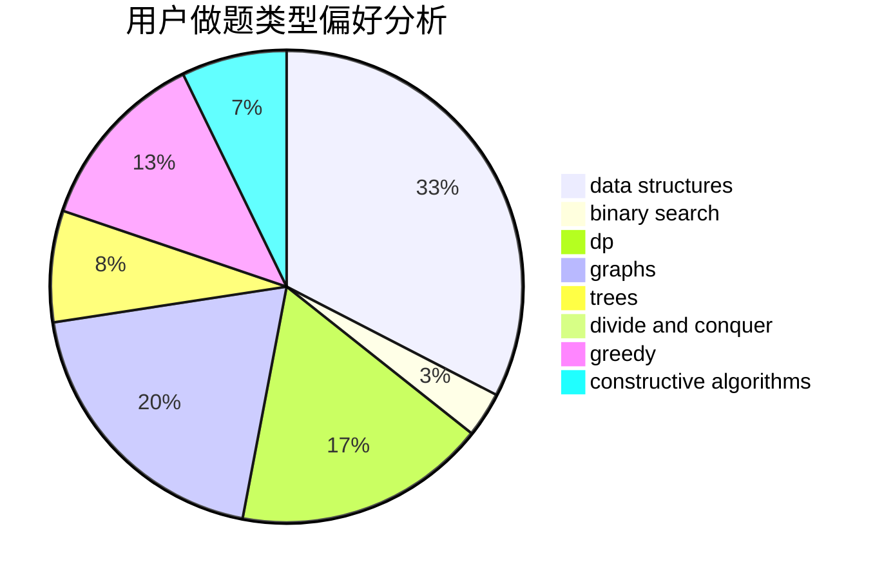

# LIKE0314

<!-- tabs:start -->

#### **用户提交结果分析**

#### **用户做题类型偏好分析**

#### **用户错题知识点分析**

<!-- tabs:end -->
# 推荐题目
[1342C](https://codeforces.com/contest/1342/problem/C)		math,
                        number theory		  
[714B](https://codeforces.com/contest/714/problem/B)		implementation,
                        sortings		  
[839A](https://codeforces.com/contest/839/problem/A)		implementation		  
[761E](https://codeforces.com/contest/761/problem/E)		constructive algorithms,
                        dfs and similar,
                        graphs,
                        greedy,
                        trees		  
[1284B](https://codeforces.com/contest/1284/problem/B)		binary search,
                        combinatorics,
                        data structures,
                        dp,
                        implementation,
                        sortings		  
[195B](https://codeforces.com/contest/195/problem/B)		data structures,
                        implementation,
                        math		  
[668A](https://codeforces.com/contest/668/problem/A)		dsu,graphs,sortings,trees		  
[286B](https://codeforces.com/contest/286/problem/B)		implementation		  
[1370A](https://codeforces.com/contest/1370/problem/A)		greedy,
                        implementation,
                        math,
                        number theory		  
[204D](https://codeforces.com/contest/204/problem/D)		dp		  
