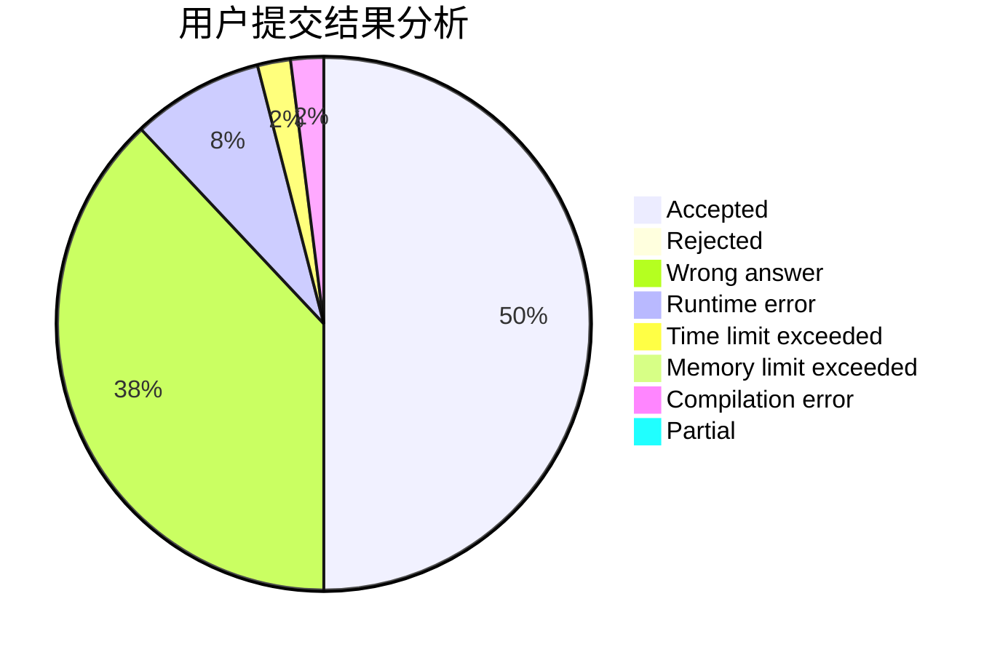
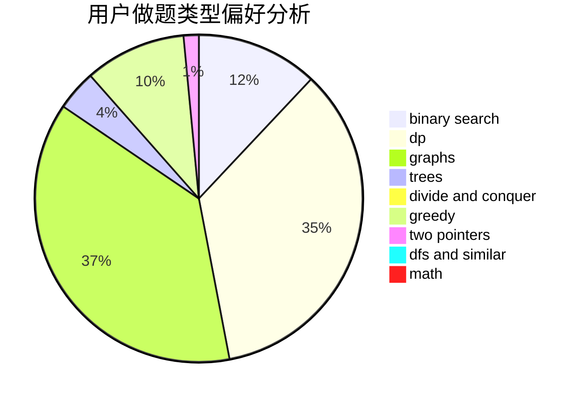

# LINGXIN12

<!-- tabs:start -->

#### **用户提交结果分析**

#### **用户做题类型偏好分析**

<!-- tabs:end -->
# 推荐题目
[227A](https://codeforces.com/contest/227/problem/A)
[1200B](https://codeforces.com/contest/1200/problem/B)
[962G](https://codeforces.com/contest/962/problem/G)
[152B](https://codeforces.com/contest/152/problem/B)
[702C](https://codeforces.com/contest/702/problem/C)
[864F](https://codeforces.com/contest/864/problem/F)
[1053E](https://codeforces.com/contest/1053/problem/E)
[883I](https://codeforces.com/contest/883/problem/I)
[1183F](https://codeforces.com/contest/1183/problem/F)
[827F](https://codeforces.com/contest/827/problem/F)
