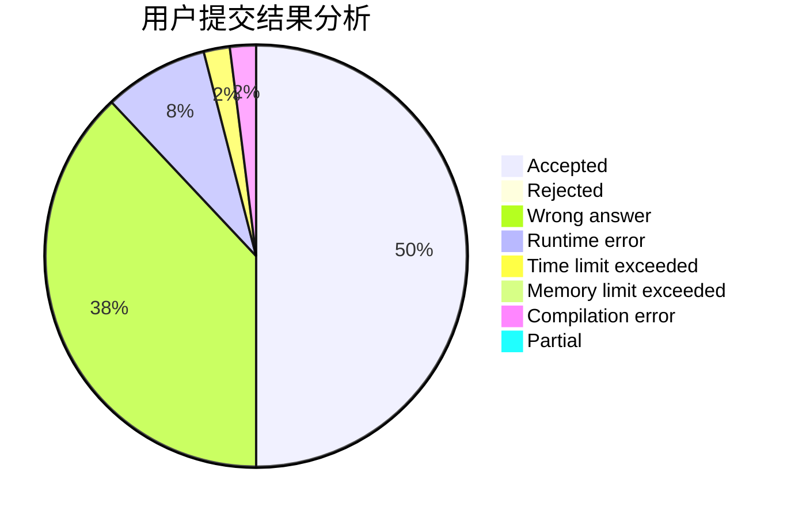
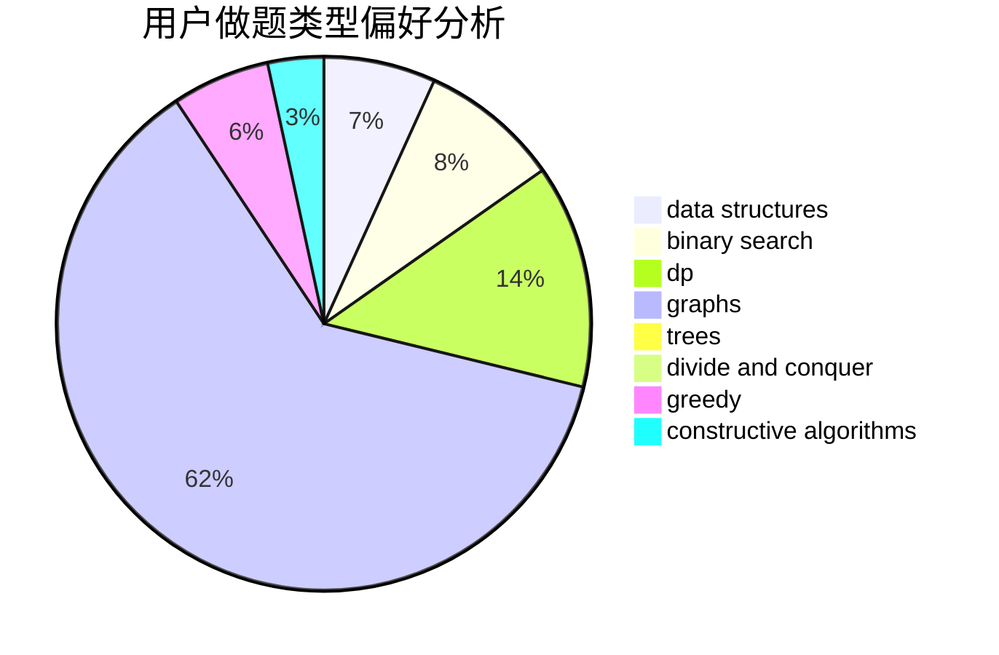

# LINGXIN12

<!-- tabs:start -->

#### **用户提交结果分析**

#### **用户做题类型偏好分析**

#### **用户错题知识点分析**

<!-- tabs:end -->
# 推荐题目
[227A](https://codeforces.com/contest/227/problem/A)		geometry		  
[1200B](https://codeforces.com/contest/1200/problem/B)		dp,
                        greedy		  
[962G](https://codeforces.com/contest/962/problem/G)		data structures,
                        dsu,
                        geometry,
                        trees		  
[152B](https://codeforces.com/contest/152/problem/B)		binary search,
                        implementation		  
[702C](https://codeforces.com/contest/702/problem/C)		binary search,
                        implementation,
                        two pointers		  
[864F](https://codeforces.com/contest/864/problem/F)		dfs and similar,
                        graphs,
                        trees		  
[1053E](https://codeforces.com/contest/1053/problem/E)		constructive algorithms,
                        trees		  
[883I](https://codeforces.com/contest/883/problem/I)		binary search,
                        dp		  
[1183F](https://codeforces.com/contest/1183/problem/F)		brute force,
                        math,
                        sortings		  
[827F](https://codeforces.com/contest/827/problem/F)		data structures,
                        dp,
                        graphs,
                        shortest paths		  
