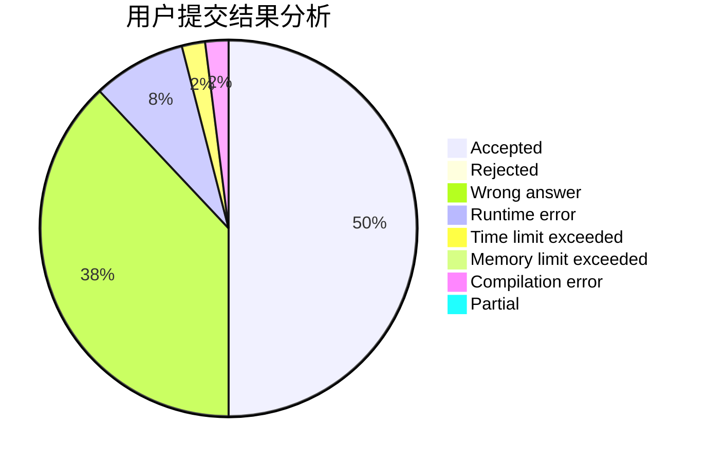
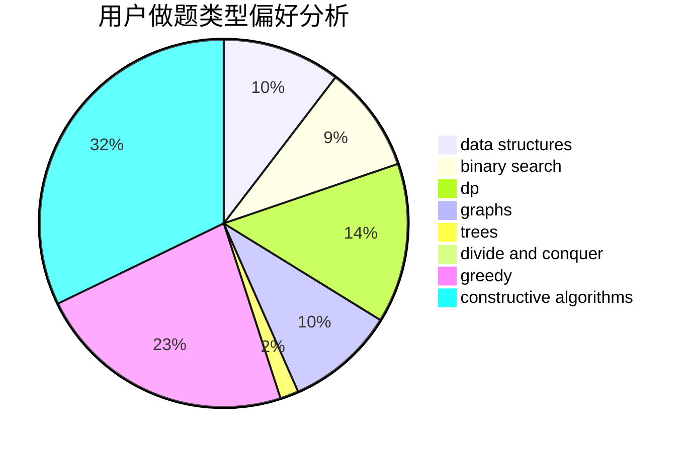

# LINGXIN12

<!-- tabs:start -->

#### **用户提交结果分析**

#### **用户做题类型偏好分析**

#### **用户错题知识点分析**

<!-- tabs:end -->
# 推荐题目
[203B](https://codeforces.com/contest/203/problem/B)		brute force,
                        implementation		  
[1196F](https://codeforces.com/contest/1196/problem/F)		brute force,
                        constructive algorithms,
                        shortest paths,
                        sortings		  
[946C](https://codeforces.com/contest/946/problem/C)		greedy,
                        strings		  
[1505B](https://codeforces.com/contest/1505/problem/B)		implementation,
                        number theory		  
[678E](https://codeforces.com/contest/678/problem/E)		bitmasks,
                        dp,
                        math,
                        probabilities		  
[846E](https://codeforces.com/contest/846/problem/E)		dfs and similar,
                        greedy,
                        trees		  
[1053A](https://codeforces.com/contest/1053/problem/A)		dsu,graphs,sortings,trees		  
[864A](https://codeforces.com/contest/864/problem/A)		implementation,
                        sortings		  
[1181A](https://codeforces.com/contest/1181/problem/A)		greedy,
                        math		  
[80B](https://codeforces.com/contest/80/problem/B)		geometry,
                        math		  
