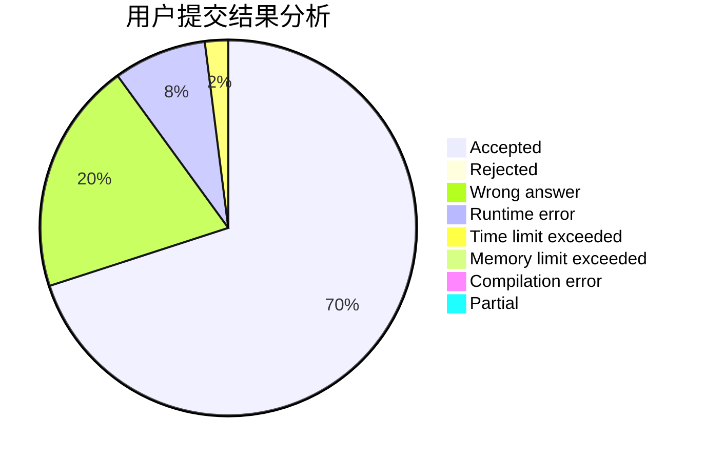
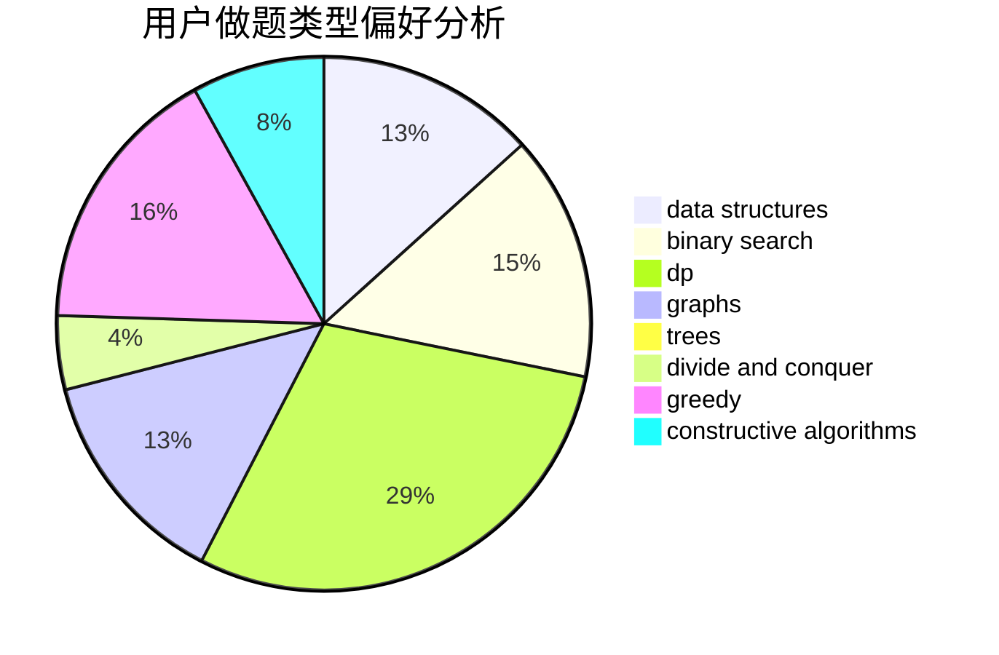

# LIUZHIHAN0217

<!-- tabs:start -->

#### **用户提交结果分析**

#### **用户做题类型偏好分析**

#### **用户错题知识点分析**

<!-- tabs:end -->
# 推荐题目
[126B](https://codeforces.com/contest/126/problem/B)		binary search,
                        dp,
                        hashing,
                        string suffix structures,
                        strings		  
[717E](https://codeforces.com/contest/717/problem/E)		dfs and similar		  
[343A](https://codeforces.com/contest/343/problem/A)		math,
                        number theory		  
[418C](https://codeforces.com/contest/418/problem/C)		dsu,graphs,sortings,trees		  
[1301D](https://codeforces.com/contest/1301/problem/D)		constructive algorithms,
                        graphs,
                        implementation		  
[431E](https://codeforces.com/contest/431/problem/E)		binary search,
                        data structures,
                        ternary search		  
[1139B](https://codeforces.com/contest/1139/problem/B)		greedy,
                        implementation		  
[893C](https://codeforces.com/contest/893/problem/C)		dfs and similar,
                        graphs,
                        greedy		  
[868B](https://codeforces.com/contest/868/problem/B)		implementation		  
[524E](https://codeforces.com/contest/524/problem/E)		data structures,
                        sortings		  
