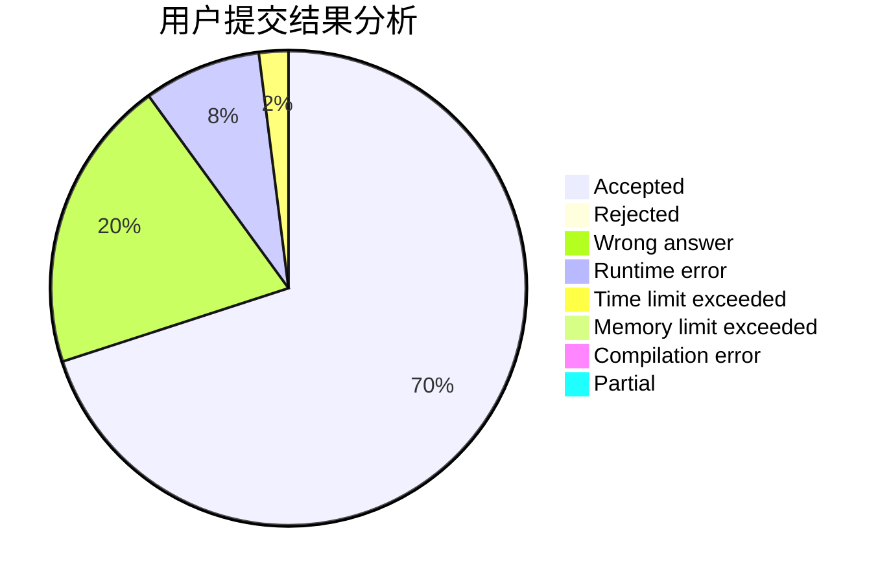
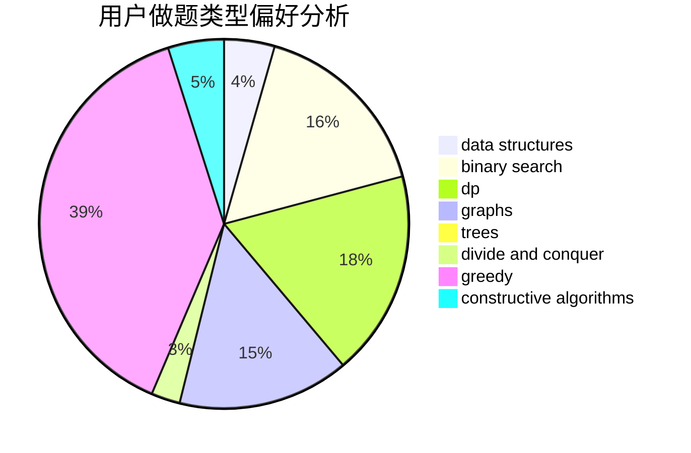

# LIUZHIHAN0217

<!-- tabs:start -->

#### **用户提交结果分析**

#### **用户做题类型偏好分析**

#### **用户错题知识点分析**

<!-- tabs:end -->
# 推荐题目
[1278F](https://codeforces.com/contest/1278/problem/F)		combinatorics,
                        dp,
                        math,
                        number theory,
                        probabilities		  
[735A](https://codeforces.com/contest/735/problem/A)		implementation,
                        strings		  
[36B](https://codeforces.com/contest/36/problem/B)		implementation		  
[443D](https://codeforces.com/contest/443/problem/D)		dsu,graphs,sortings,trees		  
[1311A](https://codeforces.com/contest/1311/problem/A)		greedy,
                        implementation,
                        math		  
[453C](https://codeforces.com/contest/453/problem/C)		constructive algorithms,
                        dfs and similar,
                        graphs		  
[1140F](https://codeforces.com/contest/1140/problem/F)		data structures,
                        divide and conquer,
                        dsu		  
[911C](https://codeforces.com/contest/911/problem/C)		brute force,
                        constructive algorithms		  
[887D](https://codeforces.com/contest/887/problem/D)		data structures,
                        two pointers		  
[549B](https://codeforces.com/contest/549/problem/B)		constructive algorithms,
                        dfs and similar,
                        graphs,
                        greedy		  
