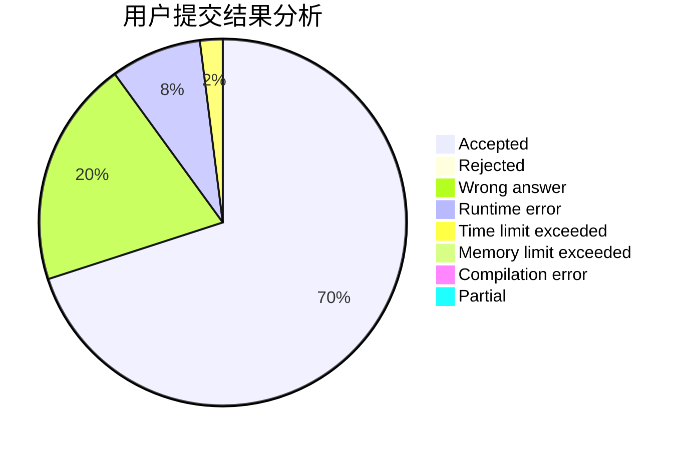
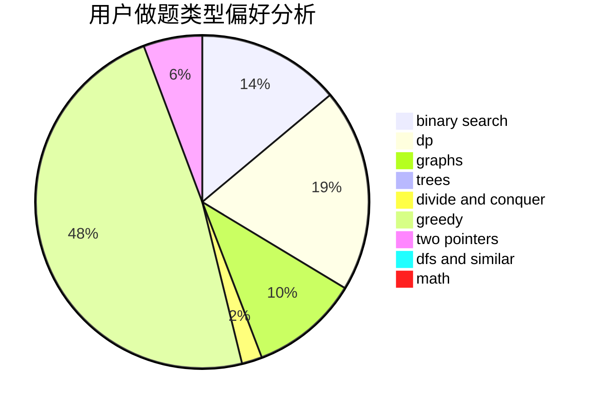

# LIUZHIHAN0217

<!-- tabs:start -->

#### **用户提交结果分析**

#### **用户做题类型偏好分析**

<!-- tabs:end -->
# 推荐题目
[1278F](https://codeforces.com/contest/1278/problem/F)
[735A](https://codeforces.com/contest/735/problem/A)
[36B](https://codeforces.com/contest/36/problem/B)
[443D](https://codeforces.com/contest/443/problem/D)
[1311A](https://codeforces.com/contest/1311/problem/A)
[453C](https://codeforces.com/contest/453/problem/C)
[1140F](https://codeforces.com/contest/1140/problem/F)
[911C](https://codeforces.com/contest/911/problem/C)
[887D](https://codeforces.com/contest/887/problem/D)
[549B](https://codeforces.com/contest/549/problem/B)
