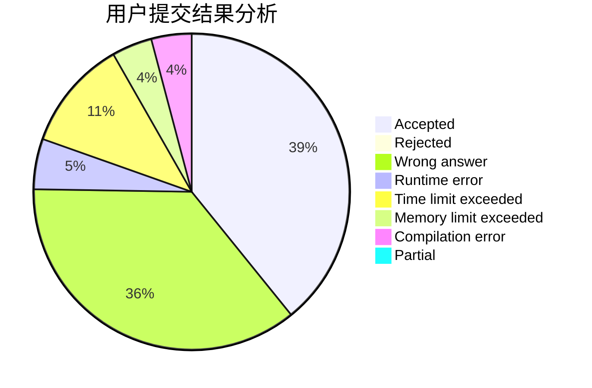
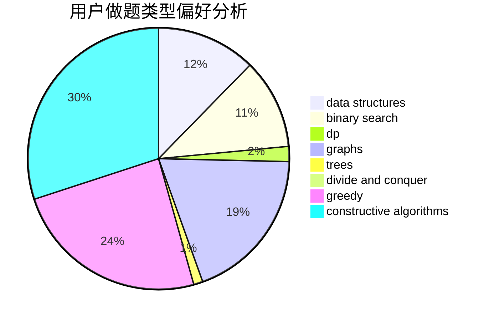
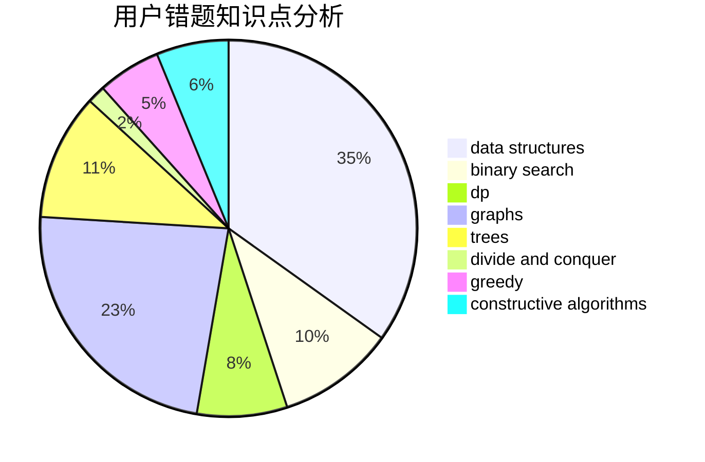

# LJC00118

<!-- tabs:start -->

#### **用户提交结果分析**

#### **用户做题类型偏好分析**

#### **用户错题知识点分析**

<!-- tabs:end -->
# 推荐题目
[113D](https://codeforces.com/contest/113/problem/D)		math,
                        matrices,
                        probabilities		  
[75D](https://codeforces.com/contest/75/problem/D)		data structures,
                        dp,
                        greedy,
                        implementation,
                        math,
                        trees		  
[1019E](https://codeforces.com/contest/1019/problem/E)		data structures,
                        divide and conquer,
                        trees		  
[810C](https://codeforces.com/contest/810/problem/C)		dsu,graphs,sortings,trees		  
[176D](https://codeforces.com/contest/176/problem/D)		dp		  
[810A](https://codeforces.com/contest/810/problem/A)		implementation,
                        math		  
[833D](https://codeforces.com/contest/833/problem/D)		data structures,
                        divide and conquer,
                        implementation,
                        trees		  
[631E](https://codeforces.com/contest/631/problem/E)		data structures,
                        dp,
                        geometry		  
[1508A](https://codeforces.com/contest/1508/problem/A)		constructive algorithms,
                        greedy,
                        implementation,
                        math,
                        strings,
                        two pointers		  
[948A](https://codeforces.com/contest/948/problem/A)		brute force,
                        dfs and similar,
                        graphs,
                        implementation		  
