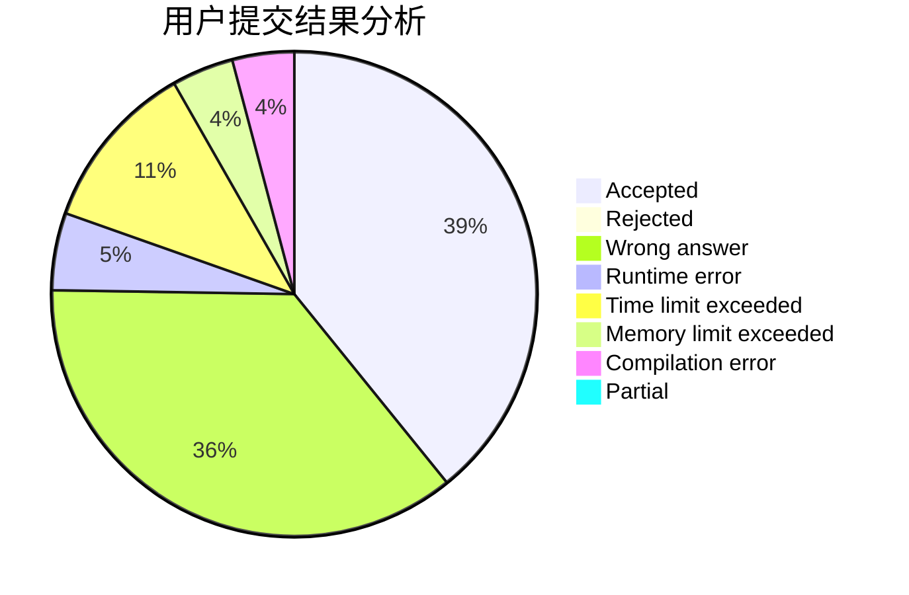
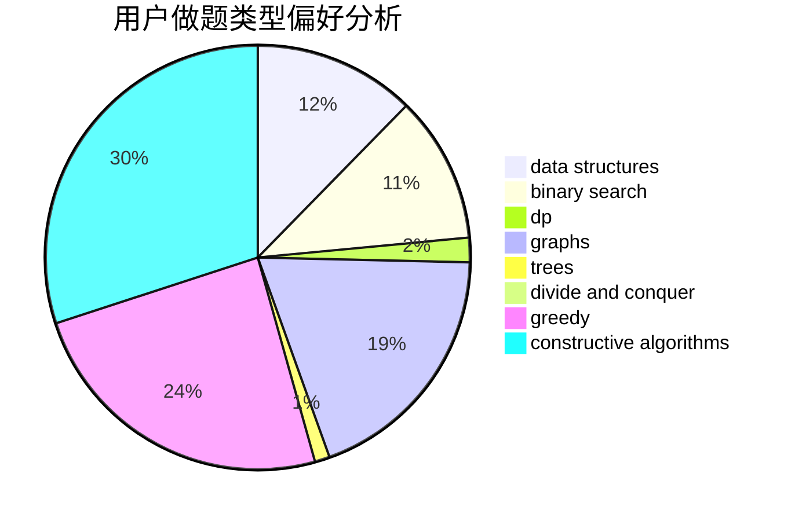
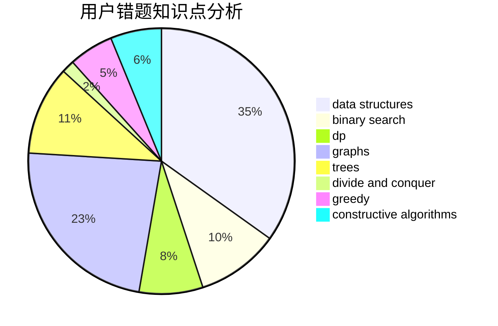

# LJC00118
<!-- tabs:start -->
#### **用户提交结果分析**

#### **用户做题类型偏好分析**

#### **用户错题知识点分析**

<!-- tabs:end -->
# 推荐题目
[Binary Literature](http://codeforces.com/problemset/problem/1508/A)		constructive algorithms,
                        greedy,
                        implementation,
                        math,
                        strings,
                        two pointers		  
[Product Sum](http://codeforces.com/problemset/problem/631/E)		data structures,
                        dp,
                        geometry		  
[Big Maximum Sum](http://codeforces.com/problemset/problem/75/D)		data structures,
                        dp,
                        greedy,
                        implementation,
                        math,
                        trees		  
[Do you want a date?](https://codeforces.com/contest/810/problem/C)		implementation,
                        math,
                        sortings		  
[Raining season](http://codeforces.com/problemset/problem/1019/E)		data structures,
                        divide and conquer,
                        trees		  
[Hyper String](http://codeforces.com/problemset/problem/176/D)		dp		  
[Red-Black Cobweb](http://codeforces.com/problemset/problem/833/D)		data structures,
                        divide and conquer,
                        implementation,
                        trees		  
[Museum](http://codeforces.com/problemset/problem/113/D)		math,
                        matrices,
                        probabilities		  
[Straight <<A>>](http://codeforces.com/problemset/problem/810/A)		implementation,
                        math		  
[Equal Product](http://codeforces.com/problemset/problem/1418/F)		data structures,
                        math,
                        number theory,
                        two pointers		  
<!-- tabs:start -->
#### **data structures**
[Binary Literature](http://codeforces.com/problemset/problem/631/E)		data structures,
                        dp,
                        geometry		  
[Product Sum](http://codeforces.com/problemset/problem/75/D)		data structures,
                        dp,
                        greedy,
                        implementation,
                        math,
                        trees		  
[Big Maximum Sum](http://codeforces.com/problemset/problem/1019/E)		data structures,
                        divide and conquer,
                        trees		  
[Do you want a date?](http://codeforces.com/problemset/problem/833/D)		data structures,
                        divide and conquer,
                        implementation,
                        trees		  
[Raining season](http://codeforces.com/problemset/problem/1418/F)		data structures,
                        math,
                        number theory,
                        two pointers		  
[Hyper String](https://codeforces.com/contest/205/problem/D)		binary search,
                        data structures		  
[Red-Black Cobweb](http://codeforces.com/problemset/problem/895/E)		data structures,
                        probabilities		  
[Museum](http://codeforces.com/problemset/problem/920/E)		data structures,
                        dfs and similar,
                        dsu,
                        graphs		  
[Straight <<A>>](http://codeforces.com/problemset/problem/1209/H)		data structures,
                        greedy,
                        math		  
[Equal Product](http://codeforces.com/problemset/problem/1260/F)		data structures,
                        trees		  
#### **binary search**
[Binary Literature](https://codeforces.com/contest/205/problem/D)		binary search,
                        data structures		  
[Product Sum](http://codeforces.com/problemset/problem/444/D)		binary search,
                        hashing,
                        strings,
                        two pointers		  
[Big Maximum Sum](http://codeforces.com/problemset/problem/1492/C)		binary search,
                        data structures,
                        dp,
                        greedy,
                        two pointers		  
[Do you want a date?](http://codeforces.com/problemset/problem/1463/D)		binary search,
                        constructive algorithms,
                        greedy,
                        two pointers		  
[Raining season](http://codeforces.com/problemset/problem/1490/G)		binary search,
                        data structures,
                        math		  
[Hyper String](http://codeforces.com/problemset/problem/1479/D)		binary search,
                        bitmasks,
                        brute force,
                        data structures,
                        probabilities,
                        trees		  
[Red-Black Cobweb](http://codeforces.com/problemset/problem/1436/E)		binary search,
                        data structures,
                        two pointers		  
[Museum](http://codeforces.com/problemset/problem/1461/D)		binary search,
                        brute force,
                        data structures,
                        divide and conquer,
                        implementation,
                        sortings		  
[Straight <<A>>](http://codeforces.com/problemset/problem/1493/C)		binary search,
                        brute force,
                        constructive algorithms,
                        greedy,
                        strings		  
[Equal Product](http://codeforces.com/problemset/problem/1487/D)		binary search,
                        brute force,
                        math,
                        number theory		  
#### **dp**
[Binary Literature](http://codeforces.com/problemset/problem/631/E)		data structures,
                        dp,
                        geometry		  
[Product Sum](http://codeforces.com/problemset/problem/75/D)		data structures,
                        dp,
                        greedy,
                        implementation,
                        math,
                        trees		  
[Big Maximum Sum](http://codeforces.com/problemset/problem/176/D)		dp		  
[Do you want a date?](http://codeforces.com/problemset/problem/1381/D)		dfs and similar,
                        dp,
                        greedy,
                        trees,
                        two pointers		  
[Raining season](http://codeforces.com/problemset/problem/671/A)		dp,
                        geometry,
                        greedy,
                        implementation		  
[Hyper String](http://codeforces.com/problemset/problem/1237/E)		dp,
                        math		  
[Red-Black Cobweb](http://codeforces.com/problemset/problem/1492/C)		binary search,
                        data structures,
                        dp,
                        greedy,
                        two pointers		  
[Museum](https://codeforces.com/contest/1457/problem/C)		brute force,
                        dp,
                        implementation		  
[Straight <<A>>](http://codeforces.com/problemset/problem/1491/C)		brute force,
                        data structures,
                        dp,
                        greedy,
                        implementation		  
[Equal Product](http://codeforces.com/problemset/problem/1437/C)		dp,
                        flows,
                        graph matchings,
                        greedy,
                        math,
                        sortings		  
#### **graph**
[Binary Literature](http://codeforces.com/problemset/problem/948/A)		brute force,
                        dfs and similar,
                        graphs,
                        implementation		  
[Product Sum](http://codeforces.com/problemset/problem/107/A)		dfs and similar,
                        graphs		  
[Big Maximum Sum](http://codeforces.com/problemset/problem/1027/D)		dfs and similar,
                        graphs		  
[Do you want a date?](http://codeforces.com/problemset/problem/920/E)		data structures,
                        dfs and similar,
                        dsu,
                        graphs		  
[Raining season](http://codeforces.com/problemset/problem/1487/C)		brute force,
                        constructive algorithms,
                        dfs and similar,
                        graphs,
                        greedy,
                        implementation,
                        math		  
[Hyper String](http://codeforces.com/problemset/problem/1437/C)		dp,
                        flows,
                        graph matchings,
                        greedy,
                        math,
                        sortings		  
[Red-Black Cobweb](http://codeforces.com/problemset/problem/1470/D)		constructive algorithms,
                        dfs and similar,
                        graph matchings,
                        graphs,
                        greedy		  
[Museum](http://codeforces.com/problemset/problem/1476/C)		dp,
                        graphs,
                        greedy		  
[Straight <<A>>](http://codeforces.com/problemset/problem/1304/D)		constructive algorithms,
                        graphs,
                        greedy,
                        two pointers		  
[Equal Product](http://codeforces.com/problemset/problem/1475/C)		combinatorics,
                        graphs,
                        math		  
#### **trees**
[Binary Literature](http://codeforces.com/problemset/problem/75/D)		data structures,
                        dp,
                        greedy,
                        implementation,
                        math,
                        trees		  
[Product Sum](http://codeforces.com/problemset/problem/1019/E)		data structures,
                        divide and conquer,
                        trees		  
[Big Maximum Sum](http://codeforces.com/problemset/problem/833/D)		data structures,
                        divide and conquer,
                        implementation,
                        trees		  
[Do you want a date?](http://codeforces.com/problemset/problem/1381/D)		dfs and similar,
                        dp,
                        greedy,
                        trees,
                        two pointers		  
[Raining season](http://codeforces.com/problemset/problem/1260/F)		data structures,
                        trees		  
[Hyper String](http://codeforces.com/problemset/problem/1479/D)		binary search,
                        bitmasks,
                        brute force,
                        data structures,
                        probabilities,
                        trees		  
[Red-Black Cobweb](http://codeforces.com/problemset/problem/1511/C)		brute force,
                        data structures,
                        implementation,
                        trees		  
[Museum](http://codeforces.com/problemset/problem/1499/F)		combinatorics,
                        dfs and similar,
                        dp,
                        trees		  
[Straight <<A>>](http://codeforces.com/problemset/problem/1491/E)		brute force,
                        dfs and similar,
                        divide and conquer,
                        number theory,
                        trees		  
[Equal Product](http://codeforces.com/problemset/problem/1466/D)		data structures,
                        greedy,
                        sortings,
                        trees		  
#### **divide and conquer**
[Binary Literature](http://codeforces.com/problemset/problem/1019/E)		data structures,
                        divide and conquer,
                        trees		  
[Product Sum](http://codeforces.com/problemset/problem/833/D)		data structures,
                        divide and conquer,
                        implementation,
                        trees		  
[Big Maximum Sum](http://codeforces.com/problemset/problem/1461/D)		binary search,
                        brute force,
                        data structures,
                        divide and conquer,
                        implementation,
                        sortings		  
[Do you want a date?](http://codeforces.com/problemset/problem/1466/G)		combinatorics,
                        divide and conquer,
                        hashing,
                        math,
                        string suffix structures,
                        strings		  
[Raining season](http://codeforces.com/problemset/problem/1490/D)		dfs and similar,
                        divide and conquer,
                        implementation		  
[Hyper String](https://codeforces.com/contest/1483/problem/C)		data structures,
                        divide and conquer,
                        dp		  
[Red-Black Cobweb](http://codeforces.com/problemset/problem/1491/E)		brute force,
                        dfs and similar,
                        divide and conquer,
                        number theory,
                        trees		  
[Museum](http://codeforces.com/problemset/problem/1303/G)		data structures,
                        divide and conquer,
                        geometry,
                        trees		  
[Straight <<A>>](http://codeforces.com/problemset/problem/1494/D)		constructive algorithms,
                        data structures,
                        dfs and similar,
                        divide and conquer,
                        dsu,
                        greedy,
                        sortings,
                        trees		  
[Equal Product](http://codeforces.com/problemset/problem/1482/E)		data structures,
                        divide and conquer,
                        dp		  
#### **greedy**
[Binary Literature](http://codeforces.com/problemset/problem/1508/A)		constructive algorithms,
                        greedy,
                        implementation,
                        math,
                        strings,
                        two pointers		  
[Product Sum](http://codeforces.com/problemset/problem/75/D)		data structures,
                        dp,
                        greedy,
                        implementation,
                        math,
                        trees		  
[Big Maximum Sum](http://codeforces.com/problemset/problem/1381/D)		dfs and similar,
                        dp,
                        greedy,
                        trees,
                        two pointers		  
[Do you want a date?](http://codeforces.com/problemset/problem/671/A)		dp,
                        geometry,
                        greedy,
                        implementation		  
[Raining season](http://codeforces.com/problemset/problem/297/B)		constructive algorithms,
                        greedy		  
[Hyper String](http://codeforces.com/problemset/problem/535/D)		greedy,
                        hashing,
                        string suffix structures,
                        strings		  
[Red-Black Cobweb](http://codeforces.com/problemset/problem/491/B)		greedy,
                        math		  
[Museum](http://codeforces.com/problemset/problem/1209/H)		data structures,
                        greedy,
                        math		  
[Straight <<A>>](http://codeforces.com/problemset/problem/1471/A)		greedy,
                        math,
                        number theory		  
[Equal Product](http://codeforces.com/problemset/problem/1492/C)		binary search,
                        data structures,
                        dp,
                        greedy,
                        two pointers		  
#### **constructive algorithms**
[Binary Literature](http://codeforces.com/problemset/problem/1508/A)		constructive algorithms,
                        greedy,
                        implementation,
                        math,
                        strings,
                        two pointers		  
[Product Sum](http://codeforces.com/problemset/problem/297/B)		constructive algorithms,
                        greedy		  
[Big Maximum Sum](http://codeforces.com/problemset/problem/727/C)		constructive algorithms,
                        interactive,
                        math		  
[Do you want a date?](http://codeforces.com/problemset/problem/1493/A)		constructive algorithms,
                        greedy		  
[Raining season](http://codeforces.com/problemset/problem/1463/D)		binary search,
                        constructive algorithms,
                        greedy,
                        two pointers		  
[Hyper String](https://codeforces.com/contest/1456/problem/B)		bitmasks,
                        brute force,
                        constructive algorithms		  
[Red-Black Cobweb](http://codeforces.com/problemset/problem/1492/D)		bitmasks,
                        constructive algorithms,
                        greedy,
                        math		  
[Museum](https://codeforces.com/contest/1504/problem/D)		constructive algorithms,
                        games,
                        interactive		  
[Straight <<A>>](https://codeforces.com/contest/1483/problem/A)		brute force,
                        constructive algorithms,
                        greedy,
                        implementation		  
[Equal Product](https://codeforces.com/contest/1457/problem/D)		bitmasks,
                        brute force,
                        constructive algorithms		  
#### **sortings**
[Binary Literature](https://codeforces.com/contest/810/problem/C)		implementation,
                        math,
                        sortings		  
[Product Sum](https://codeforces.com/contest/1496/problem/C)		geometry,
                        greedy,
                        math,
                        sortings		  
[Big Maximum Sum](http://codeforces.com/problemset/problem/1495/A)		geometry,
                        greedy,
                        math,
                        sortings		  
[Do you want a date?](http://codeforces.com/problemset/problem/1497/A)		brute force,
                        data structures,
                        greedy,
                        sortings		  
[Raining season](http://codeforces.com/problemset/problem/1427/A)		math,
                        sortings		  
[Hyper String](http://codeforces.com/problemset/problem/1461/D)		binary search,
                        brute force,
                        data structures,
                        divide and conquer,
                        implementation,
                        sortings		  
[Red-Black Cobweb](http://codeforces.com/problemset/problem/1437/C)		dp,
                        flows,
                        graph matchings,
                        greedy,
                        math,
                        sortings		  
[Museum](http://codeforces.com/problemset/problem/1473/A)		greedy,
                        implementation,
                        math,
                        sortings		  
[Straight <<A>>](http://codeforces.com/problemset/problem/1486/B)		binary search,
                        geometry,
                        shortest paths,
                        sortings		  
[Equal Product](http://codeforces.com/problemset/problem/1480/B)		greedy,
                        implementation,
                        sortings		  
<!-- tabs:end -->
