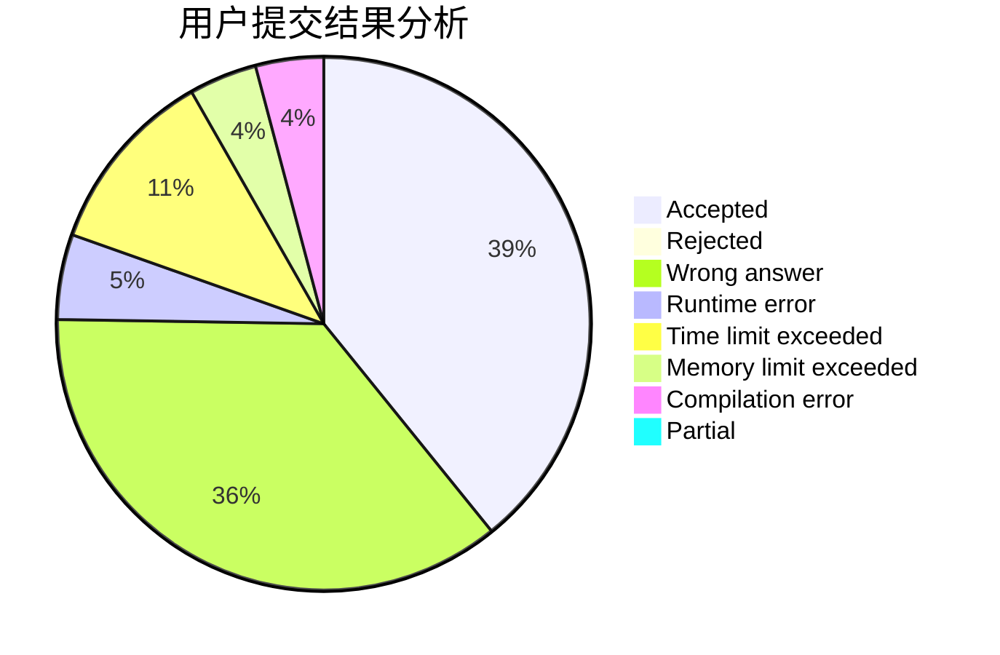
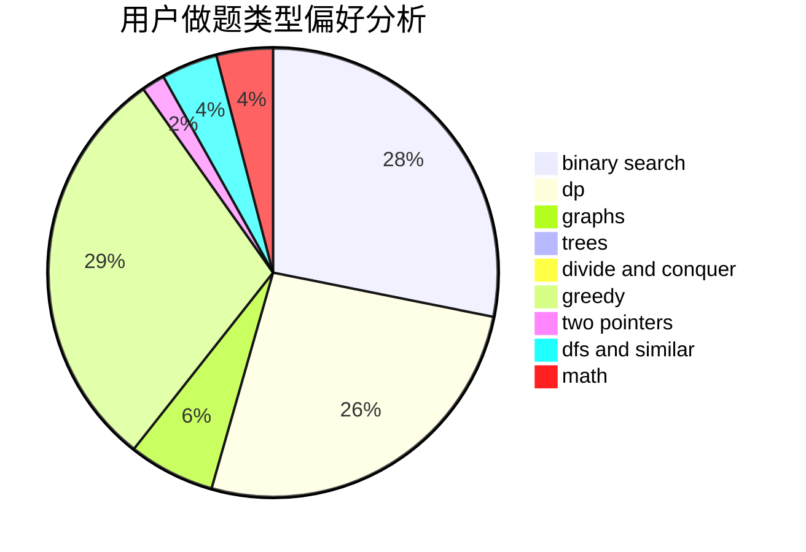

# LJC00118

<!-- tabs:start -->

#### **用户提交结果分析**

#### **用户做题类型偏好分析**

<!-- tabs:end -->
# 推荐题目
[1141D](https://codeforces.com/contest/1141/problem/D)
[77B](https://codeforces.com/contest/77/problem/B)
[1020A](https://codeforces.com/contest/1020/problem/A)
[828C](https://codeforces.com/contest/828/problem/C)
[201C](https://codeforces.com/contest/201/problem/C)
[828A](https://codeforces.com/contest/828/problem/A)
[851D](https://codeforces.com/contest/851/problem/D)
[662D](https://codeforces.com/contest/662/problem/D)
[158E](https://codeforces.com/contest/158/problem/E)
[965B](https://codeforces.com/contest/965/problem/B)
