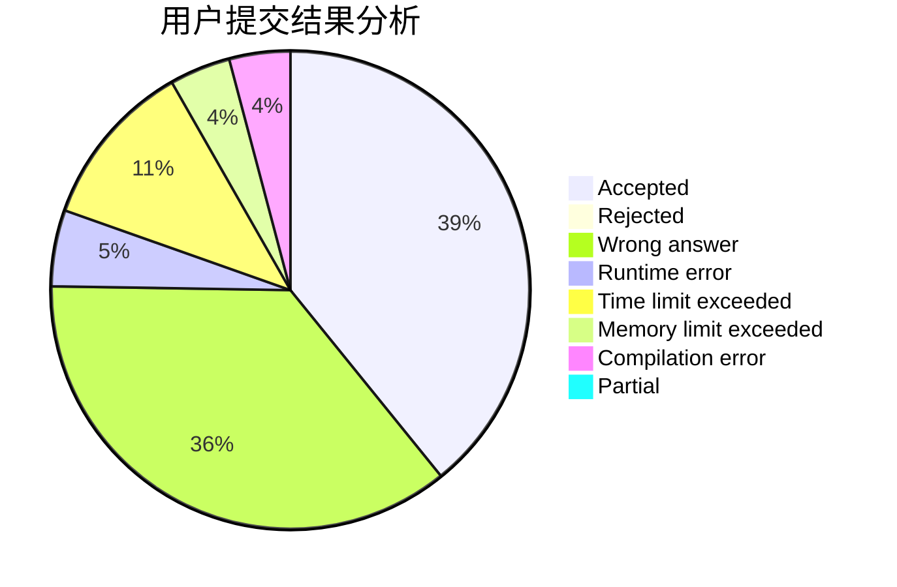
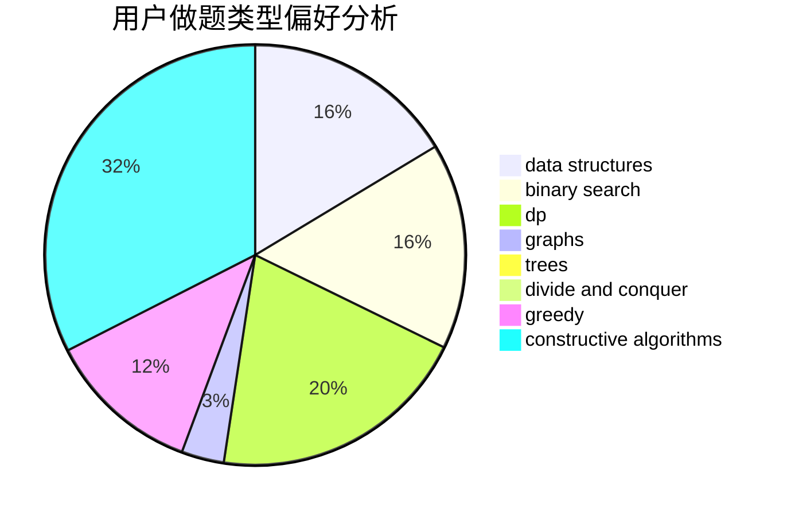
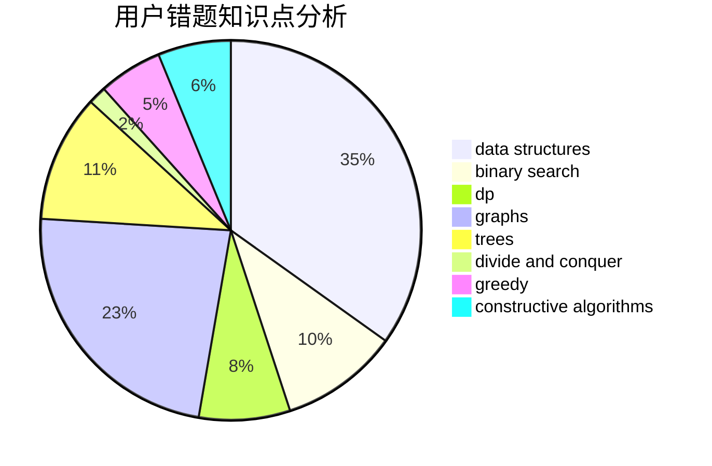

# LJC00118

<!-- tabs:start -->

#### **用户提交结果分析**

#### **用户做题类型偏好分析**

#### **用户错题知识点分析**

<!-- tabs:end -->
# 推荐题目
[1141D](https://codeforces.com/contest/1141/problem/D)		greedy,
                        implementation		  
[77B](https://codeforces.com/contest/77/problem/B)		math,
                        probabilities		  
[1020A](https://codeforces.com/contest/1020/problem/A)		math		  
[828C](https://codeforces.com/contest/828/problem/C)		dsu,graphs,sortings,trees		  
[201C](https://codeforces.com/contest/201/problem/C)		dp		  
[828A](https://codeforces.com/contest/828/problem/A)		implementation		  
[851D](https://codeforces.com/contest/851/problem/D)		dsu,graphs,sortings,trees		  
[662D](https://codeforces.com/contest/662/problem/D)		constructive algorithms,
                        greedy,
                        implementation,
                        math		  
[158E](https://codeforces.com/contest/158/problem/E)		*special problem,
                        dp,
                        sortings		  
[965B](https://codeforces.com/contest/965/problem/B)		implementation		  
