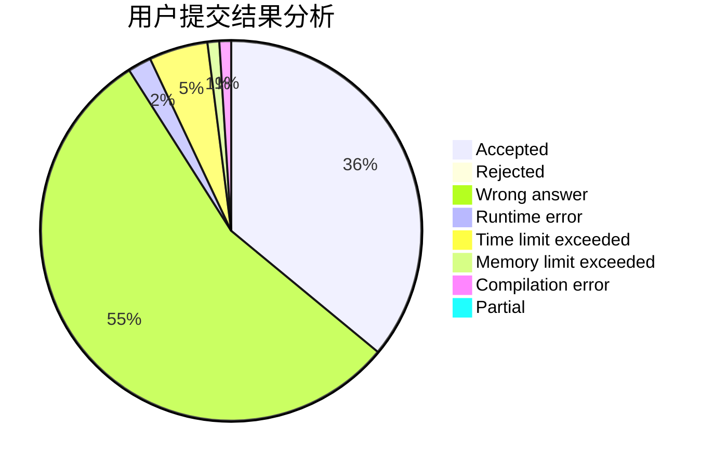
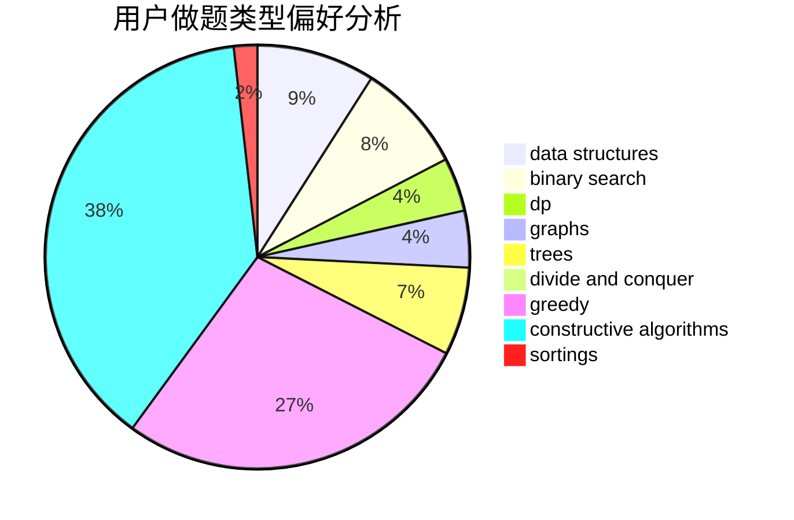
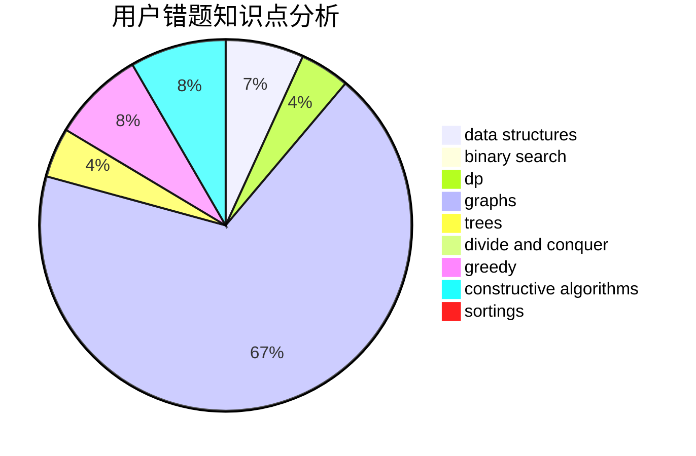

# LJF007
<!-- tabs:start -->
#### **用户提交结果分析**

#### **用户做题类型偏好分析**

#### **用户错题知识点分析**

<!-- tabs:end -->
# 推荐题目
[789D](https://codeforces.com/contest/789/problem/D)		combinatorics,
                        constructive algorithms,
                        dfs and similar,
                        dsu,
                        graphs		  
[45A](http://codeforces.com/problemset/problem/45/A)		implementation		  
[1043G](http://codeforces.com/problemset/problem/1043/G)		data structures,
                        divide and conquer,
                        hashing,
                        string suffix structures,
                        strings		  
[1167A](http://codeforces.com/problemset/problem/1167/A)		brute force,
                        greedy,
                        strings		  
[1434E](http://codeforces.com/problemset/problem/1434/E)		dsu,
                        games		  
[557B](http://codeforces.com/problemset/problem/557/B)		constructive algorithms,
                        implementation,
                        math,
                        sortings		  
[1288B](http://codeforces.com/problemset/problem/1288/B)		math		  
[887F](http://codeforces.com/problemset/problem/887/F)		greedy,
                        sortings		  
[931C](http://codeforces.com/problemset/problem/931/C)		implementation,
                        math		  
[861B](https://codeforces.com/contest/861/problem/B)		brute force,
                        implementation		  
<!-- tabs:start -->
#### **data structures**
[1043G](http://codeforces.com/problemset/problem/1043/G)		data structures,
                        divide and conquer,
                        hashing,
                        string suffix structures,
                        strings		  
[796C](http://codeforces.com/problemset/problem/796/C)		constructive algorithms,
                        data structures,
                        dp,
                        trees		  
[282E](http://codeforces.com/problemset/problem/282/E)		bitmasks,
                        data structures,
                        trees		  
[1315D](https://codeforces.com/contest/1315/problem/D)		data structures,
                        greedy,
                        sortings		  
[1209F](http://codeforces.com/problemset/problem/1209/F)		data structures,
                        dfs and similar,
                        graphs,
                        shortest paths,
                        strings,
                        trees		  
[818E](http://codeforces.com/problemset/problem/818/E)		binary search,
                        data structures,
                        number theory,
                        two pointers		  
[739E](http://codeforces.com/problemset/problem/739/E)		brute force,
                        data structures,
                        dp,
                        flows,
                        math,
                        probabilities,
                        sortings		  
[1157E](http://codeforces.com/problemset/problem/1157/E)		binary search,
                        data structures,
                        greedy		  
[1492C](http://codeforces.com/problemset/problem/1492/C)		binary search,
                        data structures,
                        dp,
                        greedy,
                        two pointers		  
[1490G](http://codeforces.com/problemset/problem/1490/G)		binary search,
                        data structures,
                        math		  
#### **binary search**
[444E](http://codeforces.com/problemset/problem/444/E)		binary search,
                        dsu,
                        trees		  
[253B](http://codeforces.com/problemset/problem/253/B)		binary search,
                        dp,
                        sortings,
                        two pointers		  
[818E](http://codeforces.com/problemset/problem/818/E)		binary search,
                        data structures,
                        number theory,
                        two pointers		  
[1157E](http://codeforces.com/problemset/problem/1157/E)		binary search,
                        data structures,
                        greedy		  
[1468D](http://codeforces.com/problemset/problem/1468/D)		binary search,
                        sortings		  
[1492C](http://codeforces.com/problemset/problem/1492/C)		binary search,
                        data structures,
                        dp,
                        greedy,
                        two pointers		  
[1463D](http://codeforces.com/problemset/problem/1463/D)		binary search,
                        constructive algorithms,
                        greedy,
                        two pointers		  
[1490G](http://codeforces.com/problemset/problem/1490/G)		binary search,
                        data structures,
                        math		  
[1479D](http://codeforces.com/problemset/problem/1479/D)		binary search,
                        bitmasks,
                        brute force,
                        data structures,
                        probabilities,
                        trees		  
[1436E](http://codeforces.com/problemset/problem/1436/E)		binary search,
                        data structures,
                        two pointers		  
#### **dp**
[935E](http://codeforces.com/problemset/problem/935/E)		dfs and similar,
                        dp,
                        trees		  
[796C](http://codeforces.com/problemset/problem/796/C)		constructive algorithms,
                        data structures,
                        dp,
                        trees		  
[1499D](http://codeforces.com/problemset/problem/1499/D)		dp,
                        math,
                        number theory		  
[839D](http://codeforces.com/problemset/problem/839/D)		combinatorics,
                        dp,
                        math,
                        number theory		  
[1241D](https://codeforces.com/contest/1241/problem/D)		dp,
                        greedy,
                        two pointers		  
[741B](http://codeforces.com/problemset/problem/741/B)		dfs and similar,
                        dp,
                        dsu		  
[1012F](http://codeforces.com/problemset/problem/1012/F)		dp,
                        implementation		  
[1229F](https://codeforces.com/contest/1229/problem/F)		dp		  
[38E](http://codeforces.com/problemset/problem/38/E)		dp,
                        sortings		  
[201D](http://codeforces.com/problemset/problem/201/D)		bitmasks,
                        brute force,
                        dp		  
#### **graph**
[789D](https://codeforces.com/contest/789/problem/D)		combinatorics,
                        constructive algorithms,
                        dfs and similar,
                        dsu,
                        graphs		  
[1161D](https://codeforces.com/contest/1161/problem/D)		dfs and similar,
                        graphs		  
[755C](http://codeforces.com/problemset/problem/755/C)		dfs and similar,
                        dsu,
                        graphs,
                        interactive,
                        trees		  
[1209F](http://codeforces.com/problemset/problem/1209/F)		data structures,
                        dfs and similar,
                        graphs,
                        shortest paths,
                        strings,
                        trees		  
[1089M](http://codeforces.com/problemset/problem/1089/M)		constructive algorithms,
                        graphs		  
[1487C](http://codeforces.com/problemset/problem/1487/C)		brute force,
                        constructive algorithms,
                        dfs and similar,
                        graphs,
                        greedy,
                        implementation,
                        math		  
[1437C](http://codeforces.com/problemset/problem/1437/C)		dp,
                        flows,
                        graph matchings,
                        greedy,
                        math,
                        sortings		  
[1470D](http://codeforces.com/problemset/problem/1470/D)		constructive algorithms,
                        dfs and similar,
                        graph matchings,
                        graphs,
                        greedy		  
[1476C](http://codeforces.com/problemset/problem/1476/C)		dp,
                        graphs,
                        greedy		  
[1304D](http://codeforces.com/problemset/problem/1304/D)		constructive algorithms,
                        graphs,
                        greedy,
                        two pointers		  
#### **trees**
[935E](http://codeforces.com/problemset/problem/935/E)		dfs and similar,
                        dp,
                        trees		  
[796C](http://codeforces.com/problemset/problem/796/C)		constructive algorithms,
                        data structures,
                        dp,
                        trees		  
[282E](http://codeforces.com/problemset/problem/282/E)		bitmasks,
                        data structures,
                        trees		  
[1311E](http://codeforces.com/problemset/problem/1311/E)		brute force,
                        constructive algorithms,
                        trees		  
[755C](http://codeforces.com/problemset/problem/755/C)		dfs and similar,
                        dsu,
                        graphs,
                        interactive,
                        trees		  
[444E](http://codeforces.com/problemset/problem/444/E)		binary search,
                        dsu,
                        trees		  
[1209F](http://codeforces.com/problemset/problem/1209/F)		data structures,
                        dfs and similar,
                        graphs,
                        shortest paths,
                        strings,
                        trees		  
[1479D](http://codeforces.com/problemset/problem/1479/D)		binary search,
                        bitmasks,
                        brute force,
                        data structures,
                        probabilities,
                        trees		  
[1511C](http://codeforces.com/problemset/problem/1511/C)		brute force,
                        data structures,
                        implementation,
                        trees		  
[1499F](http://codeforces.com/problemset/problem/1499/F)		combinatorics,
                        dfs and similar,
                        dp,
                        trees		  
#### **divide and conquer**
[1043G](http://codeforces.com/problemset/problem/1043/G)		data structures,
                        divide and conquer,
                        hashing,
                        string suffix structures,
                        strings		  
[1461D](http://codeforces.com/problemset/problem/1461/D)		binary search,
                        brute force,
                        data structures,
                        divide and conquer,
                        implementation,
                        sortings		  
[1466G](http://codeforces.com/problemset/problem/1466/G)		combinatorics,
                        divide and conquer,
                        hashing,
                        math,
                        string suffix structures,
                        strings		  
[1490D](http://codeforces.com/problemset/problem/1490/D)		dfs and similar,
                        divide and conquer,
                        implementation		  
[1483C](https://codeforces.com/contest/1483/problem/C)		data structures,
                        divide and conquer,
                        dp		  
[1491E](http://codeforces.com/problemset/problem/1491/E)		brute force,
                        dfs and similar,
                        divide and conquer,
                        number theory,
                        trees		  
[1303G](http://codeforces.com/problemset/problem/1303/G)		data structures,
                        divide and conquer,
                        geometry,
                        trees		  
[1494D](http://codeforces.com/problemset/problem/1494/D)		constructive algorithms,
                        data structures,
                        dfs and similar,
                        divide and conquer,
                        dsu,
                        greedy,
                        sortings,
                        trees		  
[1482E](http://codeforces.com/problemset/problem/1482/E)		data structures,
                        divide and conquer,
                        dp		  
[566C](http://codeforces.com/problemset/problem/566/C)		dfs and similar,
                        divide and conquer,
                        trees		  
#### **greedy**
[1167A](http://codeforces.com/problemset/problem/1167/A)		brute force,
                        greedy,
                        strings		  
[887F](http://codeforces.com/problemset/problem/887/F)		greedy,
                        sortings		  
[1167D](http://codeforces.com/problemset/problem/1167/D)		constructive algorithms,
                        greedy		  
[477B](https://codeforces.com/contest/477/problem/B)		constructive algorithms,
                        greedy,
                        math		  
[1241D](https://codeforces.com/contest/1241/problem/D)		dp,
                        greedy,
                        two pointers		  
[1315D](https://codeforces.com/contest/1315/problem/D)		data structures,
                        greedy,
                        sortings		  
[588A](http://codeforces.com/problemset/problem/588/A)		greedy		  
[1249C1](http://codeforces.com/problemset/problem/1249/C1)		brute force,
                        greedy,
                        implementation		  
[1157E](http://codeforces.com/problemset/problem/1157/E)		binary search,
                        data structures,
                        greedy		  
[1042C](http://codeforces.com/problemset/problem/1042/C)		constructive algorithms,
                        greedy,
                        math		  
#### **constructive algorithms**
[789D](https://codeforces.com/contest/789/problem/D)		combinatorics,
                        constructive algorithms,
                        dfs and similar,
                        dsu,
                        graphs		  
[557B](http://codeforces.com/problemset/problem/557/B)		constructive algorithms,
                        implementation,
                        math,
                        sortings		  
[796C](http://codeforces.com/problemset/problem/796/C)		constructive algorithms,
                        data structures,
                        dp,
                        trees		  
[1167D](http://codeforces.com/problemset/problem/1167/D)		constructive algorithms,
                        greedy		  
[398A](http://codeforces.com/problemset/problem/398/A)		constructive algorithms,
                        implementation		  
[1311E](http://codeforces.com/problemset/problem/1311/E)		brute force,
                        constructive algorithms,
                        trees		  
[1179B](http://codeforces.com/problemset/problem/1179/B)		constructive algorithms		  
[477B](https://codeforces.com/contest/477/problem/B)		constructive algorithms,
                        greedy,
                        math		  
[1089M](http://codeforces.com/problemset/problem/1089/M)		constructive algorithms,
                        graphs		  
[1042C](http://codeforces.com/problemset/problem/1042/C)		constructive algorithms,
                        greedy,
                        math		  
#### **sortings**
[557B](http://codeforces.com/problemset/problem/557/B)		constructive algorithms,
                        implementation,
                        math,
                        sortings		  
[887F](http://codeforces.com/problemset/problem/887/F)		greedy,
                        sortings		  
[1315D](https://codeforces.com/contest/1315/problem/D)		data structures,
                        greedy,
                        sortings		  
[53D](http://codeforces.com/problemset/problem/53/D)		sortings		  
[38E](http://codeforces.com/problemset/problem/38/E)		dp,
                        sortings		  
[723A](http://codeforces.com/problemset/problem/723/A)		implementation,
                        math,
                        sortings		  
[253B](http://codeforces.com/problemset/problem/253/B)		binary search,
                        dp,
                        sortings,
                        two pointers		  
[739E](http://codeforces.com/problemset/problem/739/E)		brute force,
                        data structures,
                        dp,
                        flows,
                        math,
                        probabilities,
                        sortings		  
[1468D](http://codeforces.com/problemset/problem/1468/D)		binary search,
                        sortings		  
[1496C](https://codeforces.com/contest/1496/problem/C)		geometry,
                        greedy,
                        math,
                        sortings		  
<!-- tabs:end -->
