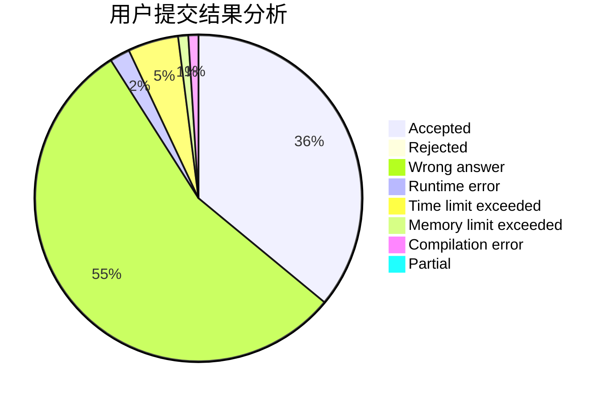
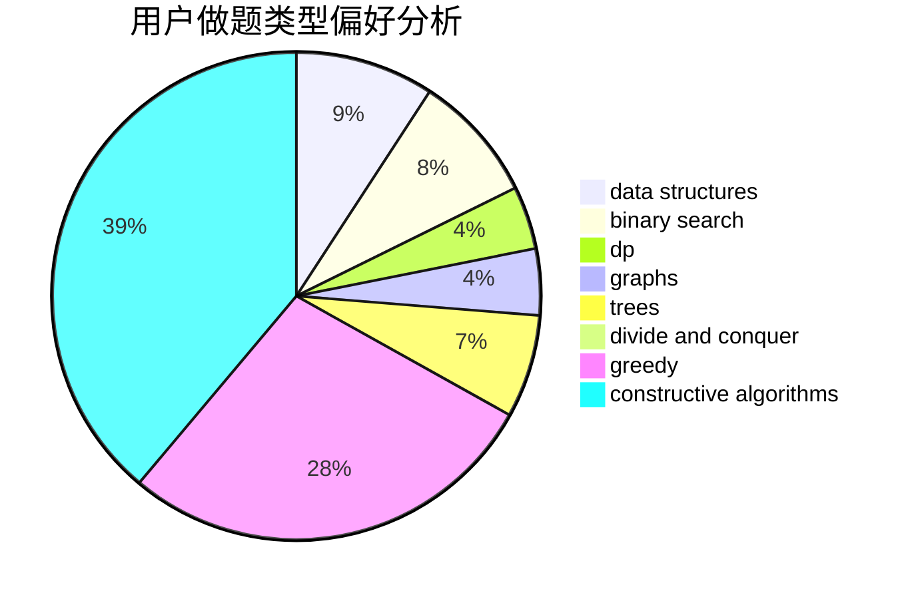
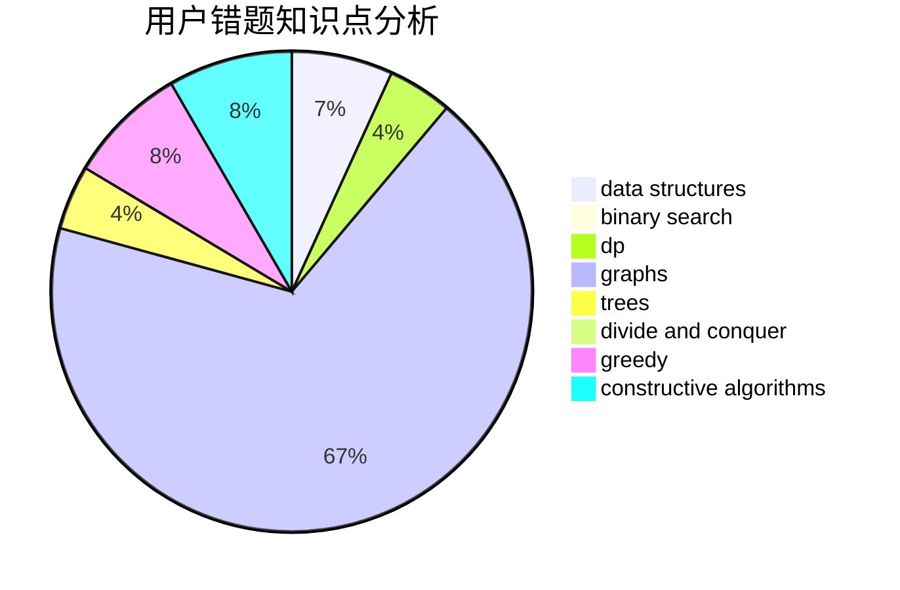

# LJF007

<!-- tabs:start -->

#### **用户提交结果分析**

#### **用户做题类型偏好分析**

#### **用户错题知识点分析**

<!-- tabs:end -->
# 推荐题目
[1167A](https://codeforces.com/contest/1167/problem/A)		brute force,
                        greedy,
                        strings		  
[723A](https://codeforces.com/contest/723/problem/A)		implementation,
                        math,
                        sortings		  
[1142A](https://codeforces.com/contest/1142/problem/A)		brute force,
                        math		  
[789D](https://codeforces.com/contest/789/problem/D)		dsu,graphs,sortings,trees		  
[1453A](https://codeforces.com/contest/1453/problem/A)		implementation		  
[1043G](https://codeforces.com/contest/1043/problem/G)		data structures,
                        divide and conquer,
                        hashing,
                        string suffix structures,
                        strings		  
[887F](https://codeforces.com/contest/887/problem/F)		greedy,
                        sortings		  
[935E](https://codeforces.com/contest/935/problem/E)		dfs and similar,
                        dp,
                        trees		  
[1179B](https://codeforces.com/contest/1179/problem/B)		constructive algorithms		  
[45G](https://codeforces.com/contest/45/problem/G)		number theory		  
