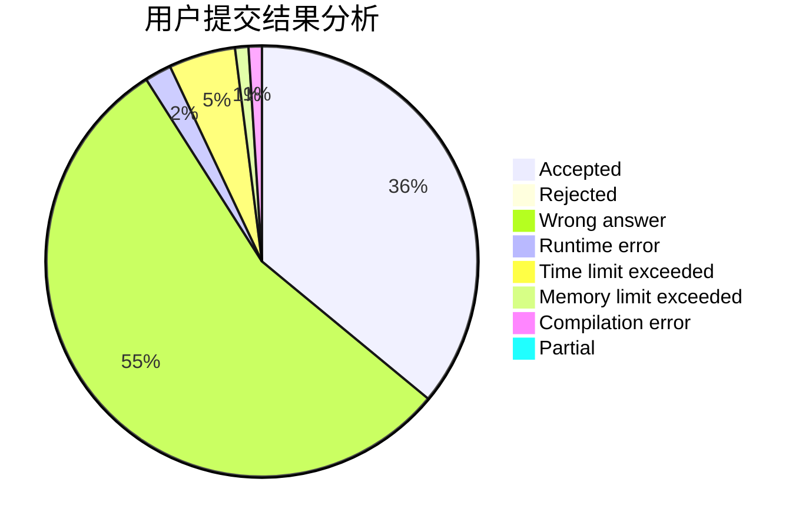
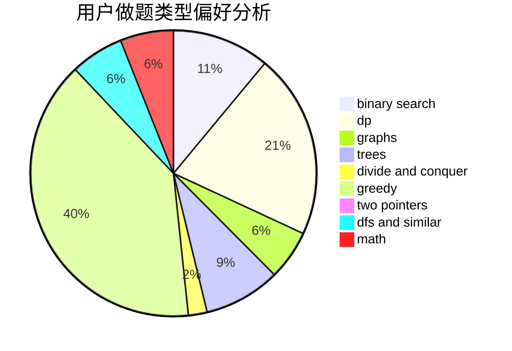

# LJF007

<!-- tabs:start -->

#### **用户提交结果分析**

#### **用户做题类型偏好分析**

<!-- tabs:end -->
# 推荐题目
[1170E](https://codeforces.com/contest/1170/problem/E)
[73C](https://codeforces.com/contest/73/problem/C)
[1144C](https://codeforces.com/contest/1144/problem/C)
[804F](https://codeforces.com/contest/804/problem/F)
[1462C](https://codeforces.com/contest/1462/problem/C)
[1044D](https://codeforces.com/contest/1044/problem/D)
[907B](https://codeforces.com/contest/907/problem/B)
[957D](https://codeforces.com/contest/957/problem/D)
[1182A](https://codeforces.com/contest/1182/problem/A)
[479B](https://codeforces.com/contest/479/problem/B)
