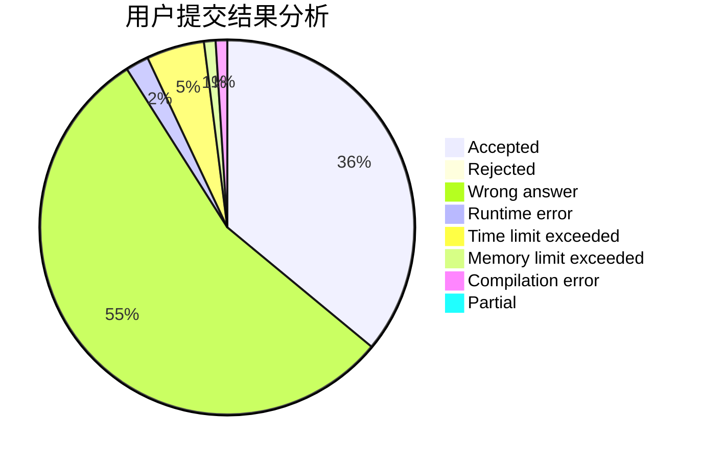
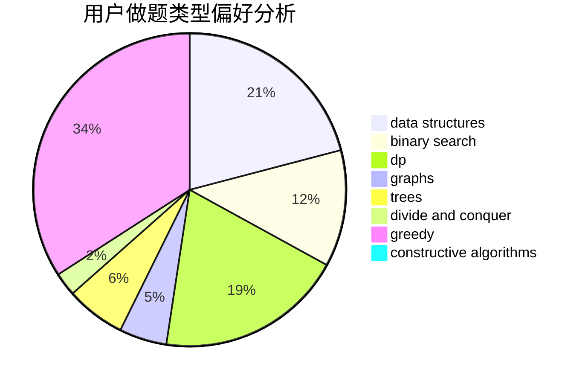
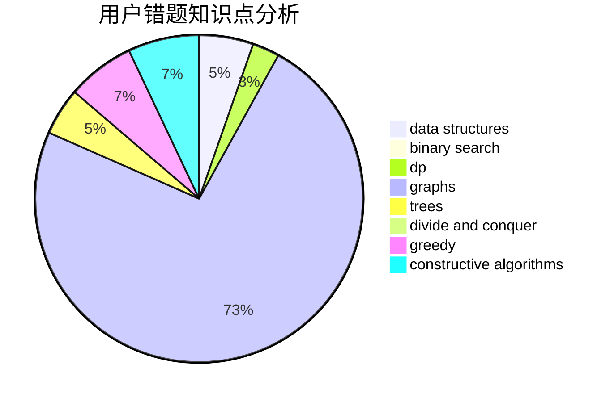

# LJF007

<!-- tabs:start -->

#### **用户提交结果分析**

#### **用户做题类型偏好分析**

#### **用户错题知识点分析**

<!-- tabs:end -->
# 推荐题目
[1170E](https://codeforces.com/contest/1170/problem/E)		*special problem,
                        binary search		  
[73C](https://codeforces.com/contest/73/problem/C)		dp		  
[1144C](https://codeforces.com/contest/1144/problem/C)		constructive algorithms,
                        sortings		  
[804F](https://codeforces.com/contest/804/problem/F)		combinatorics,
                        dfs and similar,
                        dp,
                        graphs,
                        number theory		  
[1462C](https://codeforces.com/contest/1462/problem/C)		brute force,
                        greedy,
                        math		  
[1044D](https://codeforces.com/contest/1044/problem/D)		data structures,
                        dsu		  
[907B](https://codeforces.com/contest/907/problem/B)		implementation		  
[957D](https://codeforces.com/contest/957/problem/D)		dsu,graphs,sortings,trees		  
[1182A](https://codeforces.com/contest/1182/problem/A)		dp,
                        math		  
[479B](https://codeforces.com/contest/479/problem/B)		brute force,
                        constructive algorithms,
                        greedy,
                        implementation,
                        sortings		  
