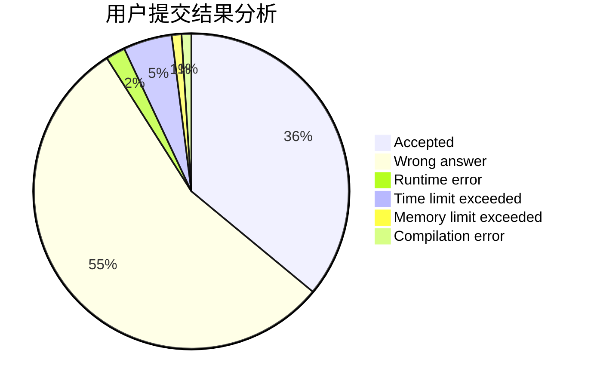
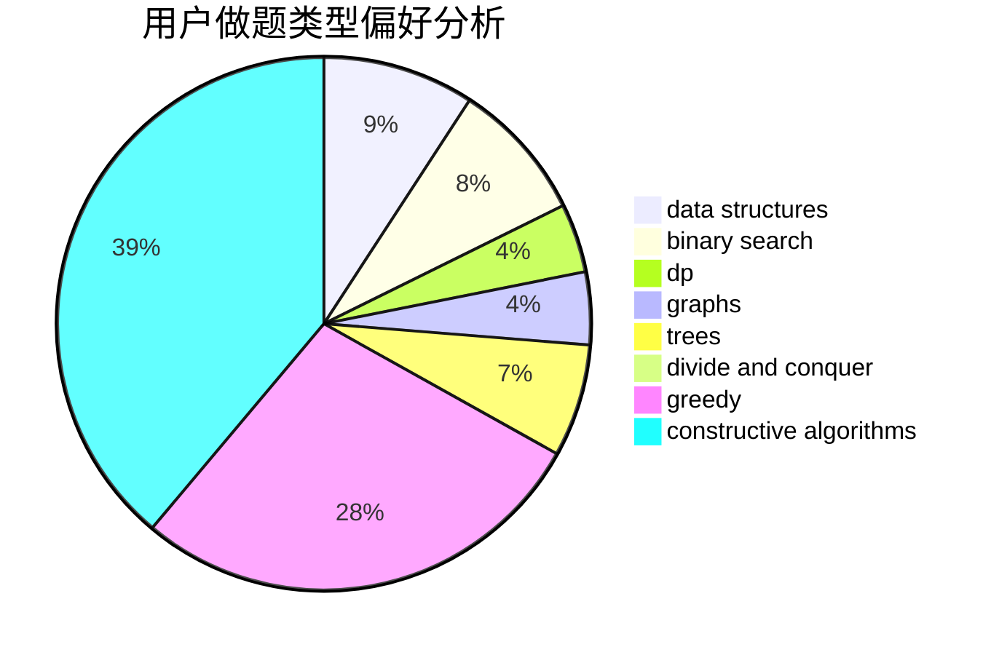
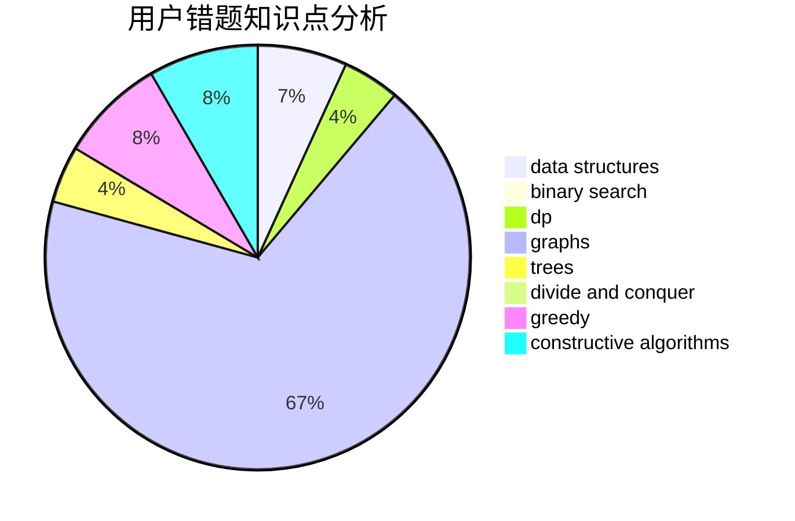

# LJF007
<!-- tabs:start -->
#### **用户提交结果分析**

#### **用户做题类型偏好分析**

#### **用户错题知识点分析**

<!-- tabs:end -->
# 推荐题目
[Weird journey](https://codeforces.com/contest/789/problem/D)		combinatorics,
                        constructive algorithms,
                        dfs and similar,
                        dsu,
                        graphs		  
[Codecraft III](http://codeforces.com/problemset/problem/45/A)		implementation		  
[Speckled Band](http://codeforces.com/problemset/problem/1043/G)		data structures,
                        divide and conquer,
                        hashing,
                        string suffix structures,
                        strings		  
[Telephone Number](http://codeforces.com/problemset/problem/1167/A)		brute force,
                        greedy,
                        strings		  
[A Convex Game](http://codeforces.com/problemset/problem/1434/E)		dsu,
                        games		  
[Pasha and Tea](http://codeforces.com/problemset/problem/557/B)		constructive algorithms,
                        implementation,
                        math,
                        sortings		  
[Yet Another Meme Problem](http://codeforces.com/problemset/problem/1288/B)		math		  
[Row of Models](http://codeforces.com/problemset/problem/887/F)		greedy,
                        sortings		  
[Laboratory Work](http://codeforces.com/problemset/problem/931/C)		implementation,
                        math		  
[Which floor?](https://codeforces.com/contest/861/problem/B)		brute force,
                        implementation		  
<!-- tabs:start -->
#### **data structures**
[Speckled Band](http://codeforces.com/problemset/problem/1043/G)		data structures,
                        divide and conquer,
                        hashing,
                        string suffix structures,
                        strings		  
[Bank Hacking](http://codeforces.com/problemset/problem/796/C)		constructive algorithms,
                        data structures,
                        dp,
                        trees		  
[Sausage Maximization](http://codeforces.com/problemset/problem/282/E)		bitmasks,
                        data structures,
                        trees		  
[Recommendations](https://codeforces.com/contest/1315/problem/D)		data structures,
                        greedy,
                        sortings		  
[Koala and Notebook](http://codeforces.com/problemset/problem/1209/F)		data structures,
                        dfs and similar,
                        graphs,
                        shortest paths,
                        strings,
                        trees		  
[Card Game Again](http://codeforces.com/problemset/problem/818/E)		binary search,
                        data structures,
                        number theory,
                        two pointers		  
[Gosha is hunting](http://codeforces.com/problemset/problem/739/E)		brute force,
                        data structures,
                        dp,
                        flows,
                        math,
                        probabilities,
                        sortings		  
[Minimum Array](http://codeforces.com/problemset/problem/1157/E)		binary search,
                        data structures,
                        greedy		  
[Maximum width](http://codeforces.com/problemset/problem/1492/C)		binary search,
                        data structures,
                        dp,
                        greedy,
                        two pointers		  
[Old Floppy Drive](http://codeforces.com/problemset/problem/1490/G)		binary search,
                        data structures,
                        math		  
#### **binary search**
[DZY Loves Planting](http://codeforces.com/problemset/problem/444/E)		binary search,
                        dsu,
                        trees		  
[Physics Practical](http://codeforces.com/problemset/problem/253/B)		binary search,
                        dp,
                        sortings,
                        two pointers		  
[Card Game Again](http://codeforces.com/problemset/problem/818/E)		binary search,
                        data structures,
                        number theory,
                        two pointers		  
[Minimum Array](http://codeforces.com/problemset/problem/1157/E)		binary search,
                        data structures,
                        greedy		  
[Firecrackers](http://codeforces.com/problemset/problem/1468/D)		binary search,
                        sortings		  
[Maximum width](http://codeforces.com/problemset/problem/1492/C)		binary search,
                        data structures,
                        dp,
                        greedy,
                        two pointers		  
[Pairs](http://codeforces.com/problemset/problem/1463/D)		binary search,
                        constructive algorithms,
                        greedy,
                        two pointers		  
[Old Floppy Drive](http://codeforces.com/problemset/problem/1490/G)		binary search,
                        data structures,
                        math		  
[Odd Mineral Resource](http://codeforces.com/problemset/problem/1479/D)		binary search,
                        bitmasks,
                        brute force,
                        data structures,
                        probabilities,
                        trees		  
[Complicated Computations](http://codeforces.com/problemset/problem/1436/E)		binary search,
                        data structures,
                        two pointers		  
#### **dp**
[Fafa and Ancient Mathematics](http://codeforces.com/problemset/problem/935/E)		dfs and similar,
                        dp,
                        trees		  
[Bank Hacking](http://codeforces.com/problemset/problem/796/C)		constructive algorithms,
                        data structures,
                        dp,
                        trees		  
[The Number of Pairs](http://codeforces.com/problemset/problem/1499/D)		dp,
                        math,
                        number theory		  
[Winter is here](http://codeforces.com/problemset/problem/839/D)		combinatorics,
                        dp,
                        math,
                        number theory		  
[Sequence Sorting](https://codeforces.com/contest/1241/problem/D)		dp,
                        greedy,
                        two pointers		  
[Arpa's weak amphitheater and Mehrdad's valuable Hoses](http://codeforces.com/problemset/problem/741/B)		dfs and similar,
                        dp,
                        dsu		  
[Passports](http://codeforces.com/problemset/problem/1012/F)		dp,
                        implementation		  
[Mateusz and Escape Room](https://codeforces.com/contest/1229/problem/F)		dp		  
[Let's Go Rolling!](http://codeforces.com/problemset/problem/38/E)		dp,
                        sortings		  
[Brand New Problem](http://codeforces.com/problemset/problem/201/D)		bitmasks,
                        brute force,
                        dp		  
#### **graph**
[Weird journey](https://codeforces.com/contest/789/problem/D)		combinatorics,
                        constructive algorithms,
                        dfs and similar,
                        dsu,
                        graphs		  
[Palindrome XOR](https://codeforces.com/contest/1161/problem/D)		dfs and similar,
                        graphs		  
[PolandBall and Forest](http://codeforces.com/problemset/problem/755/C)		dfs and similar,
                        dsu,
                        graphs,
                        interactive,
                        trees		  
[Koala and Notebook](http://codeforces.com/problemset/problem/1209/F)		data structures,
                        dfs and similar,
                        graphs,
                        shortest paths,
                        strings,
                        trees		  
[Minegraphed](http://codeforces.com/problemset/problem/1089/M)		constructive algorithms,
                        graphs		  
[Minimum Ties](http://codeforces.com/problemset/problem/1487/C)		brute force,
                        constructive algorithms,
                        dfs and similar,
                        graphs,
                        greedy,
                        implementation,
                        math		  
[Chef Monocarp](http://codeforces.com/problemset/problem/1437/C)		dp,
                        flows,
                        graph matchings,
                        greedy,
                        math,
                        sortings		  
[Strange Housing](http://codeforces.com/problemset/problem/1470/D)		constructive algorithms,
                        dfs and similar,
                        graph matchings,
                        graphs,
                        greedy		  
[Longest Simple Cycle](http://codeforces.com/problemset/problem/1476/C)		dp,
                        graphs,
                        greedy		  
[Shortest and Longest LIS](http://codeforces.com/problemset/problem/1304/D)		constructive algorithms,
                        graphs,
                        greedy,
                        two pointers		  
#### **trees**
[Fafa and Ancient Mathematics](http://codeforces.com/problemset/problem/935/E)		dfs and similar,
                        dp,
                        trees		  
[Bank Hacking](http://codeforces.com/problemset/problem/796/C)		constructive algorithms,
                        data structures,
                        dp,
                        trees		  
[Sausage Maximization](http://codeforces.com/problemset/problem/282/E)		bitmasks,
                        data structures,
                        trees		  
[Construct the Binary Tree](http://codeforces.com/problemset/problem/1311/E)		brute force,
                        constructive algorithms,
                        trees		  
[PolandBall and Forest](http://codeforces.com/problemset/problem/755/C)		dfs and similar,
                        dsu,
                        graphs,
                        interactive,
                        trees		  
[DZY Loves Planting](http://codeforces.com/problemset/problem/444/E)		binary search,
                        dsu,
                        trees		  
[Koala and Notebook](http://codeforces.com/problemset/problem/1209/F)		data structures,
                        dfs and similar,
                        graphs,
                        shortest paths,
                        strings,
                        trees		  
[Odd Mineral Resource](http://codeforces.com/problemset/problem/1479/D)		binary search,
                        bitmasks,
                        brute force,
                        data structures,
                        probabilities,
                        trees		  
[Yet Another Card Deck](http://codeforces.com/problemset/problem/1511/C)		brute force,
                        data structures,
                        implementation,
                        trees		  
[Diameter Cuts](http://codeforces.com/problemset/problem/1499/F)		combinatorics,
                        dfs and similar,
                        dp,
                        trees		  
#### **divide and conquer**
[Speckled Band](http://codeforces.com/problemset/problem/1043/G)		data structures,
                        divide and conquer,
                        hashing,
                        string suffix structures,
                        strings		  
[Divide and Summarize](http://codeforces.com/problemset/problem/1461/D)		binary search,
                        brute force,
                        data structures,
                        divide and conquer,
                        implementation,
                        sortings		  
[Song of the Sirens](http://codeforces.com/problemset/problem/1466/G)		combinatorics,
                        divide and conquer,
                        hashing,
                        math,
                        string suffix structures,
                        strings		  
[Permutation Transformation](http://codeforces.com/problemset/problem/1490/D)		dfs and similar,
                        divide and conquer,
                        implementation		  
[Skyline Photo](https://codeforces.com/contest/1483/problem/C)		data structures,
                        divide and conquer,
                        dp		  
[Fib-tree](http://codeforces.com/problemset/problem/1491/E)		brute force,
                        dfs and similar,
                        divide and conquer,
                        number theory,
                        trees		  
[Sum of Prefix Sums](http://codeforces.com/problemset/problem/1303/G)		data structures,
                        divide and conquer,
                        geometry,
                        trees		  
[Dogeforces](http://codeforces.com/problemset/problem/1494/D)		constructive algorithms,
                        data structures,
                        dfs and similar,
                        divide and conquer,
                        dsu,
                        greedy,
                        sortings,
                        trees		  
[Logistical Questions](http://codeforces.com/problemset/problem/566/C)		dfs and similar,
                        divide and conquer,
                        trees		  
[Fruit Sequences](http://codeforces.com/problemset/problem/1428/F)		binary search,
                        data structures,
                        divide and conquer,
                        dp,
                        two pointers		  
#### **greedy**
[Telephone Number](http://codeforces.com/problemset/problem/1167/A)		brute force,
                        greedy,
                        strings		  
[Row of Models](http://codeforces.com/problemset/problem/887/F)		greedy,
                        sortings		  
[Bicolored RBS](http://codeforces.com/problemset/problem/1167/D)		constructive algorithms,
                        greedy		  
[Dreamoon and Sets](https://codeforces.com/contest/477/problem/B)		constructive algorithms,
                        greedy,
                        math		  
[Sequence Sorting](https://codeforces.com/contest/1241/problem/D)		dp,
                        greedy,
                        two pointers		  
[Recommendations](https://codeforces.com/contest/1315/problem/D)		data structures,
                        greedy,
                        sortings		  
[Duff and Meat](http://codeforces.com/problemset/problem/588/A)		greedy		  
[Good Numbers (easy version)](http://codeforces.com/problemset/problem/1249/C1)		brute force,
                        greedy,
                        implementation		  
[Minimum Array](http://codeforces.com/problemset/problem/1157/E)		binary search,
                        data structures,
                        greedy		  
[Array Product](http://codeforces.com/problemset/problem/1042/C)		constructive algorithms,
                        greedy,
                        math		  
#### **constructive algorithms**
[Weird journey](https://codeforces.com/contest/789/problem/D)		combinatorics,
                        constructive algorithms,
                        dfs and similar,
                        dsu,
                        graphs		  
[Pasha and Tea](http://codeforces.com/problemset/problem/557/B)		constructive algorithms,
                        implementation,
                        math,
                        sortings		  
[Bank Hacking](http://codeforces.com/problemset/problem/796/C)		constructive algorithms,
                        data structures,
                        dp,
                        trees		  
[Bicolored RBS](http://codeforces.com/problemset/problem/1167/D)		constructive algorithms,
                        greedy		  
[Cards](http://codeforces.com/problemset/problem/398/A)		constructive algorithms,
                        implementation		  
[Construct the Binary Tree](http://codeforces.com/problemset/problem/1311/E)		brute force,
                        constructive algorithms,
                        trees		  
[Tolik and His Uncle](http://codeforces.com/problemset/problem/1179/B)		constructive algorithms		  
[Dreamoon and Sets](https://codeforces.com/contest/477/problem/B)		constructive algorithms,
                        greedy,
                        math		  
[Minegraphed](http://codeforces.com/problemset/problem/1089/M)		constructive algorithms,
                        graphs		  
[Array Product](http://codeforces.com/problemset/problem/1042/C)		constructive algorithms,
                        greedy,
                        math		  
#### **sortings**
[Pasha and Tea](http://codeforces.com/problemset/problem/557/B)		constructive algorithms,
                        implementation,
                        math,
                        sortings		  
[Row of Models](http://codeforces.com/problemset/problem/887/F)		greedy,
                        sortings		  
[Recommendations](https://codeforces.com/contest/1315/problem/D)		data structures,
                        greedy,
                        sortings		  
[Physical Education](http://codeforces.com/problemset/problem/53/D)		sortings		  
[Let's Go Rolling!](http://codeforces.com/problemset/problem/38/E)		dp,
                        sortings		  
[The New Year: Meeting Friends](http://codeforces.com/problemset/problem/723/A)		implementation,
                        math,
                        sortings		  
[Physics Practical](http://codeforces.com/problemset/problem/253/B)		binary search,
                        dp,
                        sortings,
                        two pointers		  
[Gosha is hunting](http://codeforces.com/problemset/problem/739/E)		brute force,
                        data structures,
                        dp,
                        flows,
                        math,
                        probabilities,
                        sortings		  
[Firecrackers](http://codeforces.com/problemset/problem/1468/D)		binary search,
                        sortings		  
[Diamond Miner](https://codeforces.com/contest/1496/problem/C)		geometry,
                        greedy,
                        math,
                        sortings		  
<!-- tabs:end -->
