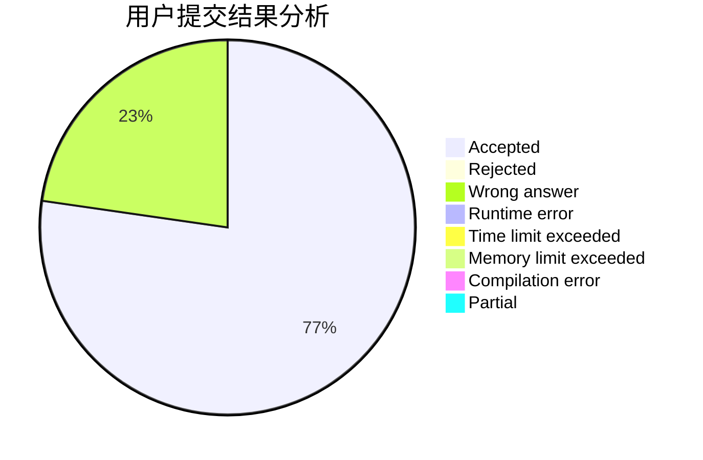
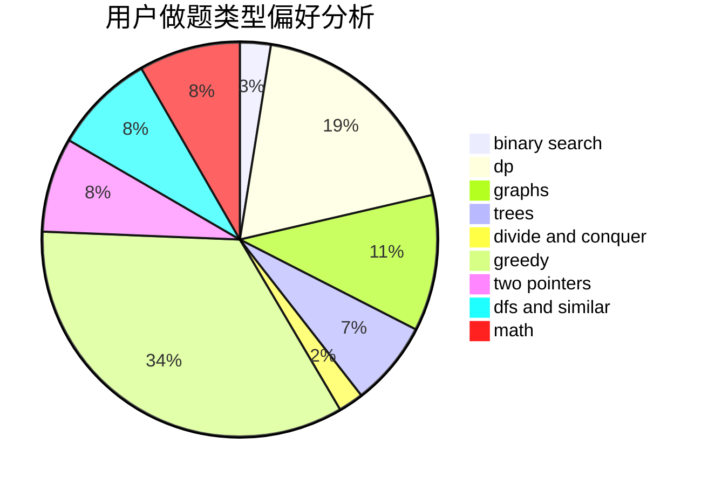

# 536952

<!-- tabs:start -->

#### **用户提交结果分析**

#### **用户做题类型偏好分析**

<!-- tabs:end -->
# 推荐题目
[1383A](https://codeforces.com/contest/1383/problem/A)
[1388B](https://codeforces.com/contest/1388/problem/B)
[1384A](https://codeforces.com/contest/1384/problem/A)
[1386B](https://codeforces.com/contest/1386/problem/B)
[1091H](https://codeforces.com/contest/1091/problem/H)
[1389E](https://codeforces.com/contest/1389/problem/E)
[1073C](https://codeforces.com/contest/1073/problem/C)
[1163D](https://codeforces.com/contest/1163/problem/D)
[1388E](https://codeforces.com/contest/1388/problem/E)
[1385G](https://codeforces.com/contest/1385/problem/G)
