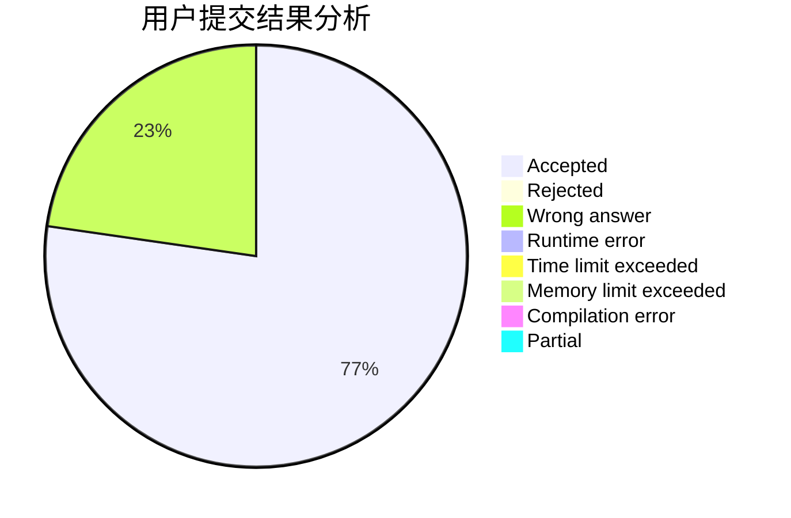
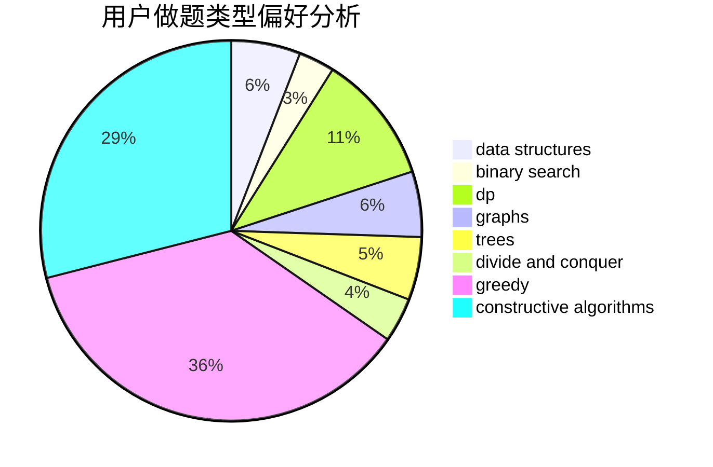

# 536952
<!-- tabs:start -->
#### **用户提交结果分析**

#### **用户做题类型偏好分析**

#### **用户错题知识点分析**

<!-- tabs:end -->
# 推荐题目
[Huawei Graph Mining Challenge](https://codeforces.com/contest/1377/problem/A1)		nan		  
[Dubious Cyrpto](http://codeforces.com/problemset/problem/1379/B)		binary search,
                        brute force,
                        math,
                        number theory		  
[Hide and Seek](https://codeforces.com/contest/1161/problem/A)		graphs		  
[Circular Dungeon](http://codeforces.com/problemset/problem/1380/G)		greedy,
                        math,
                        probabilities		  
[New Year and the Acquaintance Estimation](http://codeforces.com/problemset/problem/1091/E)		binary search,
                        data structures,
                        graphs,
                        greedy,
                        implementation,
                        math,
                        sortings		  
[Sum of Prefix Sums](http://codeforces.com/problemset/problem/1303/G)		data structures,
                        divide and conquer,
                        geometry,
                        trees		  
[Maximal Independent Set](https://codeforces.com/contest/1376/problem/B3)		nan		  
[Huawei Graph Mining Challenge](https://codeforces.com/contest/1378/problem/A2)		nan		  
[Palindromes](http://codeforces.com/problemset/problem/137/D)		dp,
                        strings		  
[Integer Game](http://codeforces.com/problemset/problem/1375/F)		constructive algorithms,
                        games,
                        interactive,
                        math		  
<!-- tabs:start -->
#### **data structures**
[Huawei Graph Mining Challenge](http://codeforces.com/problemset/problem/1091/E)		binary search,
                        data structures,
                        graphs,
                        greedy,
                        implementation,
                        math,
                        sortings		  
[Dubious Cyrpto](http://codeforces.com/problemset/problem/1303/G)		data structures,
                        divide and conquer,
                        geometry,
                        trees		  
[Hide and Seek](http://codeforces.com/problemset/problem/1380/E)		data structures,
                        dsu,
                        implementation,
                        trees		  
[Circular Dungeon](http://codeforces.com/problemset/problem/1167/F)		combinatorics,
                        data structures,
                        math,
                        sortings		  
[New Year and the Acquaintance Estimation](http://codeforces.com/problemset/problem/1379/C)		binary search,
                        brute force,
                        data structures,
                        dfs and similar,
                        dp,
                        greedy,
                        sortings,
                        two pointers		  
[Sum of Prefix Sums](http://codeforces.com/problemset/problem/1374/E2)		data structures,
                        greedy,
                        implementation,
                        sortings,
                        ternary search,
                        two pointers		  
[Maximal Independent Set](http://codeforces.com/problemset/problem/1379/F2)		data structures,
                        divide and conquer		  
[Huawei Graph Mining Challenge](http://codeforces.com/problemset/problem/1381/A1)		constructive algorithms,
                        data structures,
                        strings		  
[Palindromes](http://codeforces.com/problemset/problem/1375/C)		constructive algorithms,
                        data structures,
                        greedy		  
[Integer Game](http://codeforces.com/problemset/problem/1380/F)		data structures,
                        dp,
                        matrices		  
#### **binary search**
[Huawei Graph Mining Challenge](http://codeforces.com/problemset/problem/1379/B)		binary search,
                        brute force,
                        math,
                        number theory		  
[Dubious Cyrpto](http://codeforces.com/problemset/problem/1091/E)		binary search,
                        data structures,
                        graphs,
                        greedy,
                        implementation,
                        math,
                        sortings		  
[Hide and Seek](http://codeforces.com/problemset/problem/1288/A)		binary search,
                        brute force,
                        math,
                        ternary search		  
[Circular Dungeon](https://codeforces.com/contest/1362/problem/F)		binary search,
                        bitmasks,
                        constructive algorithms,
                        dfs and similar,
                        dsu,
                        graphs		  
[New Year and the Acquaintance Estimation](http://codeforces.com/problemset/problem/1379/C)		binary search,
                        brute force,
                        data structures,
                        dfs and similar,
                        dp,
                        greedy,
                        sortings,
                        two pointers		  
[Sum of Prefix Sums](http://codeforces.com/problemset/problem/1336/B)		binary search,
                        greedy,
                        math,
                        sortings,
                        two pointers		  
[Maximal Independent Set](http://codeforces.com/problemset/problem/1202/F)		binary search,
                        implementation,
                        math		  
[Huawei Graph Mining Challenge](http://codeforces.com/problemset/problem/1379/D)		binary search,
                        brute force,
                        data structures,
                        sortings,
                        two pointers		  
[Palindromes](http://codeforces.com/problemset/problem/1379/F1)		binary search,
                        data structures		  
[Integer Game](http://codeforces.com/problemset/problem/1492/C)		binary search,
                        data structures,
                        dp,
                        greedy,
                        two pointers		  
#### **dp**
[Huawei Graph Mining Challenge](http://codeforces.com/problemset/problem/137/D)		dp,
                        strings		  
[Dubious Cyrpto](http://codeforces.com/problemset/problem/1379/E)		constructive algorithms,
                        divide and conquer,
                        dp,
                        math,
                        trees		  
[Hide and Seek](http://codeforces.com/problemset/problem/1379/C)		binary search,
                        brute force,
                        data structures,
                        dfs and similar,
                        dp,
                        greedy,
                        sortings,
                        two pointers		  
[Circular Dungeon](http://codeforces.com/problemset/problem/1252/J)		brute force,
                        dp		  
[New Year and the Acquaintance Estimation](http://codeforces.com/problemset/problem/1380/F)		data structures,
                        dp,
                        matrices		  
[Sum of Prefix Sums](http://codeforces.com/problemset/problem/1380/C)		brute force,
                        dp,
                        greedy,
                        implementation,
                        sortings		  
[Maximal Independent Set](http://codeforces.com/problemset/problem/1326/F1)		bitmasks,
                        brute force,
                        dp,
                        meet-in-the-middle		  
[Huawei Graph Mining Challenge](http://codeforces.com/problemset/problem/1120/C)		dp,
                        strings		  
[Palindromes](http://codeforces.com/problemset/problem/1492/C)		binary search,
                        data structures,
                        dp,
                        greedy,
                        two pointers		  
[Integer Game](https://codeforces.com/contest/1457/problem/C)		brute force,
                        dp,
                        implementation		  
#### **graph**
[Huawei Graph Mining Challenge](https://codeforces.com/contest/1161/problem/A)		graphs		  
[Dubious Cyrpto](http://codeforces.com/problemset/problem/1091/E)		binary search,
                        data structures,
                        graphs,
                        greedy,
                        implementation,
                        math,
                        sortings		  
[Hide and Seek](https://codeforces.com/contest/1362/problem/F)		binary search,
                        bitmasks,
                        constructive algorithms,
                        dfs and similar,
                        dsu,
                        graphs		  
[Circular Dungeon](http://codeforces.com/problemset/problem/1375/G)		brute force,
                        constructive algorithms,
                        dfs and similar,
                        graph matchings,
                        graphs,
                        trees		  
[New Year and the Acquaintance Estimation](http://codeforces.com/problemset/problem/1284/G)		graphs		  
[Sum of Prefix Sums](http://codeforces.com/problemset/problem/1327/D)		brute force,
                        dfs and similar,
                        graphs,
                        math,
                        number theory		  
[Maximal Independent Set](http://codeforces.com/problemset/problem/1364/D)		constructive algorithms,
                        dfs and similar,
                        graphs,
                        greedy,
                        implementation,
                        trees		  
[Huawei Graph Mining Challenge](http://codeforces.com/problemset/problem/1487/C)		brute force,
                        constructive algorithms,
                        dfs and similar,
                        graphs,
                        greedy,
                        implementation,
                        math		  
[Palindromes](http://codeforces.com/problemset/problem/1437/C)		dp,
                        flows,
                        graph matchings,
                        greedy,
                        math,
                        sortings		  
[Integer Game](http://codeforces.com/problemset/problem/1470/D)		constructive algorithms,
                        dfs and similar,
                        graph matchings,
                        graphs,
                        greedy		  
#### **trees**
[Huawei Graph Mining Challenge](http://codeforces.com/problemset/problem/1303/G)		data structures,
                        divide and conquer,
                        geometry,
                        trees		  
[Dubious Cyrpto](http://codeforces.com/problemset/problem/1379/E)		constructive algorithms,
                        divide and conquer,
                        dp,
                        math,
                        trees		  
[Hide and Seek](http://codeforces.com/problemset/problem/1380/E)		data structures,
                        dsu,
                        implementation,
                        trees		  
[Circular Dungeon](http://codeforces.com/problemset/problem/1375/G)		brute force,
                        constructive algorithms,
                        dfs and similar,
                        graph matchings,
                        graphs,
                        trees		  
[New Year and the Acquaintance Estimation](http://codeforces.com/problemset/problem/1188/A2)		constructive algorithms,
                        dfs and similar,
                        implementation,
                        trees		  
[Sum of Prefix Sums](http://codeforces.com/problemset/problem/1364/D)		constructive algorithms,
                        dfs and similar,
                        graphs,
                        greedy,
                        implementation,
                        trees		  
[Maximal Independent Set](http://codeforces.com/problemset/problem/1479/D)		binary search,
                        bitmasks,
                        brute force,
                        data structures,
                        probabilities,
                        trees		  
[Huawei Graph Mining Challenge](http://codeforces.com/problemset/problem/1511/C)		brute force,
                        data structures,
                        implementation,
                        trees		  
[Palindromes](http://codeforces.com/problemset/problem/1499/F)		combinatorics,
                        dfs and similar,
                        dp,
                        trees		  
[Integer Game](http://codeforces.com/problemset/problem/1491/E)		brute force,
                        dfs and similar,
                        divide and conquer,
                        number theory,
                        trees		  
#### **divide and conquer**
[Huawei Graph Mining Challenge](http://codeforces.com/problemset/problem/1303/G)		data structures,
                        divide and conquer,
                        geometry,
                        trees		  
[Dubious Cyrpto](http://codeforces.com/problemset/problem/1379/E)		constructive algorithms,
                        divide and conquer,
                        dp,
                        math,
                        trees		  
[Hide and Seek](http://codeforces.com/problemset/problem/1379/F2)		data structures,
                        divide and conquer		  
[Circular Dungeon](http://codeforces.com/problemset/problem/1375/H)		constructive algorithms,
                        divide and conquer		  
[New Year and the Acquaintance Estimation](http://codeforces.com/problemset/problem/1175/F)		brute force,
                        data structures,
                        divide and conquer,
                        hashing,
                        math		  
[Sum of Prefix Sums](http://codeforces.com/problemset/problem/1461/D)		binary search,
                        brute force,
                        data structures,
                        divide and conquer,
                        implementation,
                        sortings		  
[Maximal Independent Set](http://codeforces.com/problemset/problem/1466/G)		combinatorics,
                        divide and conquer,
                        hashing,
                        math,
                        string suffix structures,
                        strings		  
[Huawei Graph Mining Challenge](http://codeforces.com/problemset/problem/1490/D)		dfs and similar,
                        divide and conquer,
                        implementation		  
[Palindromes](https://codeforces.com/contest/1483/problem/C)		data structures,
                        divide and conquer,
                        dp		  
[Integer Game](http://codeforces.com/problemset/problem/1491/E)		brute force,
                        dfs and similar,
                        divide and conquer,
                        number theory,
                        trees		  
#### **greedy**
[Huawei Graph Mining Challenge](http://codeforces.com/problemset/problem/1380/G)		greedy,
                        math,
                        probabilities		  
[Dubious Cyrpto](http://codeforces.com/problemset/problem/1091/E)		binary search,
                        data structures,
                        graphs,
                        greedy,
                        implementation,
                        math,
                        sortings		  
[Hide and Seek](http://codeforces.com/problemset/problem/1374/C)		greedy,
                        strings		  
[Circular Dungeon](https://codeforces.com/contest/1072/problem/D)		greedy		  
[New Year and the Acquaintance Estimation](http://codeforces.com/problemset/problem/1380/B)		greedy		  
[Sum of Prefix Sums](http://codeforces.com/problemset/problem/1379/C)		binary search,
                        brute force,
                        data structures,
                        dfs and similar,
                        dp,
                        greedy,
                        sortings,
                        two pointers		  
[Maximal Independent Set](http://codeforces.com/problemset/problem/1374/E2)		data structures,
                        greedy,
                        implementation,
                        sortings,
                        ternary search,
                        two pointers		  
[Huawei Graph Mining Challenge](http://codeforces.com/problemset/problem/1336/B)		binary search,
                        greedy,
                        math,
                        sortings,
                        two pointers		  
[Palindromes](http://codeforces.com/problemset/problem/1375/B)		constructive algorithms,
                        greedy		  
[Integer Game](http://codeforces.com/problemset/problem/1375/C)		constructive algorithms,
                        data structures,
                        greedy		  
#### **constructive algorithms**
[Huawei Graph Mining Challenge](http://codeforces.com/problemset/problem/1375/F)		constructive algorithms,
                        games,
                        interactive,
                        math		  
[Dubious Cyrpto](https://codeforces.com/contest/1362/problem/F)		binary search,
                        bitmasks,
                        constructive algorithms,
                        dfs and similar,
                        dsu,
                        graphs		  
[Hide and Seek](http://codeforces.com/problemset/problem/1379/E)		constructive algorithms,
                        divide and conquer,
                        dp,
                        math,
                        trees		  
[Circular Dungeon](http://codeforces.com/problemset/problem/1375/G)		brute force,
                        constructive algorithms,
                        dfs and similar,
                        graph matchings,
                        graphs,
                        trees		  
[New Year and the Acquaintance Estimation](http://codeforces.com/problemset/problem/1381/A1)		constructive algorithms,
                        data structures,
                        strings		  
[Sum of Prefix Sums](http://codeforces.com/problemset/problem/1375/H)		constructive algorithms,
                        divide and conquer		  
[Maximal Independent Set](http://codeforces.com/problemset/problem/1375/B)		constructive algorithms,
                        greedy		  
[Huawei Graph Mining Challenge](http://codeforces.com/problemset/problem/1375/C)		constructive algorithms,
                        data structures,
                        greedy		  
[Palindromes](http://codeforces.com/problemset/problem/1188/A2)		constructive algorithms,
                        dfs and similar,
                        implementation,
                        trees		  
[Integer Game](http://codeforces.com/problemset/problem/1375/A)		constructive algorithms,
                        math		  
#### **sortings**
[Huawei Graph Mining Challenge](http://codeforces.com/problemset/problem/1091/E)		binary search,
                        data structures,
                        graphs,
                        greedy,
                        implementation,
                        math,
                        sortings		  
[Dubious Cyrpto](http://codeforces.com/problemset/problem/1167/F)		combinatorics,
                        data structures,
                        math,
                        sortings		  
[Hide and Seek](http://codeforces.com/problemset/problem/1379/C)		binary search,
                        brute force,
                        data structures,
                        dfs and similar,
                        dp,
                        greedy,
                        sortings,
                        two pointers		  
[Circular Dungeon](http://codeforces.com/problemset/problem/1374/E2)		data structures,
                        greedy,
                        implementation,
                        sortings,
                        ternary search,
                        two pointers		  
[New Year and the Acquaintance Estimation](http://codeforces.com/problemset/problem/1336/B)		binary search,
                        greedy,
                        math,
                        sortings,
                        two pointers		  
[Sum of Prefix Sums](http://codeforces.com/problemset/problem/1379/D)		binary search,
                        brute force,
                        data structures,
                        sortings,
                        two pointers		  
[Maximal Independent Set](http://codeforces.com/problemset/problem/1374/E1)		data structures,
                        greedy,
                        sortings		  
[Huawei Graph Mining Challenge](http://codeforces.com/problemset/problem/1374/F)		brute force,
                        constructive algorithms,
                        implementation,
                        sortings		  
[Palindromes](http://codeforces.com/problemset/problem/1375/E)		constructive algorithms,
                        greedy,
                        sortings		  
[Integer Game](http://codeforces.com/problemset/problem/1375/D)		brute force,
                        constructive algorithms,
                        sortings		  
<!-- tabs:end -->
