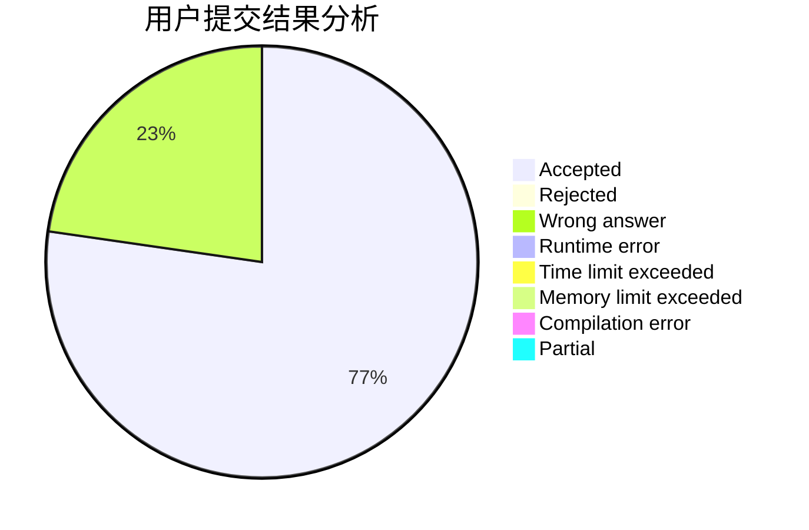
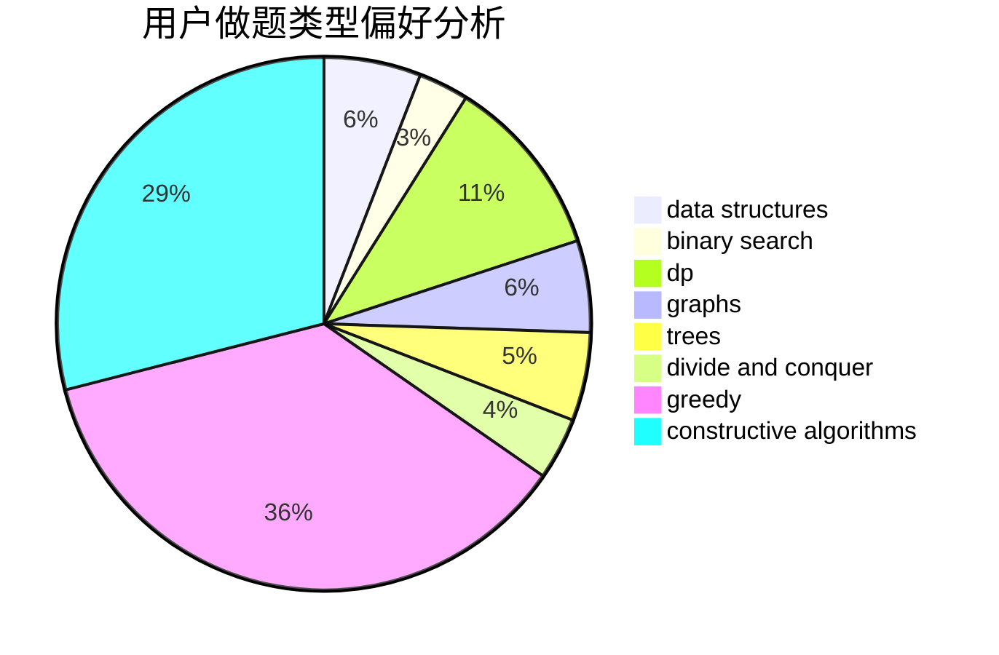

# 536952
<!-- tabs:start -->
#### **用户提交结果分析**

#### **用户做题类型偏好分析**

#### **用户错题知识点分析**

<!-- tabs:end -->
# 推荐题目
[Huawei Graph Mining Challenge](https://codeforces.com/contest/1377/problem/A1)		nan		  
[Dubious Cyrpto](http://codeforces.com/problemset/problem/1379/B)		binary search,
                        brute force,
                        math,
                        number theory		  
[Hide and Seek](https://codeforces.com/contest/1161/problem/A)		graphs		  
[Circular Dungeon](http://codeforces.com/problemset/problem/1380/G)		greedy,
                        math,
                        probabilities		  
[New Year and the Acquaintance Estimation](http://codeforces.com/problemset/problem/1091/E)		binary search,
                        data structures,
                        graphs,
                        greedy,
                        implementation,
                        math,
                        sortings		  
[Sum of Prefix Sums](http://codeforces.com/problemset/problem/1303/G)		data structures,
                        divide and conquer,
                        geometry,
                        trees		  
[Maximal Independent Set](https://codeforces.com/contest/1376/problem/B3)		nan		  
[Palindromes](http://codeforces.com/problemset/problem/137/D)		dp,
                        strings		  
[Integer Game](http://codeforces.com/problemset/problem/1375/F)		constructive algorithms,
                        games,
                        interactive,
                        math		  
<!-- tabs:start -->
#### **data structures**
[New Year and the Acquaintance Estimation](http://codeforces.com/problemset/problem/1091/E)		binary search,
                        data structures,
                        graphs,
                        greedy,
                        implementation,
                        math,
                        sortings		  
[Sum of Prefix Sums](http://codeforces.com/problemset/problem/1303/G)		data structures,
                        divide and conquer,
                        geometry,
                        trees		  
[Merging Towers](http://codeforces.com/problemset/problem/1380/E)		data structures,
                        dsu,
                        implementation,
                        trees		  
[Scalar Queries](http://codeforces.com/problemset/problem/1167/F)		combinatorics,
                        data structures,
                        math,
                        sortings		  
[Choosing flowers](http://codeforces.com/problemset/problem/1379/C)		binary search,
                        brute force,
                        data structures,
                        dfs and similar,
                        dp,
                        greedy,
                        sortings,
                        two pointers		  
[Reading Books (hard version)](http://codeforces.com/problemset/problem/1374/E2)		data structures,
                        greedy,
                        implementation,
                        sortings,
                        ternary search,
                        two pointers		  
[Chess Strikes Back (hard version)](http://codeforces.com/problemset/problem/1379/F2)		data structures,
                        divide and conquer		  
[Prefix Flip (Easy Version)](http://codeforces.com/problemset/problem/1381/A1)		constructive algorithms,
                        data structures,
                        strings		  
[Element Extermination](http://codeforces.com/problemset/problem/1375/C)		constructive algorithms,
                        data structures,
                        greedy		  
[Strange Addition](http://codeforces.com/problemset/problem/1380/F)		data structures,
                        dp,
                        matrices		  
#### **binary search**
[Dubious Cyrpto](http://codeforces.com/problemset/problem/1379/B)		binary search,
                        brute force,
                        math,
                        number theory		  
[New Year and the Acquaintance Estimation](http://codeforces.com/problemset/problem/1091/E)		binary search,
                        data structures,
                        graphs,
                        greedy,
                        implementation,
                        math,
                        sortings		  
[Deadline](http://codeforces.com/problemset/problem/1288/A)		binary search,
                        brute force,
                        math,
                        ternary search		  
[Johnny and Megan's Necklace](https://codeforces.com/contest/1362/problem/F)		binary search,
                        bitmasks,
                        constructive algorithms,
                        dfs and similar,
                        dsu,
                        graphs		  
[Choosing flowers](http://codeforces.com/problemset/problem/1379/C)		binary search,
                        brute force,
                        data structures,
                        dfs and similar,
                        dp,
                        greedy,
                        sortings,
                        two pointers		  
[Xenia and Colorful Gems](http://codeforces.com/problemset/problem/1336/B)		binary search,
                        greedy,
                        math,
                        sortings,
                        two pointers		  
[You Are Given Some Letters...](http://codeforces.com/problemset/problem/1202/F)		binary search,
                        implementation,
                        math		  
[New Passenger Trams](http://codeforces.com/problemset/problem/1379/D)		binary search,
                        brute force,
                        data structures,
                        sortings,
                        two pointers		  
[Chess Strikes Back (easy version)](http://codeforces.com/problemset/problem/1379/F1)		binary search,
                        data structures		  
[Maximum width](http://codeforces.com/problemset/problem/1492/C)		binary search,
                        data structures,
                        dp,
                        greedy,
                        two pointers		  
#### **dp**
[Palindromes](http://codeforces.com/problemset/problem/137/D)		dp,
                        strings		  
[Inverse Genealogy](http://codeforces.com/problemset/problem/1379/E)		constructive algorithms,
                        divide and conquer,
                        dp,
                        math,
                        trees		  
[Choosing flowers](http://codeforces.com/problemset/problem/1379/C)		binary search,
                        brute force,
                        data structures,
                        dfs and similar,
                        dp,
                        greedy,
                        sortings,
                        two pointers		  
[Tiling Terrace](http://codeforces.com/problemset/problem/1252/J)		brute force,
                        dp		  
[Strange Addition](http://codeforces.com/problemset/problem/1380/F)		data structures,
                        dp,
                        matrices		  
[Create The Teams](http://codeforces.com/problemset/problem/1380/C)		brute force,
                        dp,
                        greedy,
                        implementation,
                        sortings		  
[Wise Men (Easy Version)](http://codeforces.com/problemset/problem/1326/F1)		bitmasks,
                        brute force,
                        dp,
                        meet-in-the-middle		  
[Compress String](http://codeforces.com/problemset/problem/1120/C)		dp,
                        strings		  
[Maximum width](http://codeforces.com/problemset/problem/1492/C)		binary search,
                        data structures,
                        dp,
                        greedy,
                        two pointers		  
[Bouncing Ball](https://codeforces.com/contest/1457/problem/C)		brute force,
                        dp,
                        implementation		  
#### **graph**
[Hide and Seek](https://codeforces.com/contest/1161/problem/A)		graphs		  
[New Year and the Acquaintance Estimation](http://codeforces.com/problemset/problem/1091/E)		binary search,
                        data structures,
                        graphs,
                        greedy,
                        implementation,
                        math,
                        sortings		  
[Johnny and Megan's Necklace](https://codeforces.com/contest/1362/problem/F)		binary search,
                        bitmasks,
                        constructive algorithms,
                        dfs and similar,
                        dsu,
                        graphs		  
[Tree Modification](http://codeforces.com/problemset/problem/1375/G)		brute force,
                        constructive algorithms,
                        dfs and similar,
                        graph matchings,
                        graphs,
                        trees		  
[Seollal](http://codeforces.com/problemset/problem/1284/G)		graphs		  
[Infinite Path](http://codeforces.com/problemset/problem/1327/D)		brute force,
                        dfs and similar,
                        graphs,
                        math,
                        number theory		  
[Ehab's Last Corollary](http://codeforces.com/problemset/problem/1364/D)		constructive algorithms,
                        dfs and similar,
                        graphs,
                        greedy,
                        implementation,
                        trees		  
[Minimum Ties](http://codeforces.com/problemset/problem/1487/C)		brute force,
                        constructive algorithms,
                        dfs and similar,
                        graphs,
                        greedy,
                        implementation,
                        math		  
[Chef Monocarp](http://codeforces.com/problemset/problem/1437/C)		dp,
                        flows,
                        graph matchings,
                        greedy,
                        math,
                        sortings		  
[Strange Housing](http://codeforces.com/problemset/problem/1470/D)		constructive algorithms,
                        dfs and similar,
                        graph matchings,
                        graphs,
                        greedy		  
#### **trees**
[Sum of Prefix Sums](http://codeforces.com/problemset/problem/1303/G)		data structures,
                        divide and conquer,
                        geometry,
                        trees		  
[Inverse Genealogy](http://codeforces.com/problemset/problem/1379/E)		constructive algorithms,
                        divide and conquer,
                        dp,
                        math,
                        trees		  
[Merging Towers](http://codeforces.com/problemset/problem/1380/E)		data structures,
                        dsu,
                        implementation,
                        trees		  
[Tree Modification](http://codeforces.com/problemset/problem/1375/G)		brute force,
                        constructive algorithms,
                        dfs and similar,
                        graph matchings,
                        graphs,
                        trees		  
[Add on a Tree: Revolution](http://codeforces.com/problemset/problem/1188/A2)		constructive algorithms,
                        dfs and similar,
                        implementation,
                        trees		  
[Ehab's Last Corollary](http://codeforces.com/problemset/problem/1364/D)		constructive algorithms,
                        dfs and similar,
                        graphs,
                        greedy,
                        implementation,
                        trees		  
[Odd Mineral Resource](http://codeforces.com/problemset/problem/1479/D)		binary search,
                        bitmasks,
                        brute force,
                        data structures,
                        probabilities,
                        trees		  
[Yet Another Card Deck](http://codeforces.com/problemset/problem/1511/C)		brute force,
                        data structures,
                        implementation,
                        trees		  
[Diameter Cuts](http://codeforces.com/problemset/problem/1499/F)		combinatorics,
                        dfs and similar,
                        dp,
                        trees		  
[Fib-tree](http://codeforces.com/problemset/problem/1491/E)		brute force,
                        dfs and similar,
                        divide and conquer,
                        number theory,
                        trees		  
#### **divide and conquer**
[Sum of Prefix Sums](http://codeforces.com/problemset/problem/1303/G)		data structures,
                        divide and conquer,
                        geometry,
                        trees		  
[Inverse Genealogy](http://codeforces.com/problemset/problem/1379/E)		constructive algorithms,
                        divide and conquer,
                        dp,
                        math,
                        trees		  
[Chess Strikes Back (hard version)](http://codeforces.com/problemset/problem/1379/F2)		data structures,
                        divide and conquer		  
[Set Merging](http://codeforces.com/problemset/problem/1375/H)		constructive algorithms,
                        divide and conquer		  
[The Number of Subpermutations](http://codeforces.com/problemset/problem/1175/F)		brute force,
                        data structures,
                        divide and conquer,
                        hashing,
                        math		  
[Divide and Summarize](http://codeforces.com/problemset/problem/1461/D)		binary search,
                        brute force,
                        data structures,
                        divide and conquer,
                        implementation,
                        sortings		  
[Song of the Sirens](http://codeforces.com/problemset/problem/1466/G)		combinatorics,
                        divide and conquer,
                        hashing,
                        math,
                        string suffix structures,
                        strings		  
[Permutation Transformation](http://codeforces.com/problemset/problem/1490/D)		dfs and similar,
                        divide and conquer,
                        implementation		  
[Skyline Photo](https://codeforces.com/contest/1483/problem/C)		data structures,
                        divide and conquer,
                        dp		  
[Fib-tree](http://codeforces.com/problemset/problem/1491/E)		brute force,
                        dfs and similar,
                        divide and conquer,
                        number theory,
                        trees		  
#### **greedy**
[Circular Dungeon](http://codeforces.com/problemset/problem/1380/G)		greedy,
                        math,
                        probabilities		  
[New Year and the Acquaintance Estimation](http://codeforces.com/problemset/problem/1091/E)		binary search,
                        data structures,
                        graphs,
                        greedy,
                        implementation,
                        math,
                        sortings		  
[Move Brackets](http://codeforces.com/problemset/problem/1374/C)		greedy,
                        strings		  
[Minimum path](https://codeforces.com/contest/1072/problem/D)		greedy		  
[Universal Solution](http://codeforces.com/problemset/problem/1380/B)		greedy		  
[Choosing flowers](http://codeforces.com/problemset/problem/1379/C)		binary search,
                        brute force,
                        data structures,
                        dfs and similar,
                        dp,
                        greedy,
                        sortings,
                        two pointers		  
[Reading Books (hard version)](http://codeforces.com/problemset/problem/1374/E2)		data structures,
                        greedy,
                        implementation,
                        sortings,
                        ternary search,
                        two pointers		  
[Xenia and Colorful Gems](http://codeforces.com/problemset/problem/1336/B)		binary search,
                        greedy,
                        math,
                        sortings,
                        two pointers		  
[Neighbor Grid](http://codeforces.com/problemset/problem/1375/B)		constructive algorithms,
                        greedy		  
[Element Extermination](http://codeforces.com/problemset/problem/1375/C)		constructive algorithms,
                        data structures,
                        greedy		  
#### **constructive algorithms**
[Integer Game](http://codeforces.com/problemset/problem/1375/F)		constructive algorithms,
                        games,
                        interactive,
                        math		  
[Johnny and Megan's Necklace](https://codeforces.com/contest/1362/problem/F)		binary search,
                        bitmasks,
                        constructive algorithms,
                        dfs and similar,
                        dsu,
                        graphs		  
[Inverse Genealogy](http://codeforces.com/problemset/problem/1379/E)		constructive algorithms,
                        divide and conquer,
                        dp,
                        math,
                        trees		  
[Tree Modification](http://codeforces.com/problemset/problem/1375/G)		brute force,
                        constructive algorithms,
                        dfs and similar,
                        graph matchings,
                        graphs,
                        trees		  
[Prefix Flip (Easy Version)](http://codeforces.com/problemset/problem/1381/A1)		constructive algorithms,
                        data structures,
                        strings		  
[Set Merging](http://codeforces.com/problemset/problem/1375/H)		constructive algorithms,
                        divide and conquer		  
[Neighbor Grid](http://codeforces.com/problemset/problem/1375/B)		constructive algorithms,
                        greedy		  
[Element Extermination](http://codeforces.com/problemset/problem/1375/C)		constructive algorithms,
                        data structures,
                        greedy		  
[Add on a Tree: Revolution](http://codeforces.com/problemset/problem/1188/A2)		constructive algorithms,
                        dfs and similar,
                        implementation,
                        trees		  
[Sign Flipping](http://codeforces.com/problemset/problem/1375/A)		constructive algorithms,
                        math		  
#### **sortings**
[New Year and the Acquaintance Estimation](http://codeforces.com/problemset/problem/1091/E)		binary search,
                        data structures,
                        graphs,
                        greedy,
                        implementation,
                        math,
                        sortings		  
[Scalar Queries](http://codeforces.com/problemset/problem/1167/F)		combinatorics,
                        data structures,
                        math,
                        sortings		  
[Choosing flowers](http://codeforces.com/problemset/problem/1379/C)		binary search,
                        brute force,
                        data structures,
                        dfs and similar,
                        dp,
                        greedy,
                        sortings,
                        two pointers		  
[Reading Books (hard version)](http://codeforces.com/problemset/problem/1374/E2)		data structures,
                        greedy,
                        implementation,
                        sortings,
                        ternary search,
                        two pointers		  
[Xenia and Colorful Gems](http://codeforces.com/problemset/problem/1336/B)		binary search,
                        greedy,
                        math,
                        sortings,
                        two pointers		  
[New Passenger Trams](http://codeforces.com/problemset/problem/1379/D)		binary search,
                        brute force,
                        data structures,
                        sortings,
                        two pointers		  
[Reading Books (easy version)](http://codeforces.com/problemset/problem/1374/E1)		data structures,
                        greedy,
                        sortings		  
[Cyclic Shifts Sorting](http://codeforces.com/problemset/problem/1374/F)		brute force,
                        constructive algorithms,
                        implementation,
                        sortings		  
[Inversion SwapSort](http://codeforces.com/problemset/problem/1375/E)		constructive algorithms,
                        greedy,
                        sortings		  
[Replace by MEX](http://codeforces.com/problemset/problem/1375/D)		brute force,
                        constructive algorithms,
                        sortings		  
<!-- tabs:end -->
