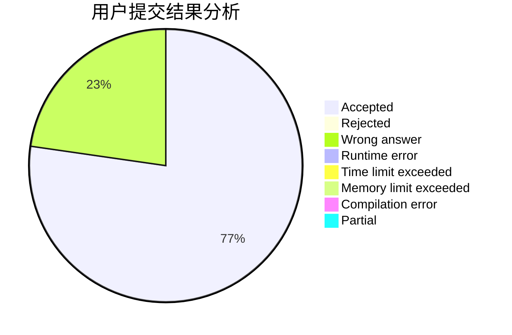
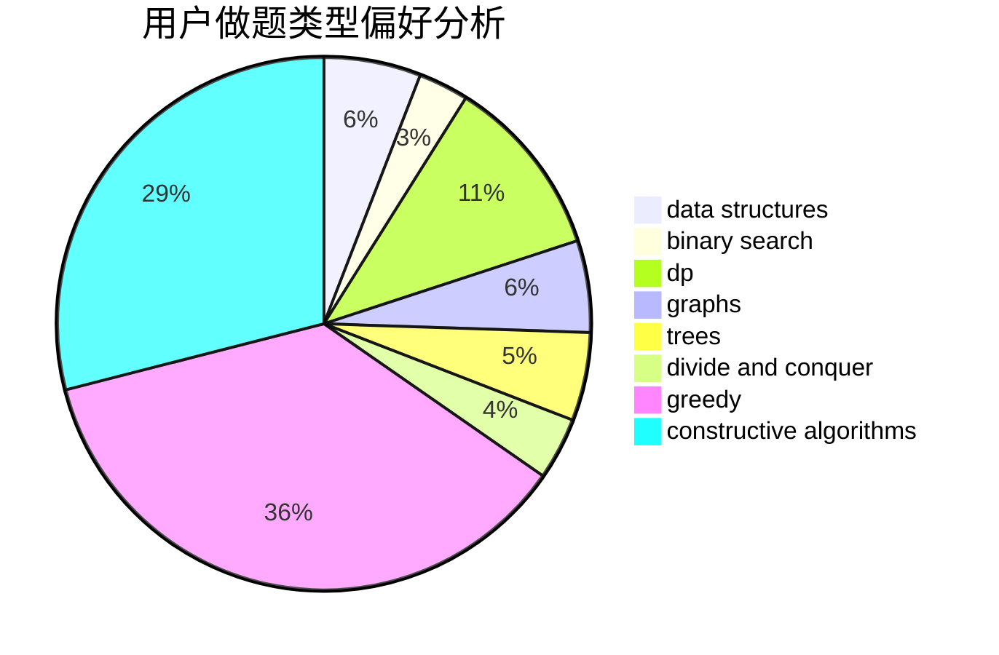

# 536952

<!-- tabs:start -->

#### **用户提交结果分析**

#### **用户做题类型偏好分析**

#### **用户错题知识点分析**

<!-- tabs:end -->
# 推荐题目
[1374B](https://codeforces.com/contest/1374/problem/B)		math		  
[1379B](https://codeforces.com/contest/1379/problem/B)		binary search,
                        brute force,
                        math,
                        number theory		  
[1375C](https://codeforces.com/contest/1375/problem/C)		constructive algorithms,
                        data structures,
                        greedy		  
[1377A1](https://codeforces.com/contest/1377A/problem/1)		dsu,graphs,sortings,trees		  
[1091E](https://codeforces.com/contest/1091/problem/E)		binary search,
                        data structures,
                        graphs,
                        greedy,
                        implementation,
                        math,
                        sortings		  
[1380B](https://codeforces.com/contest/1380/problem/B)		greedy		  
[1072D](https://codeforces.com/contest/1072/problem/D)		dsu,graphs,sortings,trees		  
[1161A](https://codeforces.com/contest/1161/problem/A)		dsu,graphs,sortings,trees		  
[1379E](https://codeforces.com/contest/1379/problem/E)		constructive algorithms,
                        divide and conquer,
                        dp,
                        math,
                        trees		  
[1376B3](https://codeforces.com/contest/1376B/problem/3)		dsu,graphs,sortings,trees		  
