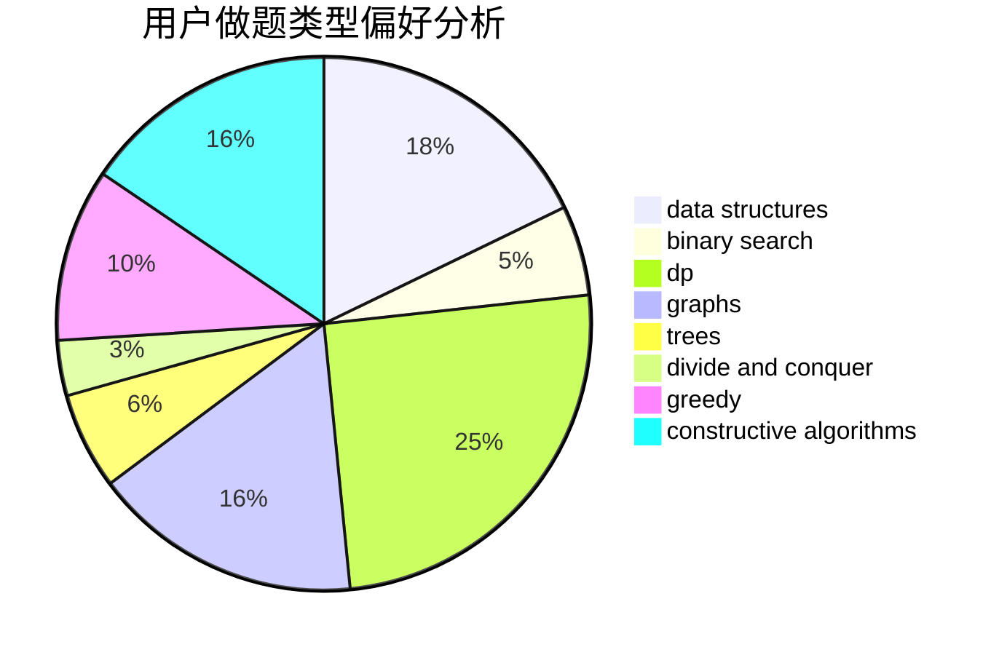

# 536952

<!-- tabs:start -->

#### **用户提交结果分析**

#### **用户做题类型偏好分析**

#### **用户错题知识点分析**

<!-- tabs:end -->
# 推荐题目
[1383A](https://codeforces.com/contest/1383/problem/A)		dsu,
                        graphs,
                        greedy,
                        sortings,
                        strings,
                        trees,
                        two pointers		  
[1388B](https://codeforces.com/contest/1388/problem/B)		greedy,
                        math		  
[1384A](https://codeforces.com/contest/1384/problem/A)		constructive algorithms,
                        greedy,
                        strings		  
[1386B](https://codeforces.com/contest/1386/problem/B)		*special problem,
                        data structures,
                        geometry,
                        math,
                        sortings		  
[1091H](https://codeforces.com/contest/1091/problem/H)		games		  
[1389E](https://codeforces.com/contest/1389/problem/E)		math,
                        number theory		  
[1073C](https://codeforces.com/contest/1073/problem/C)		binary search,
                        two pointers		  
[1163D](https://codeforces.com/contest/1163/problem/D)		dp,
                        strings		  
[1388E](https://codeforces.com/contest/1388/problem/E)		data structures,
                        geometry,
                        sortings		  
[1385G](https://codeforces.com/contest/1385/problem/G)		2-sat,
                        dfs and similar,
                        dsu,
                        graphs,
                        implementation		  
