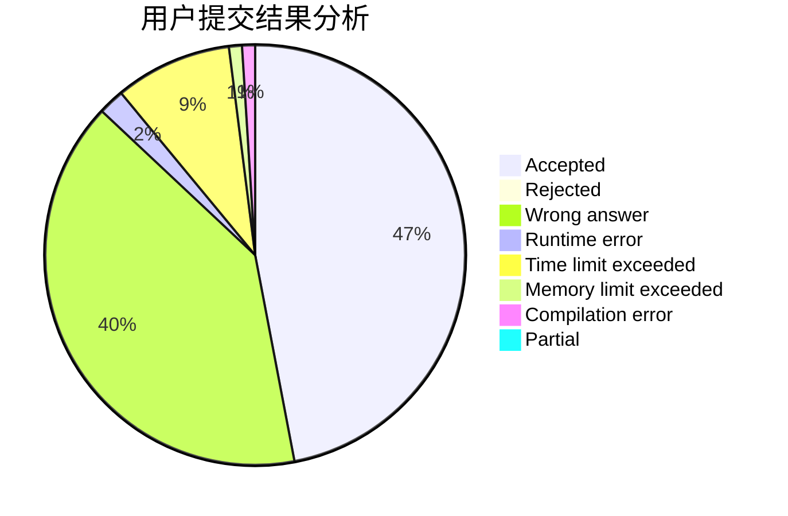
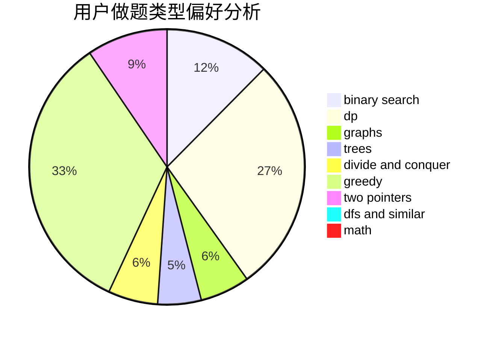

# LJIONG

<!-- tabs:start -->

#### **用户提交结果分析**

#### **用户做题类型偏好分析**

<!-- tabs:end -->
# 推荐题目
[543E](https://codeforces.com/contest/543/problem/E)
[1250F](https://codeforces.com/contest/1250/problem/F)
[1008C](https://codeforces.com/contest/1008/problem/C)
[480B](https://codeforces.com/contest/480/problem/B)
[1205F](https://codeforces.com/contest/1205/problem/F)
[1278B](https://codeforces.com/contest/1278/problem/B)
[1155F](https://codeforces.com/contest/1155/problem/F)
[101B](https://codeforces.com/contest/101/problem/B)
[1401E](https://codeforces.com/contest/1401/problem/E)
[712E](https://codeforces.com/contest/712/problem/E)
