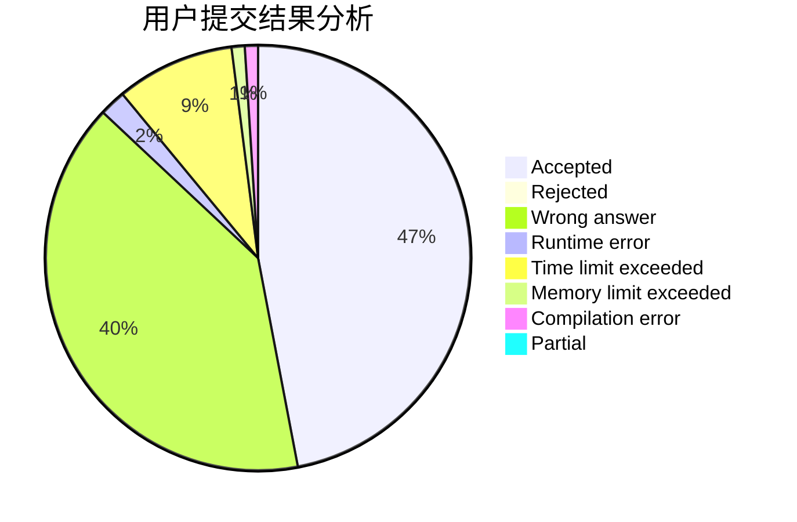
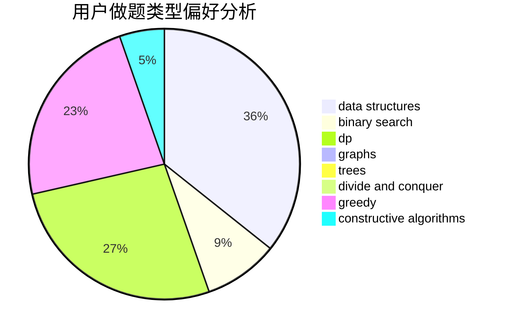
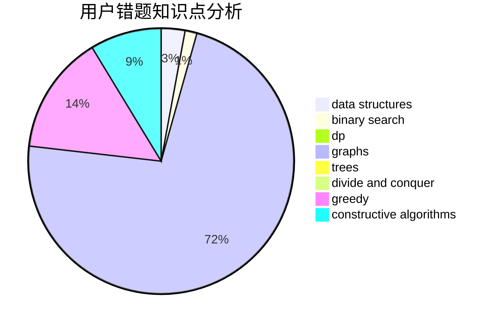

# LJIONG
<!-- tabs:start -->
#### **用户提交结果分析**

#### **用户做题类型偏好分析**

#### **用户错题知识点分析**

<!-- tabs:end -->
# 推荐题目
[Twilight and Ancient Scroll (harder version)](http://codeforces.com/problemset/problem/1393/E2)		dp,
                        hashing,
                        implementation,
                        string suffix structures,
                        strings,
                        two pointers		  
[Drazil and His Happy Friends](http://codeforces.com/problemset/problem/516/E)		math,
                        number theory		  
[Squats](http://codeforces.com/problemset/problem/424/A)		implementation		  
[Marbles](http://codeforces.com/problemset/problem/1215/E)		bitmasks,
                        dp		  
[Cloning Toys](http://codeforces.com/problemset/problem/922/A)		implementation		  
[Modulo Equality](http://codeforces.com/problemset/problem/1269/B)		brute force,
                        sortings		  
[Bots](http://codeforces.com/problemset/problem/575/H)		combinatorics,
                        number theory		  
[Nephren gives a riddle](http://codeforces.com/problemset/problem/896/A)		binary search,
                        dfs and similar		  
[Intranet of Buses](https://codeforces.com/contest/781/problem/F)		binary search,
                        geometry,
                        implementation,
                        two pointers		  
[Below the Diagonal](http://codeforces.com/problemset/problem/266/C)		constructive algorithms,
                        greedy,
                        math		  
<!-- tabs:start -->
#### **data structures**
[Twilight and Ancient Scroll (harder version)](http://codeforces.com/problemset/problem/1492/C)		binary search,
                        data structures,
                        dp,
                        greedy,
                        two pointers		  
[Drazil and His Happy Friends](http://codeforces.com/problemset/problem/1490/G)		binary search,
                        data structures,
                        math		  
[Squats](http://codeforces.com/problemset/problem/1479/D)		binary search,
                        bitmasks,
                        brute force,
                        data structures,
                        probabilities,
                        trees		  
[Marbles](http://codeforces.com/problemset/problem/1497/A)		brute force,
                        data structures,
                        greedy,
                        sortings		  
[Cloning Toys](http://codeforces.com/problemset/problem/1491/C)		brute force,
                        data structures,
                        dp,
                        greedy,
                        implementation		  
[Modulo Equality](http://codeforces.com/problemset/problem/1492/B)		data structures,
                        greedy,
                        math		  
[Bots](http://codeforces.com/problemset/problem/1436/E)		binary search,
                        data structures,
                        two pointers		  
[Nephren gives a riddle](http://codeforces.com/problemset/problem/1461/D)		binary search,
                        brute force,
                        data structures,
                        divide and conquer,
                        implementation,
                        sortings		  
[Intranet of Buses](http://codeforces.com/problemset/problem/1511/C)		brute force,
                        data structures,
                        implementation,
                        trees		  
[Below the Diagonal](http://codeforces.com/problemset/problem/1497/E1)		data structures,
                        dp,
                        greedy,
                        math,
                        number theory,
                        two pointers		  
#### **binary search**
[Twilight and Ancient Scroll (harder version)](http://codeforces.com/problemset/problem/896/A)		binary search,
                        dfs and similar		  
[Drazil and His Happy Friends](https://codeforces.com/contest/781/problem/F)		binary search,
                        geometry,
                        implementation,
                        two pointers		  
[Squats](http://codeforces.com/problemset/problem/1492/C)		binary search,
                        data structures,
                        dp,
                        greedy,
                        two pointers		  
[Marbles](http://codeforces.com/problemset/problem/1463/D)		binary search,
                        constructive algorithms,
                        greedy,
                        two pointers		  
[Cloning Toys](http://codeforces.com/problemset/problem/1490/G)		binary search,
                        data structures,
                        math		  
[Modulo Equality](http://codeforces.com/problemset/problem/1479/D)		binary search,
                        bitmasks,
                        brute force,
                        data structures,
                        probabilities,
                        trees		  
[Bots](http://codeforces.com/problemset/problem/1436/E)		binary search,
                        data structures,
                        two pointers		  
[Nephren gives a riddle](http://codeforces.com/problemset/problem/1461/D)		binary search,
                        brute force,
                        data structures,
                        divide and conquer,
                        implementation,
                        sortings		  
[Intranet of Buses](http://codeforces.com/problemset/problem/1493/C)		binary search,
                        brute force,
                        constructive algorithms,
                        greedy,
                        strings		  
[Below the Diagonal](http://codeforces.com/problemset/problem/1487/D)		binary search,
                        brute force,
                        math,
                        number theory		  
#### **dp**
[Twilight and Ancient Scroll (harder version)](http://codeforces.com/problemset/problem/1393/E2)		dp,
                        hashing,
                        implementation,
                        string suffix structures,
                        strings,
                        two pointers		  
[Drazil and His Happy Friends](http://codeforces.com/problemset/problem/1215/E)		bitmasks,
                        dp		  
[Squats](http://codeforces.com/problemset/problem/1153/F)		combinatorics,
                        dp,
                        math,
                        probabilities		  
[Marbles](http://codeforces.com/problemset/problem/461/B)		dfs and similar,
                        dp,
                        trees		  
[Cloning Toys](http://codeforces.com/problemset/problem/1092/F)		dfs and similar,
                        dp,
                        trees		  
[Modulo Equality](http://codeforces.com/problemset/problem/811/C)		dp,
                        implementation		  
[Bots](http://codeforces.com/problemset/problem/1007/E)		dp		  
[Nephren gives a riddle](http://codeforces.com/problemset/problem/1492/C)		binary search,
                        data structures,
                        dp,
                        greedy,
                        two pointers		  
[Intranet of Buses](https://codeforces.com/contest/1457/problem/C)		brute force,
                        dp,
                        implementation		  
[Below the Diagonal](http://codeforces.com/problemset/problem/1491/C)		brute force,
                        data structures,
                        dp,
                        greedy,
                        implementation		  
#### **graph**
[Twilight and Ancient Scroll (harder version)](http://codeforces.com/problemset/problem/1019/C)		constructive algorithms,
                        graphs		  
[Drazil and His Happy Friends](http://codeforces.com/problemset/problem/1245/D)		dsu,
                        graphs,
                        greedy,
                        shortest paths,
                        trees		  
[Squats](http://codeforces.com/problemset/problem/1394/B)		brute force,
                        dfs and similar,
                        graphs,
                        hashing		  
[Marbles](http://codeforces.com/problemset/problem/1487/C)		brute force,
                        constructive algorithms,
                        dfs and similar,
                        graphs,
                        greedy,
                        implementation,
                        math		  
[Cloning Toys](http://codeforces.com/problemset/problem/1437/C)		dp,
                        flows,
                        graph matchings,
                        greedy,
                        math,
                        sortings		  
[Modulo Equality](http://codeforces.com/problemset/problem/1470/D)		constructive algorithms,
                        dfs and similar,
                        graph matchings,
                        graphs,
                        greedy		  
[Bots](http://codeforces.com/problemset/problem/1476/C)		dp,
                        graphs,
                        greedy		  
[Nephren gives a riddle](http://codeforces.com/problemset/problem/1304/D)		constructive algorithms,
                        graphs,
                        greedy,
                        two pointers		  
[Intranet of Buses](http://codeforces.com/problemset/problem/1475/C)		combinatorics,
                        graphs,
                        math		  
[Below the Diagonal](http://codeforces.com/problemset/problem/553/E)		dp,
                        fft,
                        graphs,
                        math,
                        probabilities		  
#### **trees**
[Twilight and Ancient Scroll (harder version)](http://codeforces.com/problemset/problem/696/B)		dfs and similar,
                        math,
                        probabilities,
                        trees		  
[Drazil and His Happy Friends](http://codeforces.com/problemset/problem/461/B)		dfs and similar,
                        dp,
                        trees		  
[Squats](http://codeforces.com/problemset/problem/1245/D)		dsu,
                        graphs,
                        greedy,
                        shortest paths,
                        trees		  
[Marbles](http://codeforces.com/problemset/problem/1092/F)		dfs and similar,
                        dp,
                        trees		  
[Cloning Toys](http://codeforces.com/problemset/problem/1479/D)		binary search,
                        bitmasks,
                        brute force,
                        data structures,
                        probabilities,
                        trees		  
[Modulo Equality](http://codeforces.com/problemset/problem/1511/C)		brute force,
                        data structures,
                        implementation,
                        trees		  
[Bots](http://codeforces.com/problemset/problem/1499/F)		combinatorics,
                        dfs and similar,
                        dp,
                        trees		  
[Nephren gives a riddle](http://codeforces.com/problemset/problem/1491/E)		brute force,
                        dfs and similar,
                        divide and conquer,
                        number theory,
                        trees		  
[Intranet of Buses](http://codeforces.com/problemset/problem/1466/D)		data structures,
                        greedy,
                        sortings,
                        trees		  
[Below the Diagonal](http://codeforces.com/problemset/problem/1495/D)		combinatorics,
                        dfs and similar,
                        graphs,
                        math,
                        shortest paths,
                        trees		  
#### **divide and conquer**
[Twilight and Ancient Scroll (harder version)](http://codeforces.com/problemset/problem/1461/D)		binary search,
                        brute force,
                        data structures,
                        divide and conquer,
                        implementation,
                        sortings		  
[Drazil and His Happy Friends](http://codeforces.com/problemset/problem/1466/G)		combinatorics,
                        divide and conquer,
                        hashing,
                        math,
                        string suffix structures,
                        strings		  
[Squats](http://codeforces.com/problemset/problem/1490/D)		dfs and similar,
                        divide and conquer,
                        implementation		  
[Marbles](https://codeforces.com/contest/1483/problem/C)		data structures,
                        divide and conquer,
                        dp		  
[Cloning Toys](http://codeforces.com/problemset/problem/1491/E)		brute force,
                        dfs and similar,
                        divide and conquer,
                        number theory,
                        trees		  
[Modulo Equality](http://codeforces.com/problemset/problem/1303/G)		data structures,
                        divide and conquer,
                        geometry,
                        trees		  
[Bots](http://codeforces.com/problemset/problem/1494/D)		constructive algorithms,
                        data structures,
                        dfs and similar,
                        divide and conquer,
                        dsu,
                        greedy,
                        sortings,
                        trees		  
[Nephren gives a riddle](http://codeforces.com/problemset/problem/1482/E)		data structures,
                        divide and conquer,
                        dp		  
[Intranet of Buses](http://codeforces.com/problemset/problem/566/C)		dfs and similar,
                        divide and conquer,
                        trees		  
[Below the Diagonal](http://codeforces.com/problemset/problem/1428/F)		binary search,
                        data structures,
                        divide and conquer,
                        dp,
                        two pointers		  
#### **greedy**
[Twilight and Ancient Scroll (harder version)](http://codeforces.com/problemset/problem/266/C)		constructive algorithms,
                        greedy,
                        math		  
[Drazil and His Happy Friends](http://codeforces.com/problemset/problem/1245/D)		dsu,
                        graphs,
                        greedy,
                        shortest paths,
                        trees		  
[Squats](http://codeforces.com/problemset/problem/1201/B)		greedy,
                        math		  
[Marbles](http://codeforces.com/problemset/problem/1175/D)		greedy,
                        sortings		  
[Cloning Toys](http://codeforces.com/problemset/problem/1329/A)		constructive algorithms,
                        greedy,
                        implementation,
                        math		  
[Modulo Equality](http://codeforces.com/problemset/problem/1492/C)		binary search,
                        data structures,
                        dp,
                        greedy,
                        two pointers		  
[Bots](https://codeforces.com/contest/1496/problem/C)		geometry,
                        greedy,
                        math,
                        sortings		  
[Nephren gives a riddle](http://codeforces.com/problemset/problem/1493/A)		constructive algorithms,
                        greedy		  
[Intranet of Buses](http://codeforces.com/problemset/problem/1463/D)		binary search,
                        constructive algorithms,
                        greedy,
                        two pointers		  
[Below the Diagonal](http://codeforces.com/problemset/problem/1462/C)		brute force,
                        greedy,
                        math		  
#### **constructive algorithms**
[Twilight and Ancient Scroll (harder version)](http://codeforces.com/problemset/problem/266/C)		constructive algorithms,
                        greedy,
                        math		  
[Drazil and His Happy Friends](http://codeforces.com/problemset/problem/1019/C)		constructive algorithms,
                        graphs		  
[Squats](http://codeforces.com/problemset/problem/1329/A)		constructive algorithms,
                        greedy,
                        implementation,
                        math		  
[Marbles](http://codeforces.com/problemset/problem/1493/A)		constructive algorithms,
                        greedy		  
[Cloning Toys](http://codeforces.com/problemset/problem/1463/D)		binary search,
                        constructive algorithms,
                        greedy,
                        two pointers		  
[Modulo Equality](https://codeforces.com/contest/1456/problem/B)		bitmasks,
                        brute force,
                        constructive algorithms		  
[Bots](http://codeforces.com/problemset/problem/1492/D)		bitmasks,
                        constructive algorithms,
                        greedy,
                        math		  
[Nephren gives a riddle](https://codeforces.com/contest/1504/problem/D)		constructive algorithms,
                        games,
                        interactive		  
[Intranet of Buses](https://codeforces.com/contest/1483/problem/A)		brute force,
                        constructive algorithms,
                        greedy,
                        implementation		  
[Below the Diagonal](https://codeforces.com/contest/1457/problem/D)		bitmasks,
                        brute force,
                        constructive algorithms		  
#### **sortings**
[Twilight and Ancient Scroll (harder version)](http://codeforces.com/problemset/problem/1269/B)		brute force,
                        sortings		  
[Drazil and His Happy Friends](http://codeforces.com/problemset/problem/1175/D)		greedy,
                        sortings		  
[Squats](https://codeforces.com/contest/1496/problem/C)		geometry,
                        greedy,
                        math,
                        sortings		  
[Marbles](http://codeforces.com/problemset/problem/1495/A)		geometry,
                        greedy,
                        math,
                        sortings		  
[Cloning Toys](http://codeforces.com/problemset/problem/1497/A)		brute force,
                        data structures,
                        greedy,
                        sortings		  
[Modulo Equality](http://codeforces.com/problemset/problem/1427/A)		math,
                        sortings		  
[Bots](http://codeforces.com/problemset/problem/1461/D)		binary search,
                        brute force,
                        data structures,
                        divide and conquer,
                        implementation,
                        sortings		  
[Nephren gives a riddle](http://codeforces.com/problemset/problem/1437/C)		dp,
                        flows,
                        graph matchings,
                        greedy,
                        math,
                        sortings		  
[Intranet of Buses](http://codeforces.com/problemset/problem/1473/A)		greedy,
                        implementation,
                        math,
                        sortings		  
[Below the Diagonal](http://codeforces.com/problemset/problem/1486/B)		binary search,
                        geometry,
                        shortest paths,
                        sortings		  
<!-- tabs:end -->
