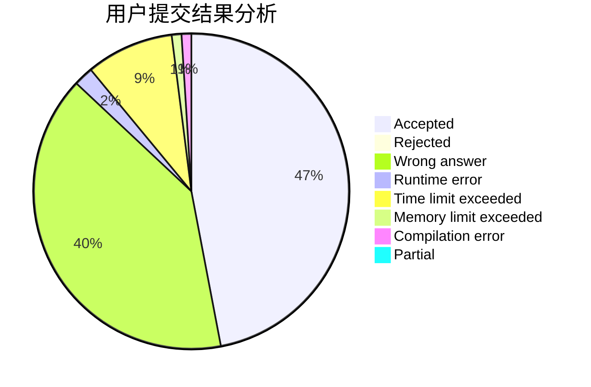
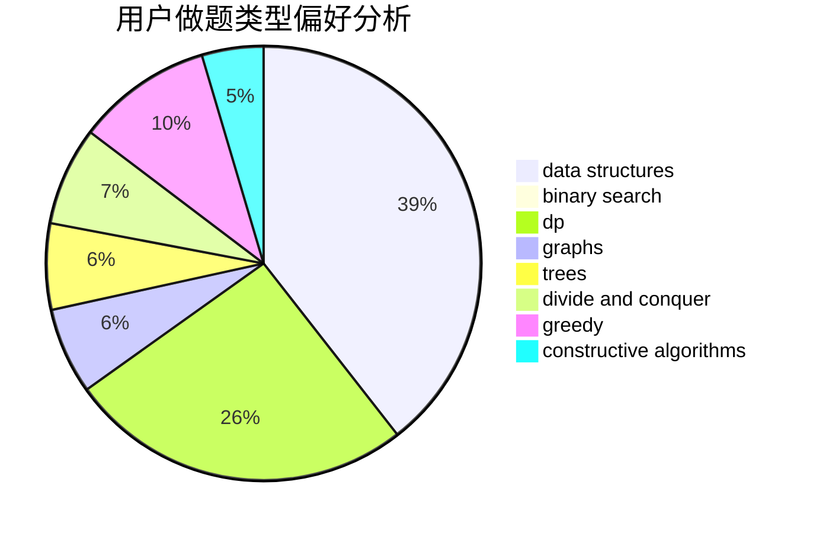
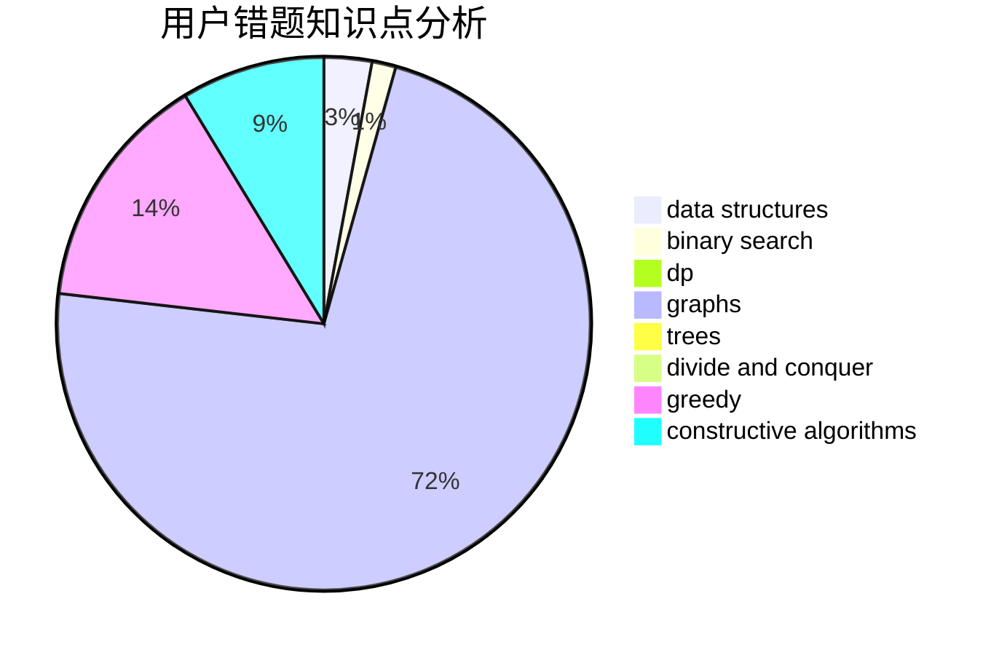

# LJIONG

<!-- tabs:start -->

#### **用户提交结果分析**

#### **用户做题类型偏好分析**

#### **用户错题知识点分析**

<!-- tabs:end -->
# 推荐题目
[543E](https://codeforces.com/contest/543/problem/E)		constructive algorithms,
                        data structures		  
[1250F](https://codeforces.com/contest/1250/problem/F)		brute force,
                        implementation		  
[1008C](https://codeforces.com/contest/1008/problem/C)		dsu,graphs,sortings,trees		  
[480B](https://codeforces.com/contest/480/problem/B)		dsu,graphs,sortings,trees		  
[1205F](https://codeforces.com/contest/1205/problem/F)		constructive algorithms,
                        math		  
[1278B](https://codeforces.com/contest/1278/problem/B)		greedy,
                        math		  
[1155F](https://codeforces.com/contest/1155/problem/F)		brute force,
                        dp,
                        graphs		  
[101B](https://codeforces.com/contest/101/problem/B)		binary search,
                        data structures,
                        dp		  
[1401E](https://codeforces.com/contest/1401/problem/E)		data structures,
                        geometry,
                        implementation,
                        sortings		  
[712E](https://codeforces.com/contest/712/problem/E)		data structures,
                        math,
                        probabilities		  
