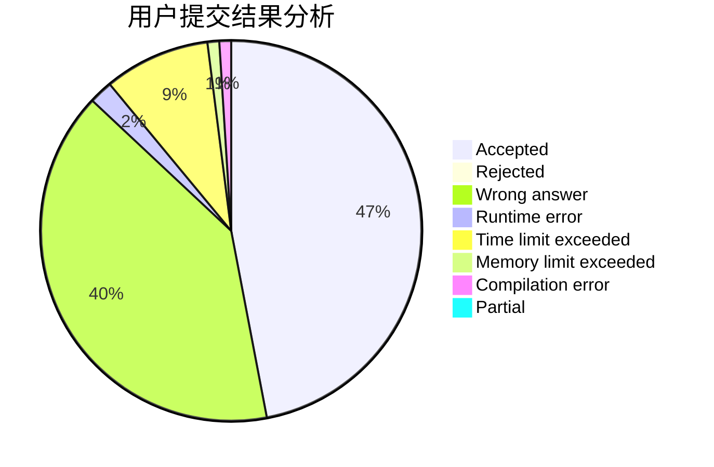
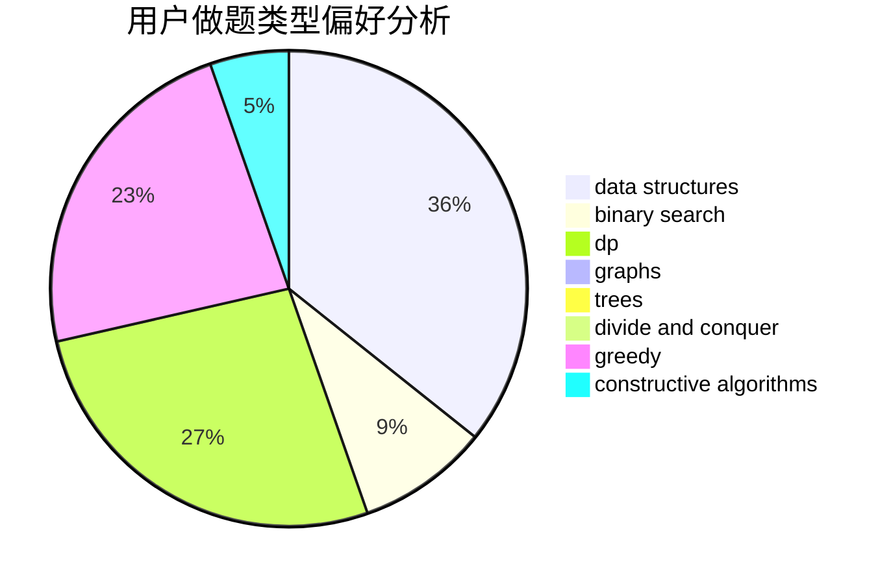
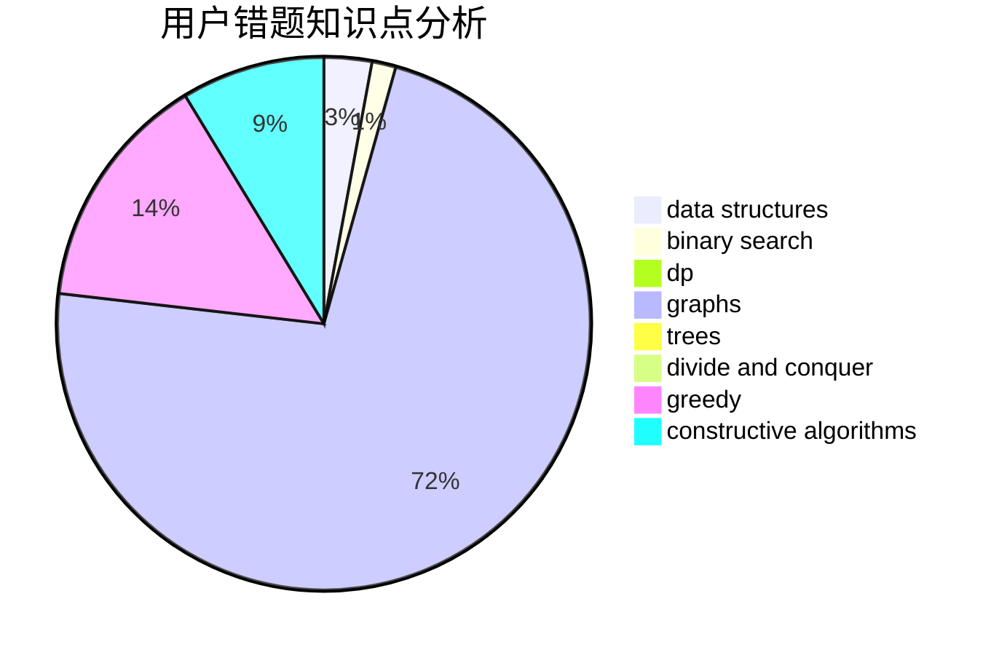

# LJIONG

<!-- tabs:start -->

#### **用户提交结果分析**

#### **用户做题类型偏好分析**

#### **用户错题知识点分析**

<!-- tabs:end -->
# 推荐题目
[516E](https://codeforces.com/contest/516/problem/E)		math,
                        number theory		  
[1245D](https://codeforces.com/contest/1245/problem/D)		dsu,
                        graphs,
                        greedy,
                        shortest paths,
                        trees		  
[1007E](https://codeforces.com/contest/1007/problem/E)		dp		  
[461B](https://codeforces.com/contest/461/problem/B)		dfs and similar,
                        dp,
                        trees		  
[1201B](https://codeforces.com/contest/1201/problem/B)		greedy,
                        math		  
[1269B](https://codeforces.com/contest/1269/problem/B)		brute force,
                        sortings		  
[1153F](https://codeforces.com/contest/1153/problem/F)		combinatorics,
                        dp,
                        math,
                        probabilities		  
[1019C](https://codeforces.com/contest/1019/problem/C)		constructive algorithms,
                        graphs		  
[1393E2](https://codeforces.com/contest/1393E/problem/2)		dp,
                        hashing,
                        implementation,
                        string suffix structures,
                        strings,
                        two pointers		  
[696B](https://codeforces.com/contest/696/problem/B)		dfs and similar,
                        math,
                        probabilities,
                        trees		  
