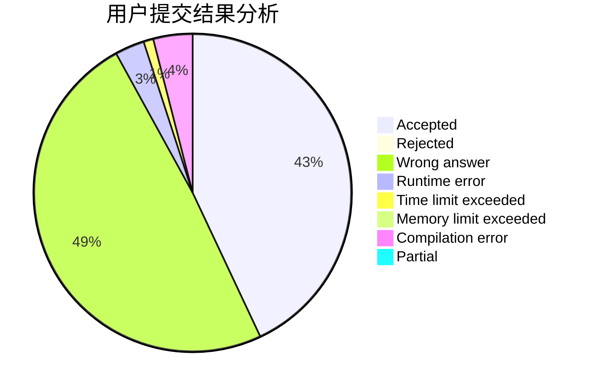
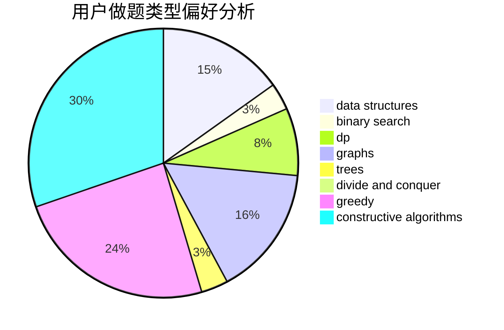

# LJQYYDS

<!-- tabs:start -->

#### **用户提交结果分析**

#### **用户做题类型偏好分析**

#### **用户错题知识点分析**

<!-- tabs:end -->
# 推荐题目
[1250B](https://codeforces.com/contest/1250/problem/B)		brute force,
                        constructive algorithms,
                        greedy,
                        math		  
[433B](https://codeforces.com/contest/433/problem/B)		dp,
                        implementation,
                        sortings		  
[528A](https://codeforces.com/contest/528/problem/A)		dsu,graphs,sortings,trees		  
[620A](https://codeforces.com/contest/620/problem/A)		implementation,
                        math		  
[853A](https://codeforces.com/contest/853/problem/A)		greedy		  
[469A](https://codeforces.com/contest/469/problem/A)		greedy,
                        implementation		  
[1136C](https://codeforces.com/contest/1136/problem/C)		constructive algorithms,
                        sortings		  
[288D](https://codeforces.com/contest/288/problem/D)		combinatorics,
                        dfs and similar,
                        trees		  
[402B](https://codeforces.com/contest/402/problem/B)		brute force,
                        implementation		  
[173A](https://codeforces.com/contest/173/problem/A)		implementation,
                        math		  
