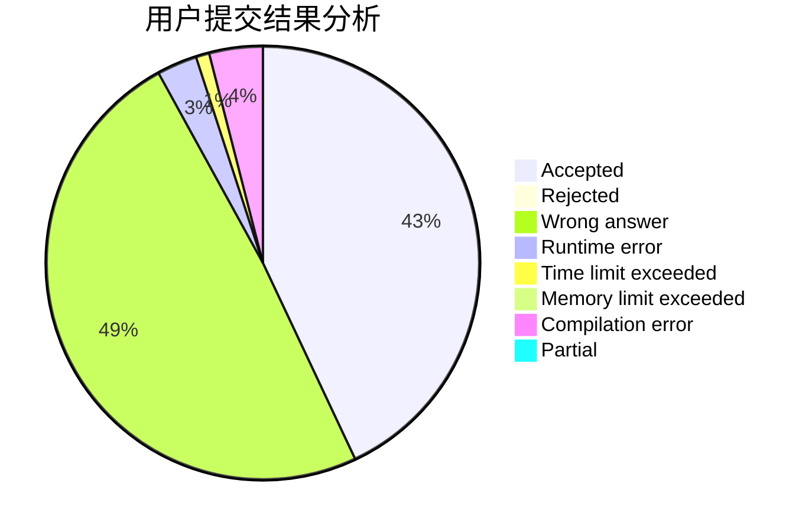
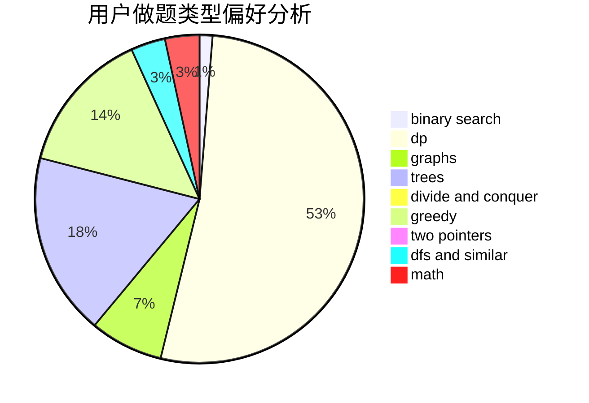

# LJQYYDS

<!-- tabs:start -->

#### **用户提交结果分析**

#### **用户做题类型偏好分析**

<!-- tabs:end -->
# 推荐题目
[1250B](https://codeforces.com/contest/1250/problem/B)
[433B](https://codeforces.com/contest/433/problem/B)
[528A](https://codeforces.com/contest/528/problem/A)
[620A](https://codeforces.com/contest/620/problem/A)
[853A](https://codeforces.com/contest/853/problem/A)
[469A](https://codeforces.com/contest/469/problem/A)
[1136C](https://codeforces.com/contest/1136/problem/C)
[288D](https://codeforces.com/contest/288/problem/D)
[402B](https://codeforces.com/contest/402/problem/B)
[173A](https://codeforces.com/contest/173/problem/A)
