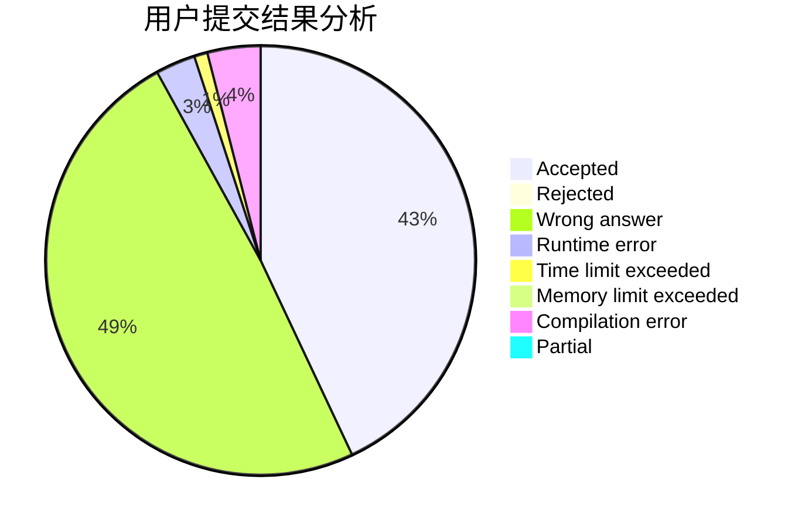
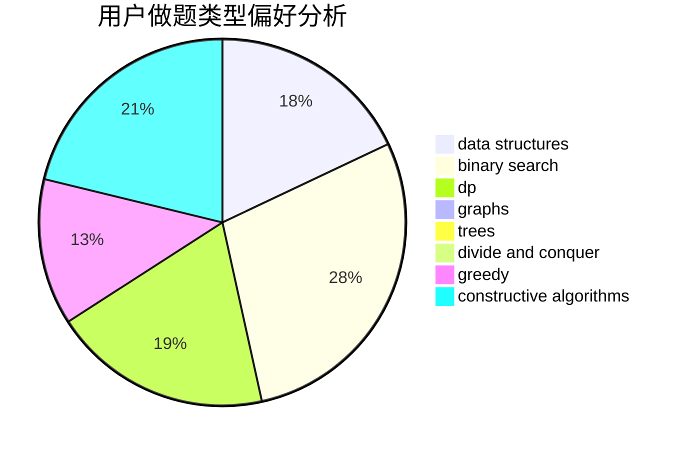

# LJQYYDS

<!-- tabs:start -->

#### **用户提交结果分析**

#### **用户做题类型偏好分析**

#### **用户错题知识点分析**

<!-- tabs:end -->
# 推荐题目
[1244G](https://codeforces.com/contest/1244/problem/G)		constructive algorithms,
                        greedy,
                        math		  
[404C](https://codeforces.com/contest/404/problem/C)		dfs and similar,
                        graphs,
                        sortings		  
[508A](https://codeforces.com/contest/508/problem/A)		brute force		  
[600E](https://codeforces.com/contest/600/problem/E)		data structures,
                        dfs and similar,
                        dsu,
                        trees		  
[835C](https://codeforces.com/contest/835/problem/C)		dp,
                        implementation		  
[449C](https://codeforces.com/contest/449/problem/C)		constructive algorithms,
                        number theory		  
[1132D](https://codeforces.com/contest/1132/problem/D)		binary search,
                        greedy		  
[272D](https://codeforces.com/contest/272/problem/D)		combinatorics,
                        math,
                        sortings		  
[372B](https://codeforces.com/contest/372/problem/B)		brute force,
                        divide and conquer,
                        dp		  
[1513C](https://codeforces.com/contest/1513/problem/C)		dp,
                        matrices		  
