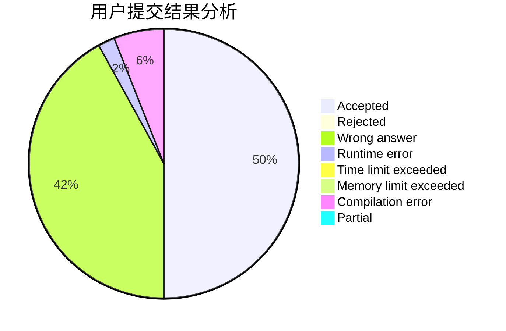
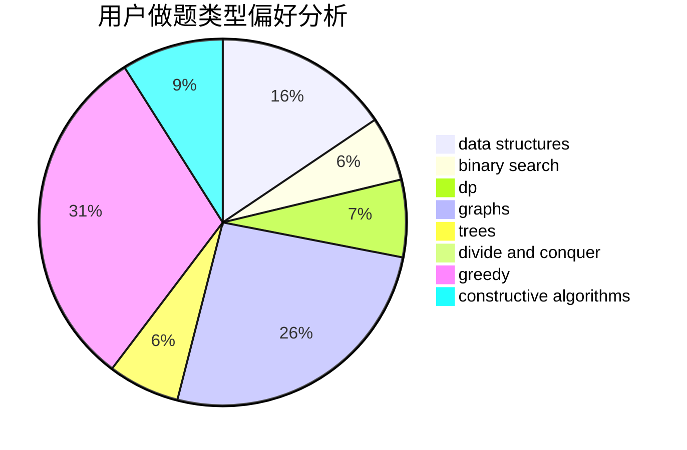
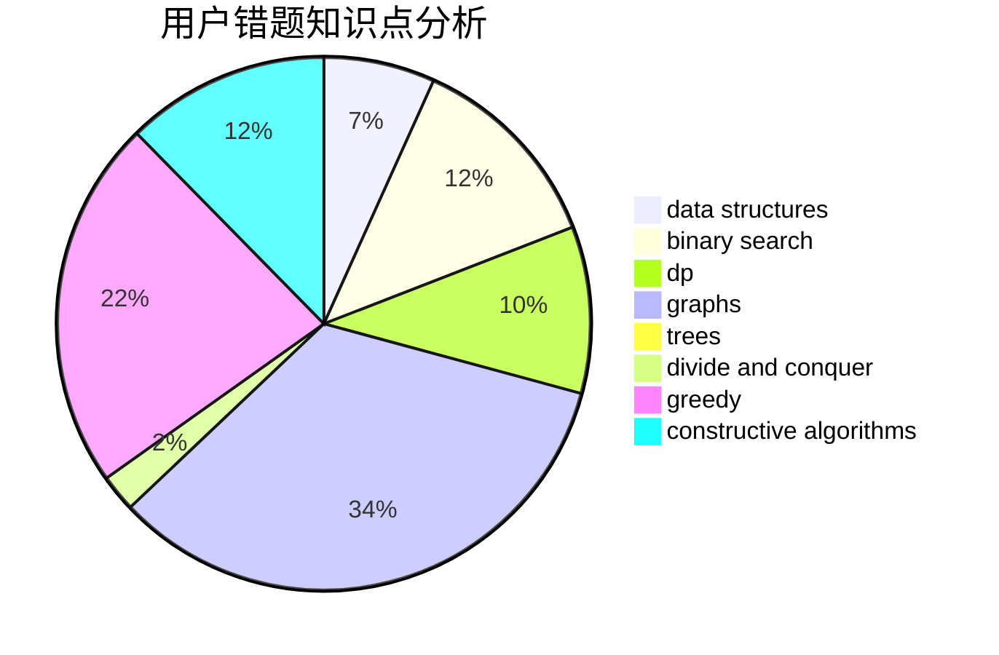

# LKP1111

<!-- tabs:start -->

#### **用户提交结果分析**

#### **用户做题类型偏好分析**

#### **用户错题知识点分析**

<!-- tabs:end -->
# 推荐题目
[1223E](https://codeforces.com/contest/1223/problem/E)		dp,
                        sortings,
                        trees		  
[1093B](https://codeforces.com/contest/1093/problem/B)		constructive algorithms,
                        greedy,
                        sortings,
                        strings		  
[515A](https://codeforces.com/contest/515/problem/A)		math		  
[1211B](https://codeforces.com/contest/1211/problem/B)		*special problem,
                        implementation		  
[14C](https://codeforces.com/contest/14/problem/C)		brute force,
                        constructive algorithms,
                        geometry,
                        implementation,
                        math		  
[1256B](https://codeforces.com/contest/1256/problem/B)		greedy		  
[702C](https://codeforces.com/contest/702/problem/C)		binary search,
                        implementation,
                        two pointers		  
[1081F](https://codeforces.com/contest/1081/problem/F)		constructive algorithms,
                        implementation,
                        interactive		  
[401D](https://codeforces.com/contest/401/problem/D)		bitmasks,
                        brute force,
                        combinatorics,
                        dp,
                        number theory		  
[1245C](https://codeforces.com/contest/1245/problem/C)		dp		  
