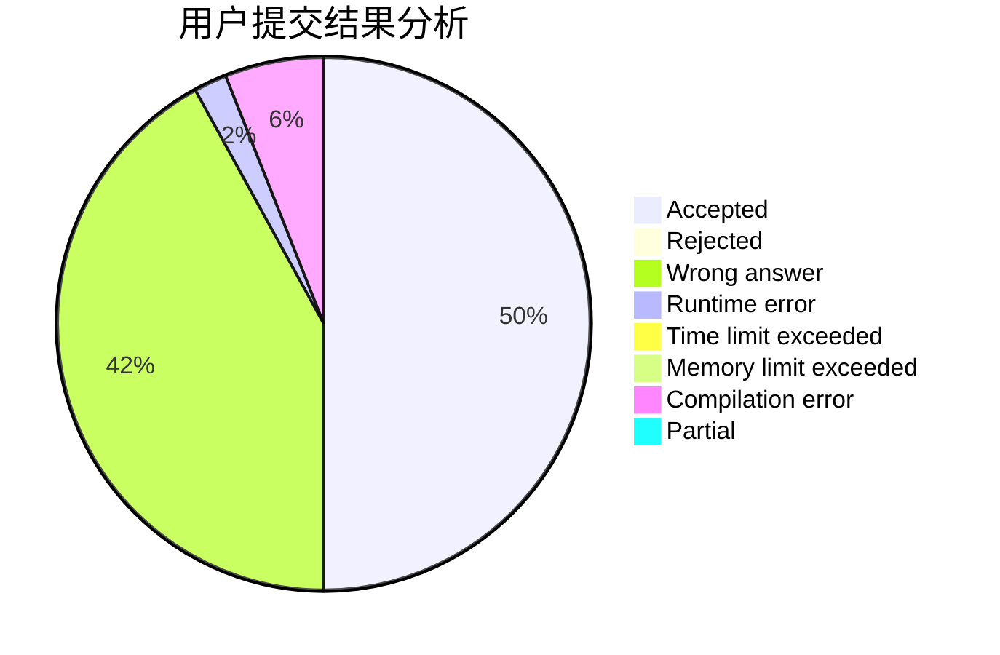
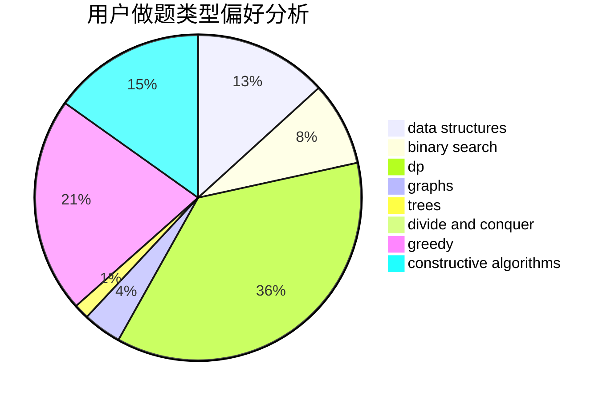
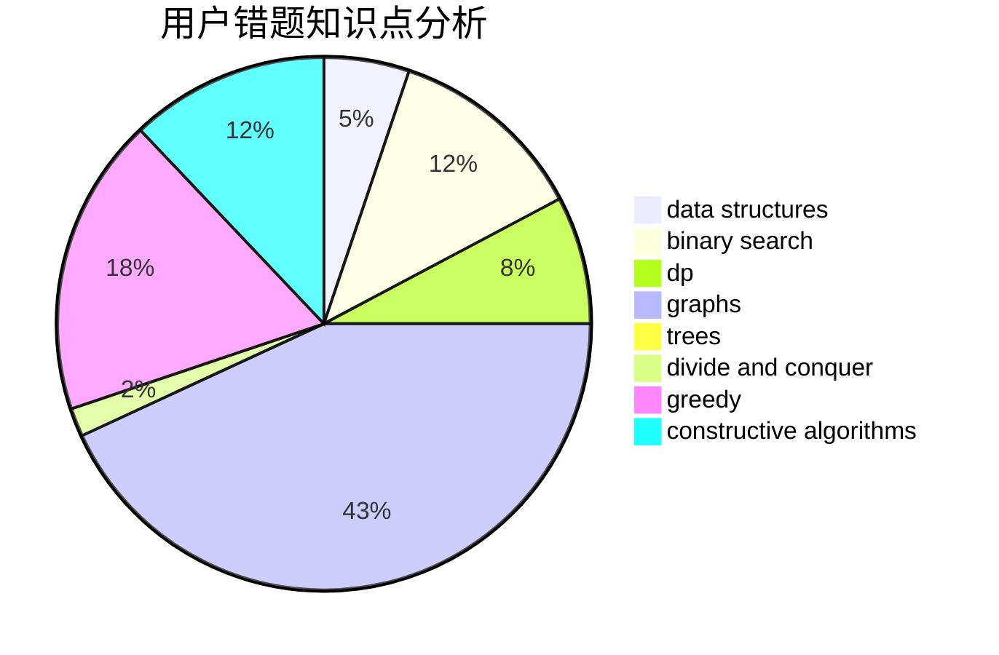

# LKP1111

<!-- tabs:start -->

#### **用户提交结果分析**

#### **用户做题类型偏好分析**

#### **用户错题知识点分析**

<!-- tabs:end -->
# 推荐题目
[1217A](https://codeforces.com/contest/1217/problem/A)		binary search,
                        math		  
[1092E](https://codeforces.com/contest/1092/problem/E)		constructive algorithms,
                        dfs and similar,
                        greedy,
                        trees		  
[494E](https://codeforces.com/contest/494/problem/E)		data structures,
                        games		  
[1207B](https://codeforces.com/contest/1207/problem/B)		constructive algorithms,
                        greedy,
                        implementation		  
[1491F](https://codeforces.com/contest/1491/problem/F)		binary search,
                        constructive algorithms,
                        interactive		  
[1251A](https://codeforces.com/contest/1251/problem/A)		brute force,
                        strings,
                        two pointers		  
[678E](https://codeforces.com/contest/678/problem/E)		bitmasks,
                        dp,
                        math,
                        probabilities		  
[1081C](https://codeforces.com/contest/1081/problem/C)		combinatorics,
                        dp,
                        math		  
[371E](https://codeforces.com/contest/371/problem/E)		greedy,
                        math,
                        two pointers		  
[123E](https://codeforces.com/contest/123/problem/E)		dfs and similar,
                        dp,
                        probabilities,
                        trees		  
