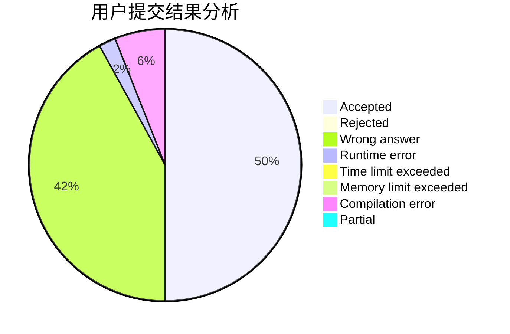
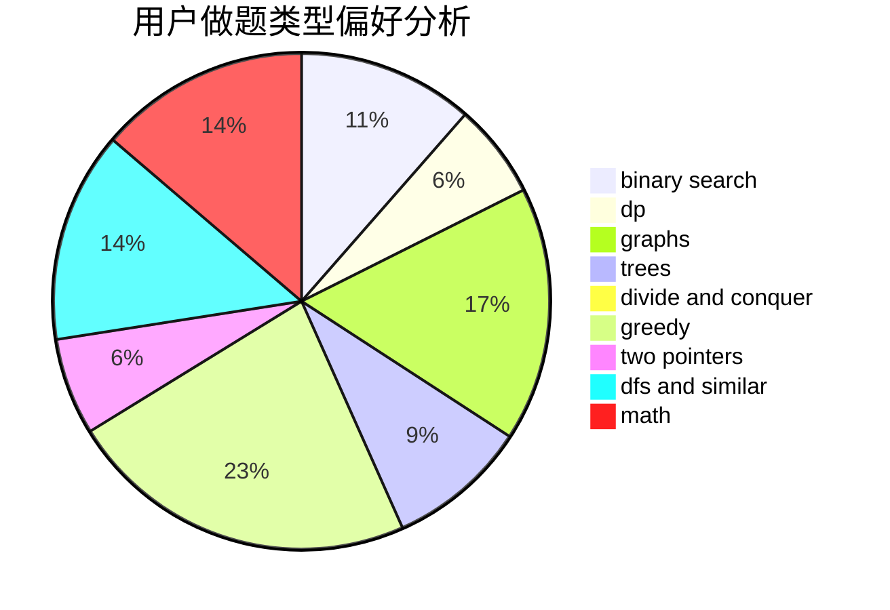

# LKP1111

<!-- tabs:start -->

#### **用户提交结果分析**

#### **用户做题类型偏好分析**

<!-- tabs:end -->
# 推荐题目
[1223E](https://codeforces.com/contest/1223/problem/E)
[1093B](https://codeforces.com/contest/1093/problem/B)
[515A](https://codeforces.com/contest/515/problem/A)
[1211B](https://codeforces.com/contest/1211/problem/B)
[14C](https://codeforces.com/contest/14/problem/C)
[1256B](https://codeforces.com/contest/1256/problem/B)
[702C](https://codeforces.com/contest/702/problem/C)
[1081F](https://codeforces.com/contest/1081/problem/F)
[401D](https://codeforces.com/contest/401/problem/D)
[1245C](https://codeforces.com/contest/1245/problem/C)
