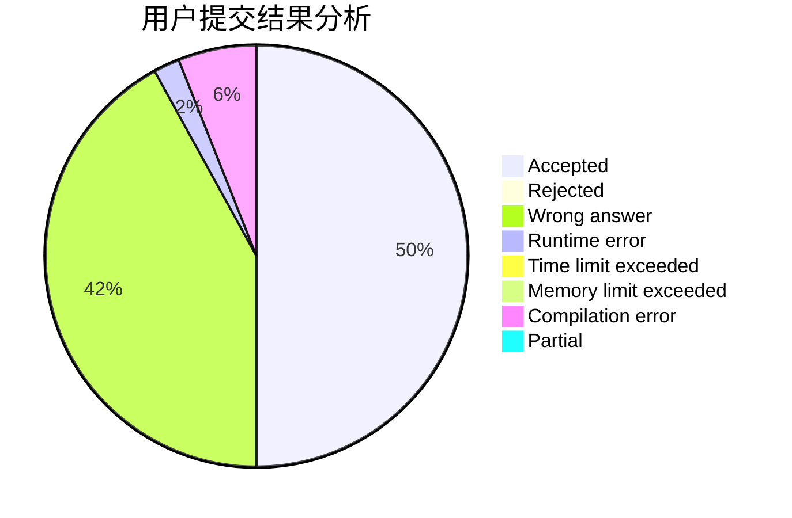
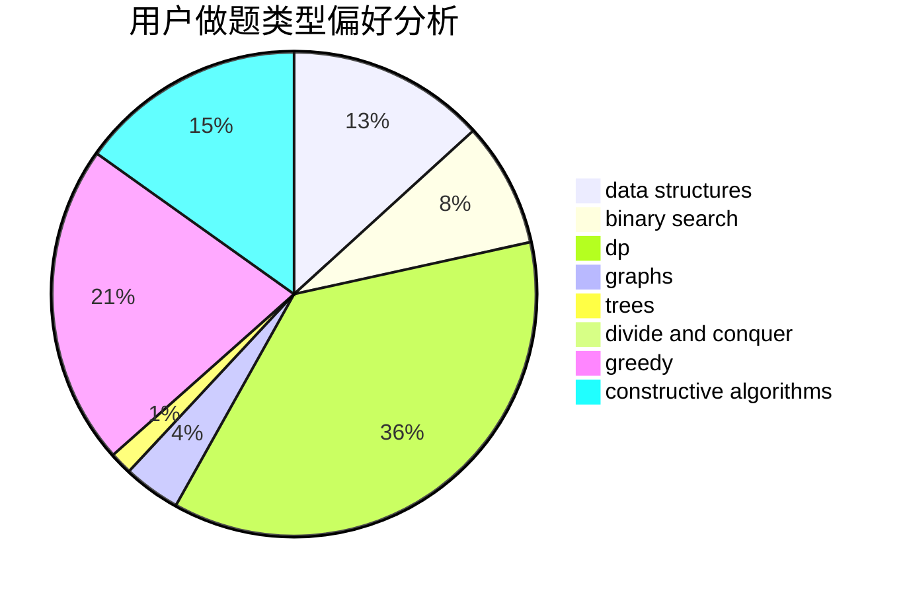
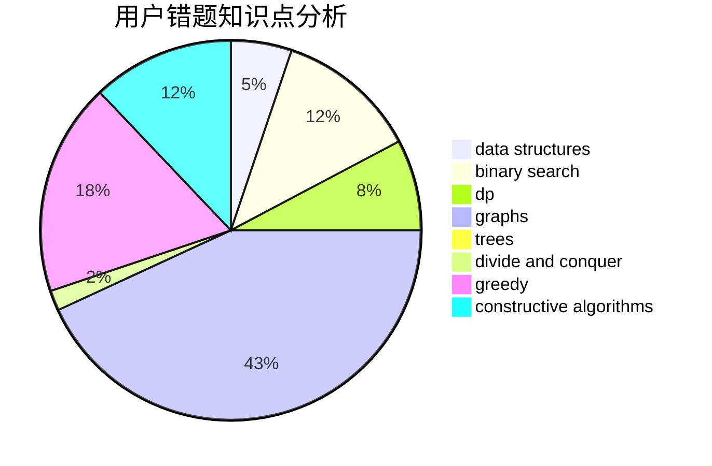

# LKP1111
<!-- tabs:start -->
#### **用户提交结果分析**

#### **用户做题类型偏好分析**

#### **用户错题知识点分析**

<!-- tabs:end -->
# 推荐题目
[Square Filling](http://codeforces.com/problemset/problem/1207/B)		constructive algorithms,
                        greedy,
                        implementation		  
[Magnets](http://codeforces.com/problemset/problem/1491/F)		binary search,
                        constructive algorithms,
                        interactive		  
[Sharti](http://codeforces.com/problemset/problem/494/E)		data structures,
                        games		  
[Born This Way](http://codeforces.com/problemset/problem/1148/B)		binary search,
                        brute force,
                        two pointers		  
[Creating a Character](http://codeforces.com/problemset/problem/1217/A)		binary search,
                        math		  
[Minimal Diameter Forest](http://codeforces.com/problemset/problem/1092/E)		constructive algorithms,
                        dfs and similar,
                        greedy,
                        trees		  
[Subway Innovation](http://codeforces.com/problemset/problem/371/E)		greedy,
                        math,
                        two pointers		  
[Arson In Berland Forest](https://codeforces.com/contest/1261/problem/C)		binary search,
                        graphs,
                        graphs,
                        shortest paths		  
[Friends and Presents](http://codeforces.com/problemset/problem/483/B)		binary search,
                        math		  
[Broken Keyboard](http://codeforces.com/problemset/problem/1251/A)		brute force,
                        strings,
                        two pointers		  
<!-- tabs:start -->
#### **data structures**
[Square Filling](http://codeforces.com/problemset/problem/494/E)		data structures,
                        games		  
[Magnets](https://codeforces.com/contest/867/problem/E)		constructive algorithms,
                        data structures,
                        greedy		  
[Sharti](http://codeforces.com/problemset/problem/1404/C)		binary search,
                        constructive algorithms,
                        data structures,
                        greedy,
                        two pointers		  
[Born This Way](http://codeforces.com/problemset/problem/813/E)		binary search,
                        data structures		  
[Creating a Character](http://codeforces.com/problemset/problem/1492/C)		binary search,
                        data structures,
                        dp,
                        greedy,
                        two pointers		  
[Minimal Diameter Forest](http://codeforces.com/problemset/problem/1490/G)		binary search,
                        data structures,
                        math		  
[Subway Innovation](http://codeforces.com/problemset/problem/1479/D)		binary search,
                        bitmasks,
                        brute force,
                        data structures,
                        probabilities,
                        trees		  
[Arson In Berland Forest](http://codeforces.com/problemset/problem/1497/A)		brute force,
                        data structures,
                        greedy,
                        sortings		  
[Friends and Presents](http://codeforces.com/problemset/problem/1491/C)		brute force,
                        data structures,
                        dp,
                        greedy,
                        implementation		  
[Broken Keyboard](http://codeforces.com/problemset/problem/1492/B)		data structures,
                        greedy,
                        math		  
#### **binary search**
[Square Filling](http://codeforces.com/problemset/problem/1491/F)		binary search,
                        constructive algorithms,
                        interactive		  
[Magnets](http://codeforces.com/problemset/problem/1148/B)		binary search,
                        brute force,
                        two pointers		  
[Sharti](http://codeforces.com/problemset/problem/1217/A)		binary search,
                        math		  
[Born This Way](https://codeforces.com/contest/1261/problem/C)		binary search,
                        graphs,
                        graphs,
                        shortest paths		  
[Creating a Character](http://codeforces.com/problemset/problem/483/B)		binary search,
                        math		  
[Minimal Diameter Forest](http://codeforces.com/problemset/problem/1238/D)		binary search,
                        combinatorics,
                        dp,
                        strings		  
[Subway Innovation](http://codeforces.com/problemset/problem/1345/B)		binary search,
                        brute force,
                        dp,
                        math		  
[Arson In Berland Forest](http://codeforces.com/problemset/problem/1404/C)		binary search,
                        constructive algorithms,
                        data structures,
                        greedy,
                        two pointers		  
[Friends and Presents](http://codeforces.com/problemset/problem/813/E)		binary search,
                        data structures		  
[Broken Keyboard](http://codeforces.com/problemset/problem/1492/C)		binary search,
                        data structures,
                        dp,
                        greedy,
                        two pointers		  
#### **dp**
[Square Filling](http://codeforces.com/problemset/problem/123/E)		dfs and similar,
                        dp,
                        probabilities,
                        trees		  
[Magnets](http://codeforces.com/problemset/problem/1081/C)		combinatorics,
                        dp,
                        math		  
[Sharti](http://codeforces.com/problemset/problem/386/C)		dp,
                        strings,
                        two pointers		  
[Born This Way](http://codeforces.com/problemset/problem/1238/D)		binary search,
                        combinatorics,
                        dp,
                        strings		  
[Creating a Character](http://codeforces.com/problemset/problem/678/E)		bitmasks,
                        dp,
                        math,
                        probabilities		  
[Minimal Diameter Forest](http://codeforces.com/problemset/problem/1345/B)		binary search,
                        brute force,
                        dp,
                        math		  
[Subway Innovation](http://codeforces.com/problemset/problem/1109/A)		dp,
                        implementation		  
[Arson In Berland Forest](http://codeforces.com/problemset/problem/1326/F2)		bitmasks,
                        dp,
                        math		  
[Friends and Presents](http://codeforces.com/problemset/problem/1492/C)		binary search,
                        data structures,
                        dp,
                        greedy,
                        two pointers		  
[Broken Keyboard](https://codeforces.com/contest/1457/problem/C)		brute force,
                        dp,
                        implementation		  
#### **graph**
[Square Filling](https://codeforces.com/contest/1261/problem/C)		binary search,
                        graphs,
                        graphs,
                        shortest paths		  
[Magnets](http://codeforces.com/problemset/problem/1487/C)		brute force,
                        constructive algorithms,
                        dfs and similar,
                        graphs,
                        greedy,
                        implementation,
                        math		  
[Sharti](http://codeforces.com/problemset/problem/1437/C)		dp,
                        flows,
                        graph matchings,
                        greedy,
                        math,
                        sortings		  
[Born This Way](http://codeforces.com/problemset/problem/1470/D)		constructive algorithms,
                        dfs and similar,
                        graph matchings,
                        graphs,
                        greedy		  
[Creating a Character](http://codeforces.com/problemset/problem/1476/C)		dp,
                        graphs,
                        greedy		  
[Minimal Diameter Forest](http://codeforces.com/problemset/problem/1304/D)		constructive algorithms,
                        graphs,
                        greedy,
                        two pointers		  
[Subway Innovation](http://codeforces.com/problemset/problem/1475/C)		combinatorics,
                        graphs,
                        math		  
[Arson In Berland Forest](http://codeforces.com/problemset/problem/553/E)		dp,
                        fft,
                        graphs,
                        math,
                        probabilities		  
[Friends and Presents](http://codeforces.com/problemset/problem/1495/C)		constructive algorithms,
                        graphs		  
[Broken Keyboard](http://codeforces.com/problemset/problem/1510/K)		brute force,
                        graphs,
                        implementation		  
#### **trees**
[Square Filling](http://codeforces.com/problemset/problem/1092/E)		constructive algorithms,
                        dfs and similar,
                        greedy,
                        trees		  
[Magnets](http://codeforces.com/problemset/problem/123/E)		dfs and similar,
                        dp,
                        probabilities,
                        trees		  
[Sharti](http://codeforces.com/problemset/problem/1205/D)		constructive algorithms,
                        trees		  
[Born This Way](http://codeforces.com/problemset/problem/1479/D)		binary search,
                        bitmasks,
                        brute force,
                        data structures,
                        probabilities,
                        trees		  
[Creating a Character](http://codeforces.com/problemset/problem/1511/C)		brute force,
                        data structures,
                        implementation,
                        trees		  
[Minimal Diameter Forest](http://codeforces.com/problemset/problem/1499/F)		combinatorics,
                        dfs and similar,
                        dp,
                        trees		  
[Subway Innovation](http://codeforces.com/problemset/problem/1491/E)		brute force,
                        dfs and similar,
                        divide and conquer,
                        number theory,
                        trees		  
[Arson In Berland Forest](http://codeforces.com/problemset/problem/1466/D)		data structures,
                        greedy,
                        sortings,
                        trees		  
[Friends and Presents](http://codeforces.com/problemset/problem/1495/D)		combinatorics,
                        dfs and similar,
                        graphs,
                        math,
                        shortest paths,
                        trees		  
[Broken Keyboard](http://codeforces.com/problemset/problem/1303/G)		data structures,
                        divide and conquer,
                        geometry,
                        trees		  
#### **divide and conquer**
[Square Filling](http://codeforces.com/problemset/problem/1250/M)		constructive algorithms,
                        divide and conquer		  
[Magnets](http://codeforces.com/problemset/problem/1461/D)		binary search,
                        brute force,
                        data structures,
                        divide and conquer,
                        implementation,
                        sortings		  
[Sharti](http://codeforces.com/problemset/problem/1466/G)		combinatorics,
                        divide and conquer,
                        hashing,
                        math,
                        string suffix structures,
                        strings		  
[Born This Way](http://codeforces.com/problemset/problem/1490/D)		dfs and similar,
                        divide and conquer,
                        implementation		  
[Creating a Character](https://codeforces.com/contest/1483/problem/C)		data structures,
                        divide and conquer,
                        dp		  
[Minimal Diameter Forest](http://codeforces.com/problemset/problem/1491/E)		brute force,
                        dfs and similar,
                        divide and conquer,
                        number theory,
                        trees		  
[Subway Innovation](http://codeforces.com/problemset/problem/1303/G)		data structures,
                        divide and conquer,
                        geometry,
                        trees		  
[Arson In Berland Forest](http://codeforces.com/problemset/problem/1494/D)		constructive algorithms,
                        data structures,
                        dfs and similar,
                        divide and conquer,
                        dsu,
                        greedy,
                        sortings,
                        trees		  
[Friends and Presents](http://codeforces.com/problemset/problem/1482/E)		data structures,
                        divide and conquer,
                        dp		  
[Broken Keyboard](http://codeforces.com/problemset/problem/566/C)		dfs and similar,
                        divide and conquer,
                        trees		  
#### **greedy**
[Square Filling](http://codeforces.com/problemset/problem/1207/B)		constructive algorithms,
                        greedy,
                        implementation		  
[Magnets](http://codeforces.com/problemset/problem/1092/E)		constructive algorithms,
                        dfs and similar,
                        greedy,
                        trees		  
[Sharti](http://codeforces.com/problemset/problem/371/E)		greedy,
                        math,
                        two pointers		  
[Born This Way](http://codeforces.com/problemset/problem/1471/B)		brute force,
                        greedy,
                        implementation,
                        math		  
[Creating a Character](http://codeforces.com/problemset/problem/363/C)		greedy,
                        implementation		  
[Minimal Diameter Forest](https://codeforces.com/contest/867/problem/E)		constructive algorithms,
                        data structures,
                        greedy		  
[Subway Innovation](http://codeforces.com/problemset/problem/1404/C)		binary search,
                        constructive algorithms,
                        data structures,
                        greedy,
                        two pointers		  
[Arson In Berland Forest](http://codeforces.com/problemset/problem/1492/C)		binary search,
                        data structures,
                        dp,
                        greedy,
                        two pointers		  
[Friends and Presents](https://codeforces.com/contest/1496/problem/C)		geometry,
                        greedy,
                        math,
                        sortings		  
[Broken Keyboard](http://codeforces.com/problemset/problem/1493/A)		constructive algorithms,
                        greedy		  
#### **constructive algorithms**
[Square Filling](http://codeforces.com/problemset/problem/1207/B)		constructive algorithms,
                        greedy,
                        implementation		  
[Magnets](http://codeforces.com/problemset/problem/1491/F)		binary search,
                        constructive algorithms,
                        interactive		  
[Sharti](http://codeforces.com/problemset/problem/1092/E)		constructive algorithms,
                        dfs and similar,
                        greedy,
                        trees		  
[Born This Way](http://codeforces.com/problemset/problem/1250/M)		constructive algorithms,
                        divide and conquer		  
[Creating a Character](http://codeforces.com/problemset/problem/254/A)		constructive algorithms,
                        sortings		  
[Minimal Diameter Forest](http://codeforces.com/problemset/problem/10/E)		constructive algorithms		  
[Subway Innovation](https://codeforces.com/contest/867/problem/E)		constructive algorithms,
                        data structures,
                        greedy		  
[Arson In Berland Forest](http://codeforces.com/problemset/problem/1205/D)		constructive algorithms,
                        trees		  
[Friends and Presents](http://codeforces.com/problemset/problem/1404/C)		binary search,
                        constructive algorithms,
                        data structures,
                        greedy,
                        two pointers		  
[Broken Keyboard](http://codeforces.com/problemset/problem/1493/A)		constructive algorithms,
                        greedy		  
#### **sortings**
[Square Filling](http://codeforces.com/problemset/problem/254/A)		constructive algorithms,
                        sortings		  
[Magnets](https://codeforces.com/contest/1496/problem/C)		geometry,
                        greedy,
                        math,
                        sortings		  
[Sharti](http://codeforces.com/problemset/problem/1495/A)		geometry,
                        greedy,
                        math,
                        sortings		  
[Born This Way](http://codeforces.com/problemset/problem/1497/A)		brute force,
                        data structures,
                        greedy,
                        sortings		  
[Creating a Character](http://codeforces.com/problemset/problem/1427/A)		math,
                        sortings		  
[Minimal Diameter Forest](http://codeforces.com/problemset/problem/1461/D)		binary search,
                        brute force,
                        data structures,
                        divide and conquer,
                        implementation,
                        sortings		  
[Subway Innovation](http://codeforces.com/problemset/problem/1437/C)		dp,
                        flows,
                        graph matchings,
                        greedy,
                        math,
                        sortings		  
[Arson In Berland Forest](http://codeforces.com/problemset/problem/1473/A)		greedy,
                        implementation,
                        math,
                        sortings		  
[Friends and Presents](http://codeforces.com/problemset/problem/1486/B)		binary search,
                        geometry,
                        shortest paths,
                        sortings		  
[Broken Keyboard](http://codeforces.com/problemset/problem/1480/B)		greedy,
                        implementation,
                        sortings		  
<!-- tabs:end -->
