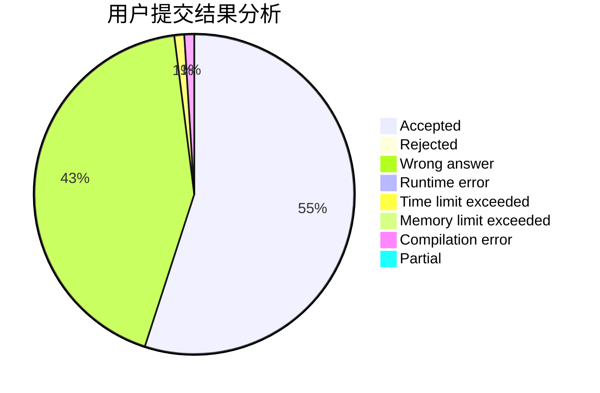
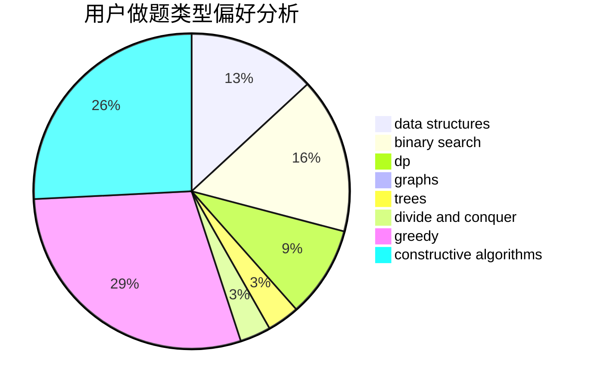
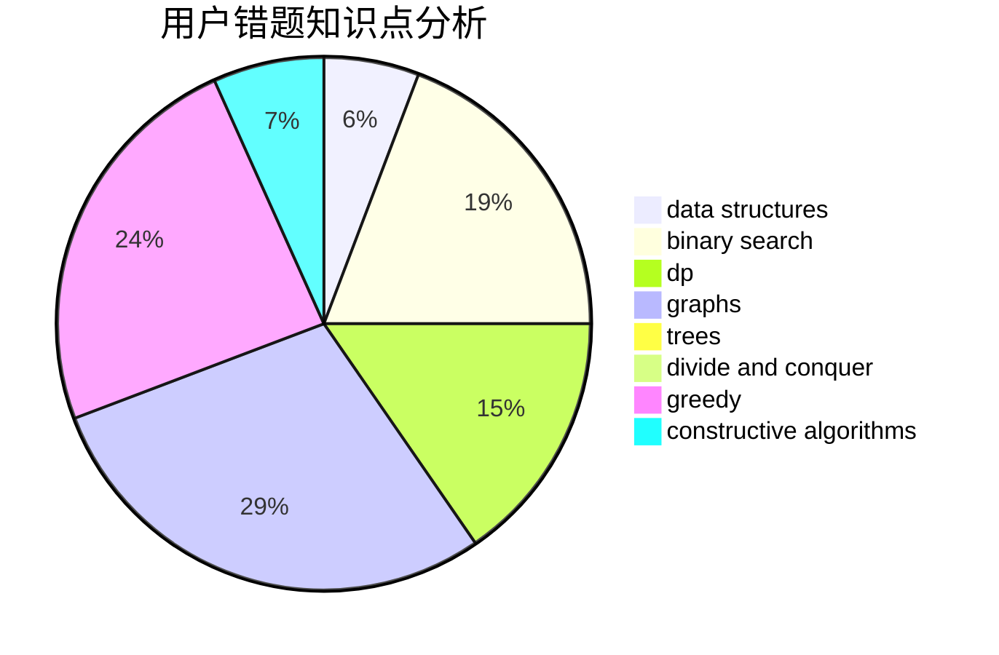

# LKPl

<!-- tabs:start -->

#### **用户提交结果分析**

#### **用户做题类型偏好分析**

#### **用户错题知识点分析**

<!-- tabs:end -->
# 推荐题目
[1292C](https://codeforces.com/contest/1292/problem/C)		combinatorics,
                        dfs and similar,
                        dp,
                        greedy,
                        trees		  
[445A](https://codeforces.com/contest/445/problem/A)		dfs and similar,
                        implementation		  
[160A](https://codeforces.com/contest/160/problem/A)		greedy,
                        sortings		  
[851B](https://codeforces.com/contest/851/problem/B)		geometry,
                        math		  
[321E](https://codeforces.com/contest/321/problem/E)		data structures,
                        divide and conquer,
                        dp		  
[1349D](https://codeforces.com/contest/1349/problem/D)		math,
                        probabilities		  
[1246F](https://codeforces.com/contest/1246/problem/F)		nan		  
[311E](https://codeforces.com/contest/311/problem/E)		flows		  
[1282D](https://codeforces.com/contest/1282/problem/D)		constructive algorithms,
                        interactive,
                        strings		  
[526G](https://codeforces.com/contest/526/problem/G)		greedy,
                        trees		  
