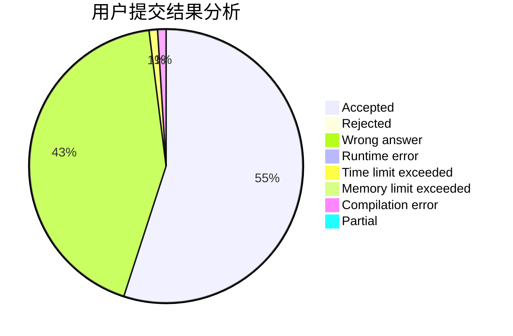
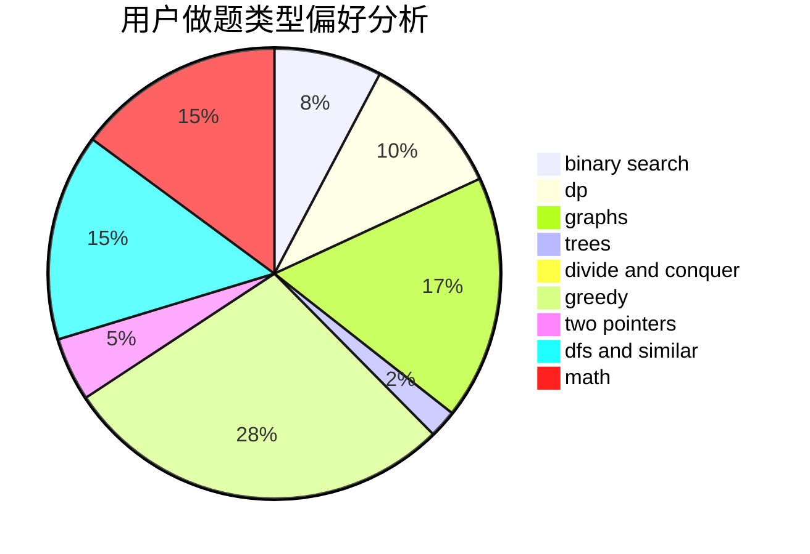

# LKPl

<!-- tabs:start -->

#### **用户提交结果分析**

#### **用户做题类型偏好分析**

<!-- tabs:end -->
# 推荐题目
[1299C](https://codeforces.com/contest/1299/problem/C)
[464E](https://codeforces.com/contest/464/problem/E)
[183D](https://codeforces.com/contest/183/problem/D)
[86C](https://codeforces.com/contest/86/problem/C)
[353D](https://codeforces.com/contest/353/problem/D)
[13562](https://codeforces.com/contest/1356/problem/2)
[1250N](https://codeforces.com/contest/1250/problem/N)
[335D](https://codeforces.com/contest/335/problem/D)
[128B](https://codeforces.com/contest/128/problem/B)
[551A](https://codeforces.com/contest/551/problem/A)
