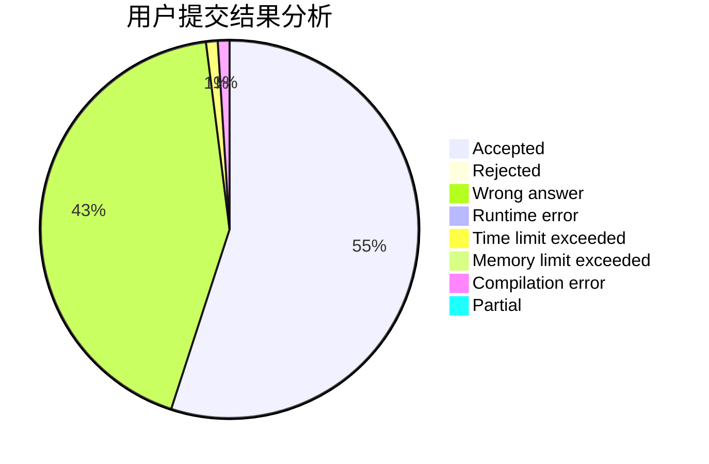
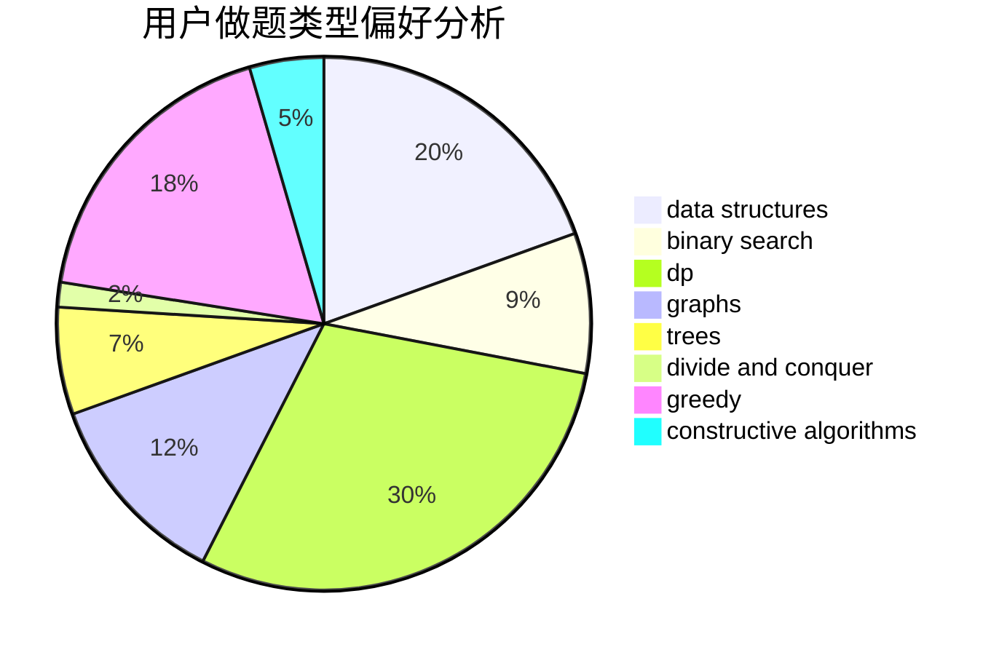
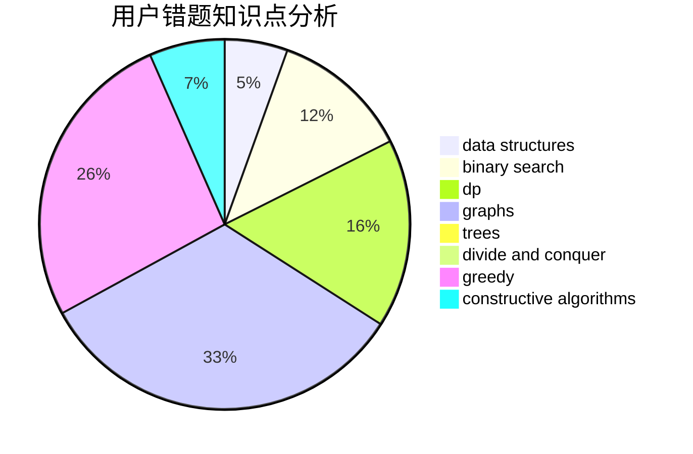

# LKPl

<!-- tabs:start -->

#### **用户提交结果分析**

#### **用户做题类型偏好分析**

#### **用户错题知识点分析**

<!-- tabs:end -->
# 推荐题目
[1299C](https://codeforces.com/contest/1299/problem/C)		data structures,
                        geometry,
                        greedy		  
[464E](https://codeforces.com/contest/464/problem/E)		data structures,
                        graphs,
                        shortest paths		  
[183D](https://codeforces.com/contest/183/problem/D)		dp,
                        greedy,
                        probabilities		  
[86C](https://codeforces.com/contest/86/problem/C)		dp,
                        string suffix structures,
                        trees		  
[353D](https://codeforces.com/contest/353/problem/D)		constructive algorithms,
                        dp		  
[13562](https://codeforces.com/contest/1356/problem/2)		dsu,graphs,sortings,trees		  
[1250N](https://codeforces.com/contest/1250/problem/N)		dfs and similar,
                        graphs,
                        greedy		  
[335D](https://codeforces.com/contest/335/problem/D)		brute force,
                        dp		  
[128B](https://codeforces.com/contest/128/problem/B)		brute force,
                        constructive algorithms,
                        hashing,
                        implementation,
                        string suffix structures,
                        strings		  
[551A](https://codeforces.com/contest/551/problem/A)		brute force,
                        implementation,
                        sortings		  
