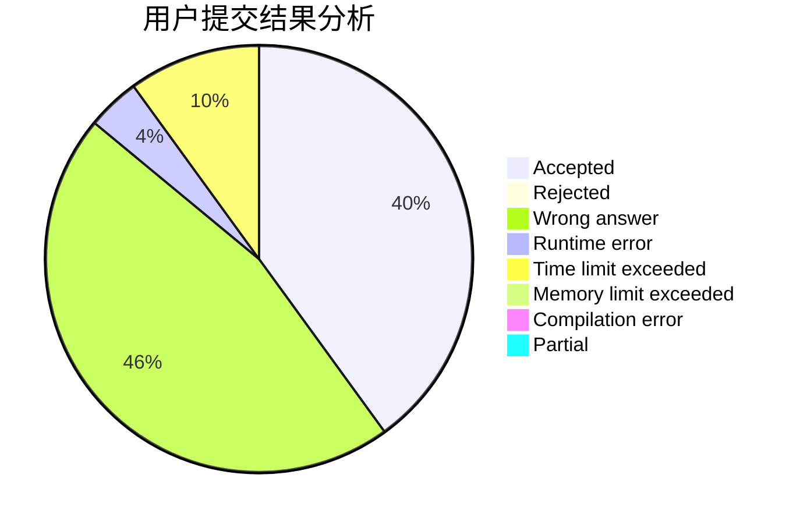
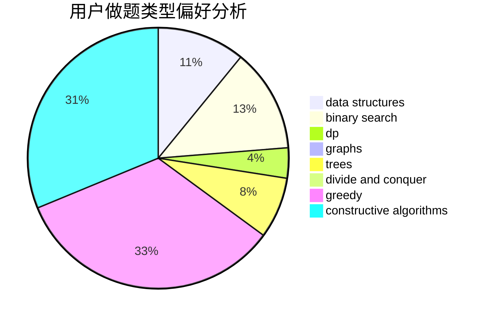
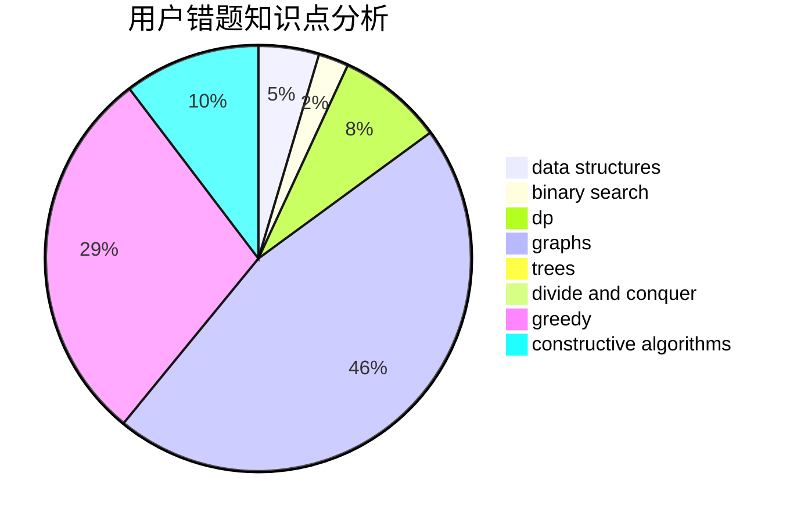

# LLSGYN

<!-- tabs:start -->

#### **用户提交结果分析**

#### **用户做题类型偏好分析**

#### **用户错题知识点分析**

<!-- tabs:end -->
# 推荐题目
[1349E](https://codeforces.com/contest/1349/problem/E)		constructive algorithms,
                        dp,
                        greedy		  
[1399F](https://codeforces.com/contest/1399/problem/F)		data structures,
                        dp,
                        graphs,
                        sortings		  
[515C](https://codeforces.com/contest/515/problem/C)		greedy,
                        math,
                        sortings		  
[1013C](https://codeforces.com/contest/1013/problem/C)		dsu,graphs,sortings,trees		  
[1109B](https://codeforces.com/contest/1109/problem/B)		constructive algorithms,
                        hashing,
                        strings		  
[1148E](https://codeforces.com/contest/1148/problem/E)		constructive algorithms,
                        greedy,
                        math,
                        sortings,
                        two pointers		  
[814D](https://codeforces.com/contest/814/problem/D)		dfs and similar,
                        dp,
                        geometry,
                        greedy,
                        trees		  
[840C](https://codeforces.com/contest/840/problem/C)		combinatorics,
                        dp		  
[574C](https://codeforces.com/contest/574/problem/C)		dsu,graphs,sortings,trees		  
[863E](https://codeforces.com/contest/863/problem/E)		data structures,
                        sortings		  
