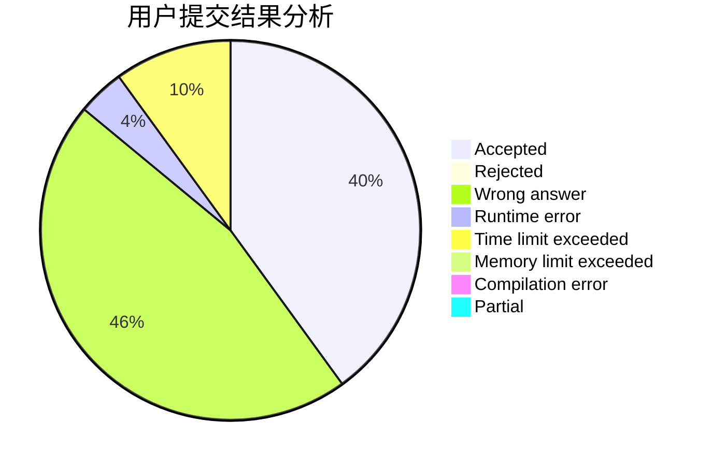
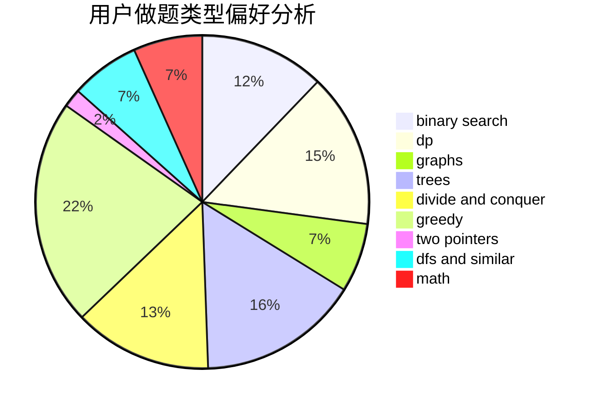

# LLSGYN

<!-- tabs:start -->

#### **用户提交结果分析**

#### **用户做题类型偏好分析**

<!-- tabs:end -->
# 推荐题目
[13563](https://codeforces.com/contest/1356/problem/3)
[1408H](https://codeforces.com/contest/1408/problem/H)
[542D](https://codeforces.com/contest/542/problem/D)
[10151](https://codeforces.com/contest/1015/problem/1)
[1109F](https://codeforces.com/contest/1109/problem/F)
[114E](https://codeforces.com/contest/114/problem/E)
[833B](https://codeforces.com/contest/833/problem/B)
[85A](https://codeforces.com/contest/85/problem/A)
[594D](https://codeforces.com/contest/594/problem/D)
[883G](https://codeforces.com/contest/883/problem/G)
