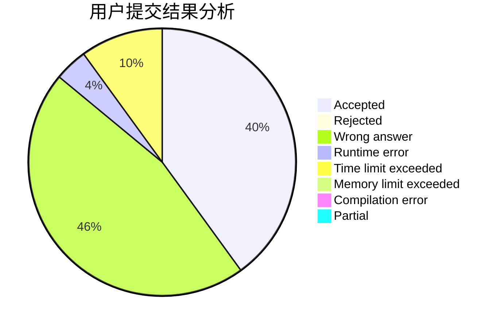
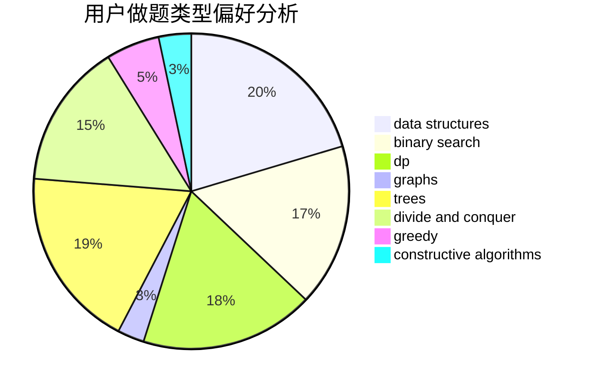
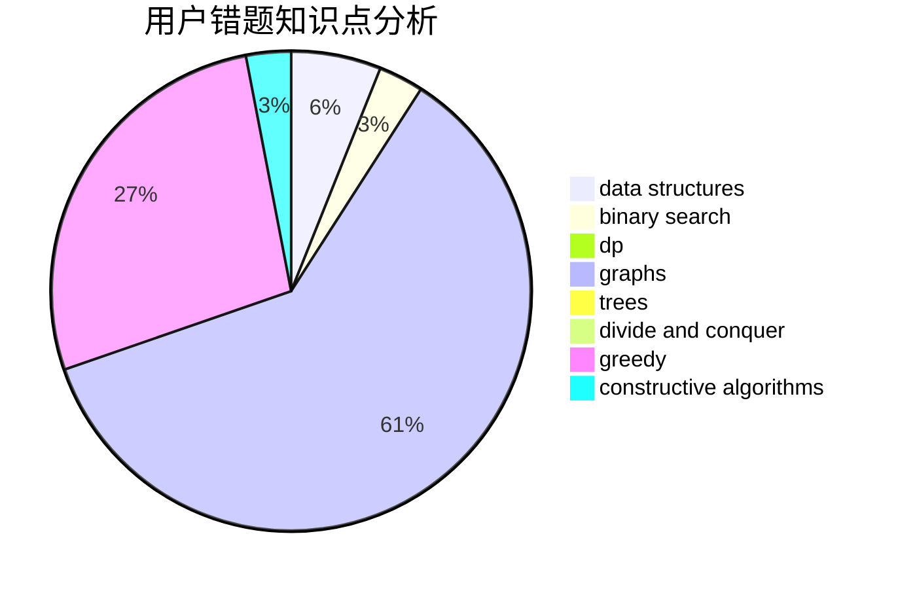

# LLSGYN

<!-- tabs:start -->

#### **用户提交结果分析**

#### **用户做题类型偏好分析**

#### **用户错题知识点分析**

<!-- tabs:end -->
# 推荐题目
[13563](https://codeforces.com/contest/1356/problem/3)		dsu,graphs,sortings,trees		  
[1408H](https://codeforces.com/contest/1408/problem/H)		binary search,
                        data structures,
                        flows,
                        greedy		  
[542D](https://codeforces.com/contest/542/problem/D)		dfs and similar,
                        dp,
                        hashing,
                        math,
                        number theory		  
[10151](https://codeforces.com/contest/1015/problem/1)		dsu,graphs,sortings,trees		  
[1109F](https://codeforces.com/contest/1109/problem/F)		data structures,
                        trees		  
[114E](https://codeforces.com/contest/114/problem/E)		dsu,graphs,sortings,trees		  
[833B](https://codeforces.com/contest/833/problem/B)		binary search,
                        data structures,
                        divide and conquer,
                        dp,
                        two pointers		  
[85A](https://codeforces.com/contest/85/problem/A)		constructive algorithms,
                        implementation		  
[594D](https://codeforces.com/contest/594/problem/D)		data structures,
                        number theory		  
[883G](https://codeforces.com/contest/883/problem/G)		dfs and similar,
                        graphs		  
