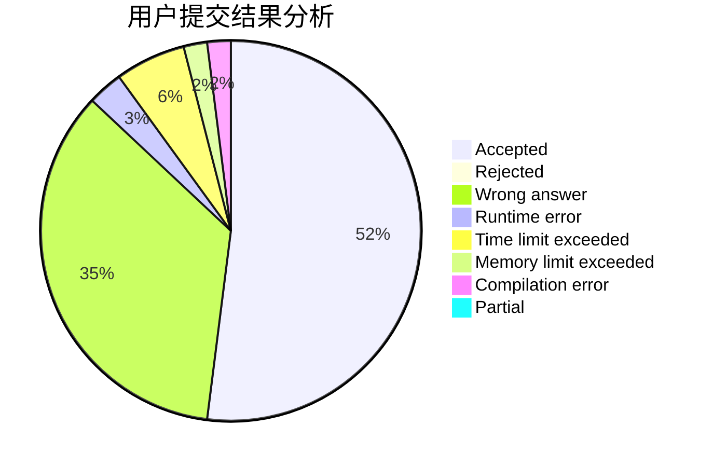
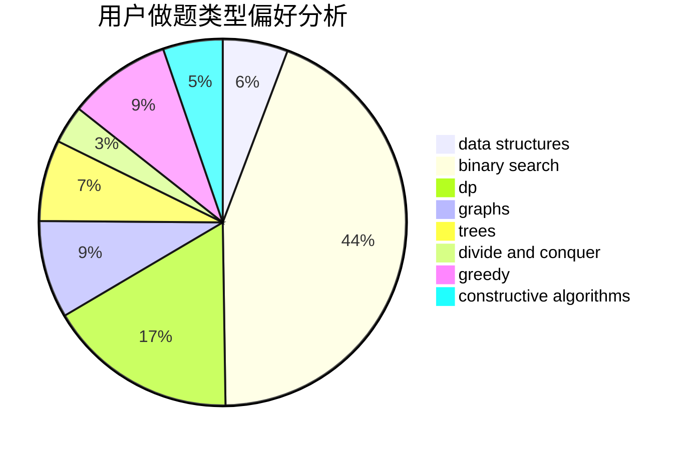
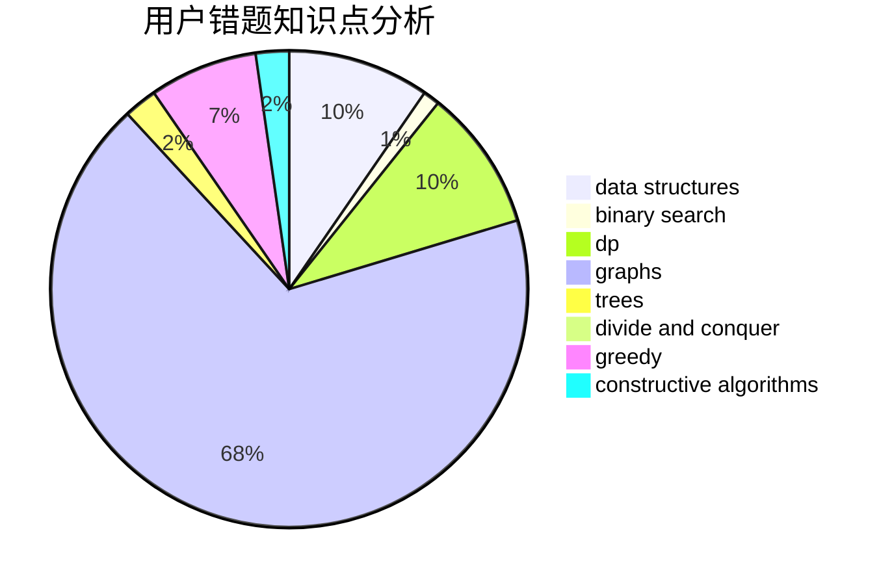

# LMOliver

<!-- tabs:start -->

#### **用户提交结果分析**

#### **用户做题类型偏好分析**

#### **用户错题知识点分析**

<!-- tabs:end -->
# 推荐题目
[949A](https://codeforces.com/contest/949/problem/A)		greedy		  
[195B](https://codeforces.com/contest/195/problem/B)		data structures,
                        implementation,
                        math		  
[816B](https://codeforces.com/contest/816/problem/B)		binary search,
                        data structures,
                        implementation		  
[365A](https://codeforces.com/contest/365/problem/A)		implementation		  
[396C](https://codeforces.com/contest/396/problem/C)		data structures,
                        graphs,
                        trees		  
[388D](https://codeforces.com/contest/388/problem/D)		math		  
[753C](https://codeforces.com/contest/753/problem/C)		brute force,
                        constructive algorithms,
                        interactive		  
[739D](https://codeforces.com/contest/739/problem/D)		graph matchings		  
[1492D](https://codeforces.com/contest/1492/problem/D)		bitmasks,
                        constructive algorithms,
                        greedy,
                        math		  
[526D](https://codeforces.com/contest/526/problem/D)		hashing,
                        string suffix structures,
                        strings		  
