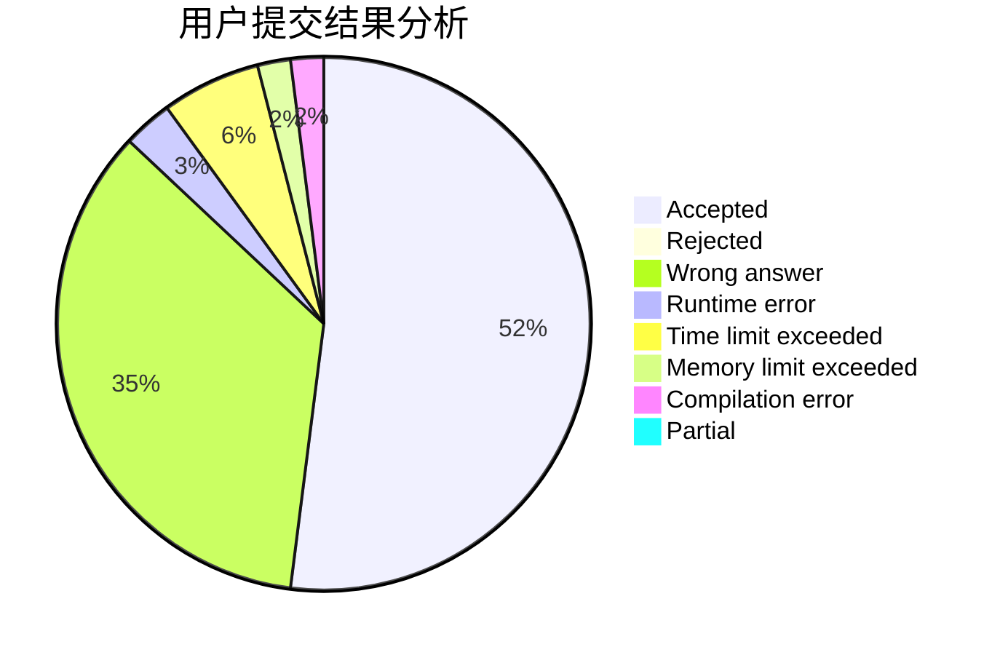
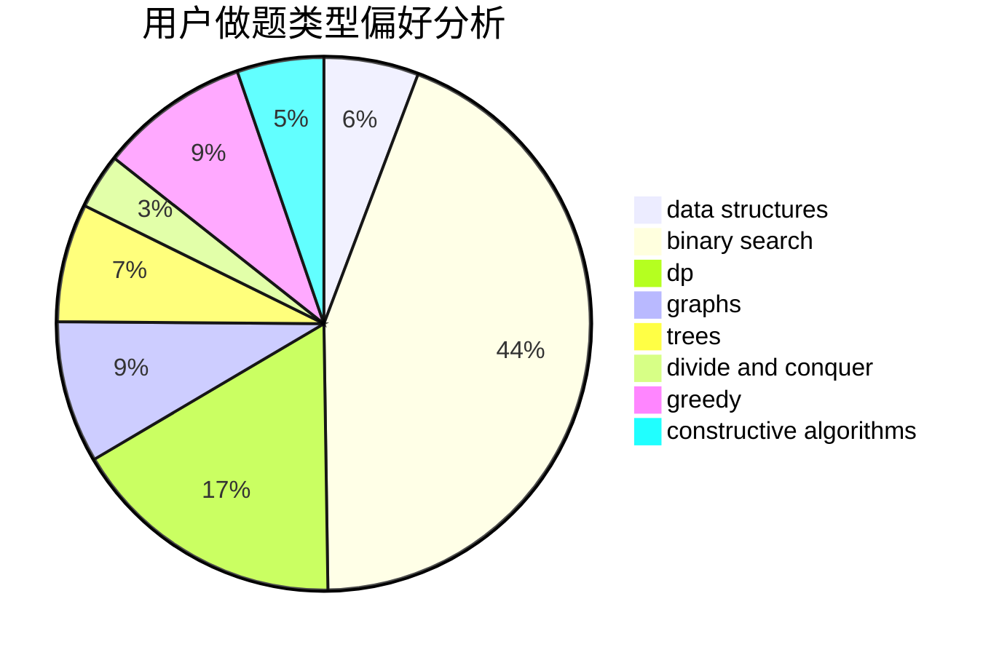
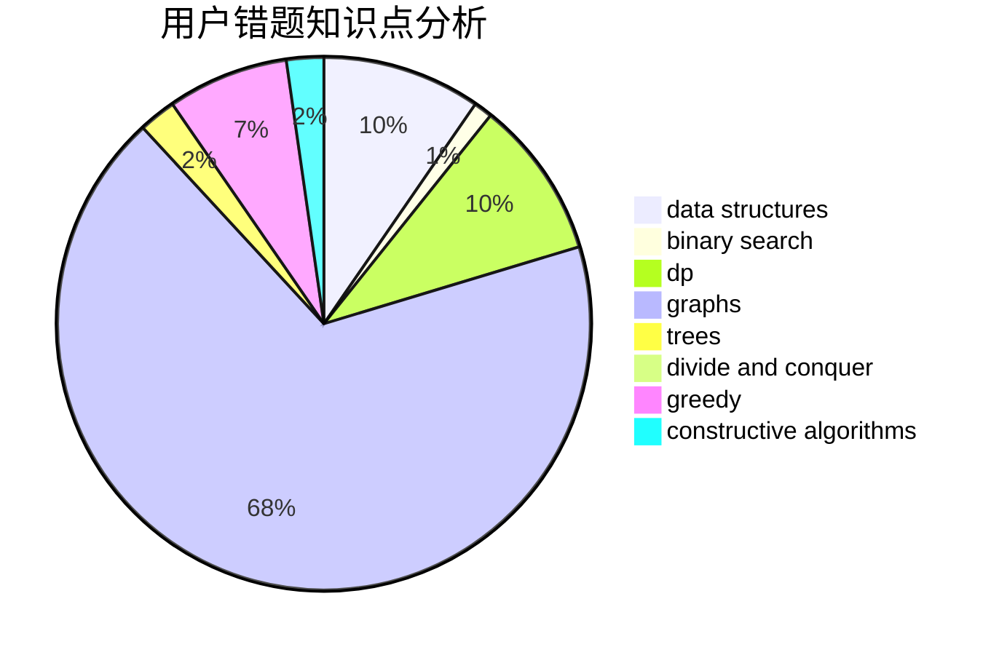

# LMOliver
<!-- tabs:start -->
#### **用户提交结果分析**

#### **用户做题类型偏好分析**

#### **用户错题知识点分析**

<!-- tabs:end -->
# 推荐题目
[Karen and Coffee](http://codeforces.com/problemset/problem/816/B)		binary search,
                        data structures,
                        implementation		  
[Zebras](http://codeforces.com/problemset/problem/949/A)		greedy		  
[After Training](http://codeforces.com/problemset/problem/195/B)		data structures,
                        implementation,
                        math		  
[On Changing Tree](http://codeforces.com/problemset/problem/396/C)		data structures,
                        graphs,
                        trees		  
[Phone Code](http://codeforces.com/problemset/problem/172/A)		*special problem,
                        brute force,
                        implementation		  
[Interactive Bulls and Cows (Hard)](http://codeforces.com/problemset/problem/753/C)		brute force,
                        constructive algorithms,
                        interactive		  
[Stressful Training](http://codeforces.com/problemset/problem/1132/D)		binary search,
                        greedy		  
[Good Number](http://codeforces.com/problemset/problem/365/A)		implementation		  
[Fly](http://codeforces.com/problemset/problem/1010/A)		binary search,
                        math		  
[No Game No Life](http://codeforces.com/problemset/problem/1411/G)		bitmasks,
                        games,
                        math,
                        matrices		  
<!-- tabs:start -->
#### **data structures**
[Karen and Coffee](http://codeforces.com/problemset/problem/816/B)		binary search,
                        data structures,
                        implementation		  
[Zebras](http://codeforces.com/problemset/problem/195/B)		data structures,
                        implementation,
                        math		  
[After Training](http://codeforces.com/problemset/problem/396/C)		data structures,
                        graphs,
                        trees		  
[On Changing Tree](http://codeforces.com/problemset/problem/414/D)		binary search,
                        data structures,
                        greedy,
                        trees,
                        two pointers		  
[Phone Code](https://codeforces.com/contest/948/problem/C)		binary search,
                        data structures		  
[Interactive Bulls and Cows (Hard)](http://codeforces.com/problemset/problem/513/D2)		constructive algorithms,
                        data structures		  
[Stressful Training](http://codeforces.com/problemset/problem/797/F)		data structures,
                        dp,
                        greedy,
                        sortings		  
[Good Number](http://codeforces.com/problemset/problem/1492/C)		binary search,
                        data structures,
                        dp,
                        greedy,
                        two pointers		  
[Fly](http://codeforces.com/problemset/problem/1490/G)		binary search,
                        data structures,
                        math		  
[No Game No Life](http://codeforces.com/problemset/problem/1479/D)		binary search,
                        bitmasks,
                        brute force,
                        data structures,
                        probabilities,
                        trees		  
#### **binary search**
[Karen and Coffee](http://codeforces.com/problemset/problem/816/B)		binary search,
                        data structures,
                        implementation		  
[Zebras](http://codeforces.com/problemset/problem/1132/D)		binary search,
                        greedy		  
[After Training](http://codeforces.com/problemset/problem/1010/A)		binary search,
                        math		  
[On Changing Tree](http://codeforces.com/problemset/problem/414/D)		binary search,
                        data structures,
                        greedy,
                        trees,
                        two pointers		  
[Phone Code](http://codeforces.com/problemset/problem/1237/C2)		binary search,
                        constructive algorithms,
                        divide and conquer,
                        greedy,
                        implementation,
                        sortings		  
[Interactive Bulls and Cows (Hard)](https://codeforces.com/contest/948/problem/C)		binary search,
                        data structures		  
[Stressful Training](http://codeforces.com/problemset/problem/1492/C)		binary search,
                        data structures,
                        dp,
                        greedy,
                        two pointers		  
[Good Number](http://codeforces.com/problemset/problem/1463/D)		binary search,
                        constructive algorithms,
                        greedy,
                        two pointers		  
[Fly](http://codeforces.com/problemset/problem/1490/G)		binary search,
                        data structures,
                        math		  
[No Game No Life](http://codeforces.com/problemset/problem/1479/D)		binary search,
                        bitmasks,
                        brute force,
                        data structures,
                        probabilities,
                        trees		  
#### **dp**
[Karen and Coffee](http://codeforces.com/problemset/problem/1242/C)		bitmasks,
                        dfs and similar,
                        dp,
                        graphs		  
[Zebras](http://codeforces.com/problemset/problem/797/F)		data structures,
                        dp,
                        greedy,
                        sortings		  
[After Training](http://codeforces.com/problemset/problem/708/E)		dp,
                        math		  
[On Changing Tree](http://codeforces.com/problemset/problem/1492/C)		binary search,
                        data structures,
                        dp,
                        greedy,
                        two pointers		  
[Phone Code](https://codeforces.com/contest/1457/problem/C)		brute force,
                        dp,
                        implementation		  
[Interactive Bulls and Cows (Hard)](http://codeforces.com/problemset/problem/1491/C)		brute force,
                        data structures,
                        dp,
                        greedy,
                        implementation		  
[Stressful Training](http://codeforces.com/problemset/problem/1437/C)		dp,
                        flows,
                        graph matchings,
                        greedy,
                        math,
                        sortings		  
[Good Number](http://codeforces.com/problemset/problem/1499/B)		brute force,
                        dp,
                        greedy,
                        implementation		  
[Fly](http://codeforces.com/problemset/problem/1491/D)		bitmasks,
                        constructive algorithms,
                        dp,
                        greedy,
                        math		  
[No Game No Life](http://codeforces.com/problemset/problem/1497/E1)		data structures,
                        dp,
                        greedy,
                        math,
                        number theory,
                        two pointers		  
#### **graph**
[Karen and Coffee](http://codeforces.com/problemset/problem/396/C)		data structures,
                        graphs,
                        trees		  
[Zebras](http://codeforces.com/problemset/problem/739/D)		graph matchings		  
[After Training](http://codeforces.com/problemset/problem/1242/C)		bitmasks,
                        dfs and similar,
                        dp,
                        graphs		  
[On Changing Tree](http://codeforces.com/problemset/problem/1209/D)		dfs and similar,
                        dsu,
                        graphs		  
[Phone Code](http://codeforces.com/problemset/problem/1133/F2)		constructive algorithms,
                        dfs and similar,
                        dsu,
                        graphs,
                        greedy		  
[Interactive Bulls and Cows (Hard)](http://codeforces.com/problemset/problem/1487/C)		brute force,
                        constructive algorithms,
                        dfs and similar,
                        graphs,
                        greedy,
                        implementation,
                        math		  
[Stressful Training](http://codeforces.com/problemset/problem/1437/C)		dp,
                        flows,
                        graph matchings,
                        greedy,
                        math,
                        sortings		  
[Good Number](http://codeforces.com/problemset/problem/1470/D)		constructive algorithms,
                        dfs and similar,
                        graph matchings,
                        graphs,
                        greedy		  
[Fly](http://codeforces.com/problemset/problem/1476/C)		dp,
                        graphs,
                        greedy		  
[No Game No Life](http://codeforces.com/problemset/problem/1304/D)		constructive algorithms,
                        graphs,
                        greedy,
                        two pointers		  
#### **trees**
[Karen and Coffee](http://codeforces.com/problemset/problem/396/C)		data structures,
                        graphs,
                        trees		  
[Zebras](http://codeforces.com/problemset/problem/414/D)		binary search,
                        data structures,
                        greedy,
                        trees,
                        two pointers		  
[After Training](http://codeforces.com/problemset/problem/1479/D)		binary search,
                        bitmasks,
                        brute force,
                        data structures,
                        probabilities,
                        trees		  
[On Changing Tree](http://codeforces.com/problemset/problem/1511/C)		brute force,
                        data structures,
                        implementation,
                        trees		  
[Phone Code](http://codeforces.com/problemset/problem/1499/F)		combinatorics,
                        dfs and similar,
                        dp,
                        trees		  
[Interactive Bulls and Cows (Hard)](http://codeforces.com/problemset/problem/1491/E)		brute force,
                        dfs and similar,
                        divide and conquer,
                        number theory,
                        trees		  
[Stressful Training](http://codeforces.com/problemset/problem/1466/D)		data structures,
                        greedy,
                        sortings,
                        trees		  
[Good Number](http://codeforces.com/problemset/problem/1495/D)		combinatorics,
                        dfs and similar,
                        graphs,
                        math,
                        shortest paths,
                        trees		  
[Fly](http://codeforces.com/problemset/problem/1303/G)		data structures,
                        divide and conquer,
                        geometry,
                        trees		  
[No Game No Life](http://codeforces.com/problemset/problem/1454/E)		combinatorics,
                        dfs and similar,
                        graphs,
                        trees		  
#### **divide and conquer**
[Karen and Coffee](http://codeforces.com/problemset/problem/1237/C2)		binary search,
                        constructive algorithms,
                        divide and conquer,
                        greedy,
                        implementation,
                        sortings		  
[Zebras](http://codeforces.com/problemset/problem/1408/F)		constructive algorithms,
                        divide and conquer		  
[After Training](http://codeforces.com/problemset/problem/1461/D)		binary search,
                        brute force,
                        data structures,
                        divide and conquer,
                        implementation,
                        sortings		  
[On Changing Tree](http://codeforces.com/problemset/problem/1466/G)		combinatorics,
                        divide and conquer,
                        hashing,
                        math,
                        string suffix structures,
                        strings		  
[Phone Code](http://codeforces.com/problemset/problem/1490/D)		dfs and similar,
                        divide and conquer,
                        implementation		  
[Interactive Bulls and Cows (Hard)](https://codeforces.com/contest/1483/problem/C)		data structures,
                        divide and conquer,
                        dp		  
[Stressful Training](http://codeforces.com/problemset/problem/1491/E)		brute force,
                        dfs and similar,
                        divide and conquer,
                        number theory,
                        trees		  
[Good Number](http://codeforces.com/problemset/problem/1303/G)		data structures,
                        divide and conquer,
                        geometry,
                        trees		  
[Fly](http://codeforces.com/problemset/problem/1494/D)		constructive algorithms,
                        data structures,
                        dfs and similar,
                        divide and conquer,
                        dsu,
                        greedy,
                        sortings,
                        trees		  
[No Game No Life](http://codeforces.com/problemset/problem/1482/E)		data structures,
                        divide and conquer,
                        dp		  
#### **greedy**
[Karen and Coffee](http://codeforces.com/problemset/problem/949/A)		greedy		  
[Zebras](http://codeforces.com/problemset/problem/1132/D)		binary search,
                        greedy		  
[After Training](http://codeforces.com/problemset/problem/414/D)		binary search,
                        data structures,
                        greedy,
                        trees,
                        two pointers		  
[On Changing Tree](http://codeforces.com/problemset/problem/1492/D)		bitmasks,
                        constructive algorithms,
                        greedy,
                        math		  
[Phone Code](http://codeforces.com/problemset/problem/508/B)		greedy,
                        math,
                        strings		  
[Interactive Bulls and Cows (Hard)](http://codeforces.com/problemset/problem/1237/C2)		binary search,
                        constructive algorithms,
                        divide and conquer,
                        greedy,
                        implementation,
                        sortings		  
[Stressful Training](https://codeforces.com/contest/1456/problem/C)		constructive algorithms,
                        greedy,
                        math		  
[Good Number](http://codeforces.com/problemset/problem/797/F)		data structures,
                        dp,
                        greedy,
                        sortings		  
[Fly](http://codeforces.com/problemset/problem/1133/F2)		constructive algorithms,
                        dfs and similar,
                        dsu,
                        graphs,
                        greedy		  
[No Game No Life](http://codeforces.com/problemset/problem/1492/C)		binary search,
                        data structures,
                        dp,
                        greedy,
                        two pointers		  
#### **constructive algorithms**
[Karen and Coffee](http://codeforces.com/problemset/problem/753/C)		brute force,
                        constructive algorithms,
                        interactive		  
[Zebras](http://codeforces.com/problemset/problem/1492/D)		bitmasks,
                        constructive algorithms,
                        greedy,
                        math		  
[After Training](http://codeforces.com/problemset/problem/1237/C2)		binary search,
                        constructive algorithms,
                        divide and conquer,
                        greedy,
                        implementation,
                        sortings		  
[On Changing Tree](https://codeforces.com/contest/1456/problem/C)		constructive algorithms,
                        greedy,
                        math		  
[Phone Code](http://codeforces.com/problemset/problem/513/D2)		constructive algorithms,
                        data structures		  
[Interactive Bulls and Cows (Hard)](http://codeforces.com/problemset/problem/1133/F2)		constructive algorithms,
                        dfs and similar,
                        dsu,
                        graphs,
                        greedy		  
[Stressful Training](http://codeforces.com/problemset/problem/1408/F)		constructive algorithms,
                        divide and conquer		  
[Good Number](http://codeforces.com/problemset/problem/1493/A)		constructive algorithms,
                        greedy		  
[Fly](http://codeforces.com/problemset/problem/1463/D)		binary search,
                        constructive algorithms,
                        greedy,
                        two pointers		  
[No Game No Life](https://codeforces.com/contest/1456/problem/B)		bitmasks,
                        brute force,
                        constructive algorithms		  
#### **sortings**
[Karen and Coffee](http://codeforces.com/problemset/problem/1237/C2)		binary search,
                        constructive algorithms,
                        divide and conquer,
                        greedy,
                        implementation,
                        sortings		  
[Zebras](http://codeforces.com/problemset/problem/797/F)		data structures,
                        dp,
                        greedy,
                        sortings		  
[After Training](https://codeforces.com/contest/1496/problem/C)		geometry,
                        greedy,
                        math,
                        sortings		  
[On Changing Tree](http://codeforces.com/problemset/problem/1495/A)		geometry,
                        greedy,
                        math,
                        sortings		  
[Phone Code](http://codeforces.com/problemset/problem/1497/A)		brute force,
                        data structures,
                        greedy,
                        sortings		  
[Interactive Bulls and Cows (Hard)](http://codeforces.com/problemset/problem/1427/A)		math,
                        sortings		  
[Stressful Training](http://codeforces.com/problemset/problem/1461/D)		binary search,
                        brute force,
                        data structures,
                        divide and conquer,
                        implementation,
                        sortings		  
[Good Number](http://codeforces.com/problemset/problem/1437/C)		dp,
                        flows,
                        graph matchings,
                        greedy,
                        math,
                        sortings		  
[Fly](http://codeforces.com/problemset/problem/1473/A)		greedy,
                        implementation,
                        math,
                        sortings		  
[No Game No Life](http://codeforces.com/problemset/problem/1486/B)		binary search,
                        geometry,
                        shortest paths,
                        sortings		  
<!-- tabs:end -->
