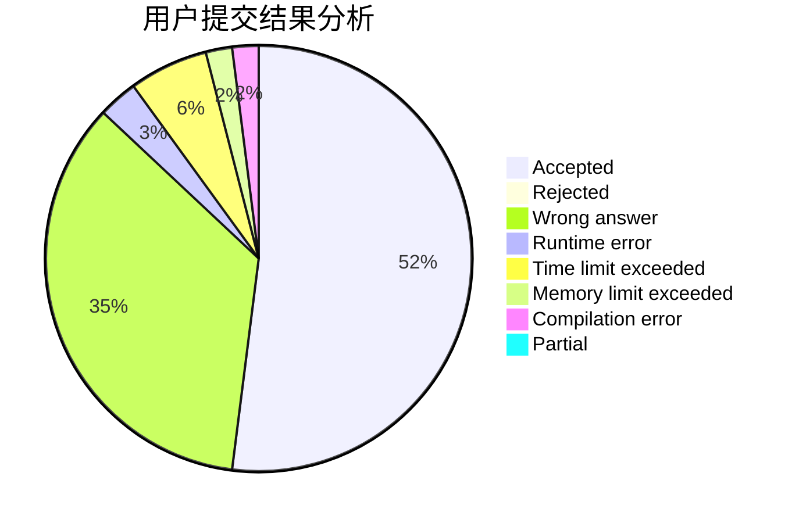
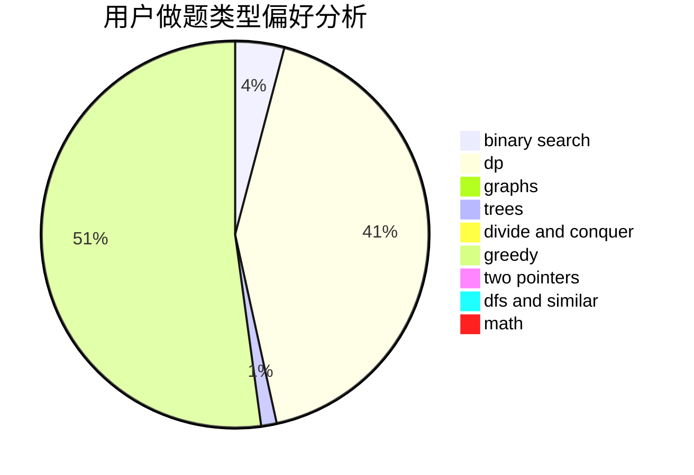

# LMOliver

<!-- tabs:start -->

#### **用户提交结果分析**

#### **用户做题类型偏好分析**

<!-- tabs:end -->
# 推荐题目
[965E](https://codeforces.com/contest/965/problem/E)
[218B](https://codeforces.com/contest/218/problem/B)
[835C](https://codeforces.com/contest/835/problem/C)
[393C](https://codeforces.com/contest/393/problem/C)
[424B](https://codeforces.com/contest/424/problem/B)
[418A](https://codeforces.com/contest/418/problem/A)
[771E](https://codeforces.com/contest/771/problem/E)
[75D](https://codeforces.com/contest/75/problem/D)
[1500E](https://codeforces.com/contest/1500/problem/E)
[550C](https://codeforces.com/contest/550/problem/C)
