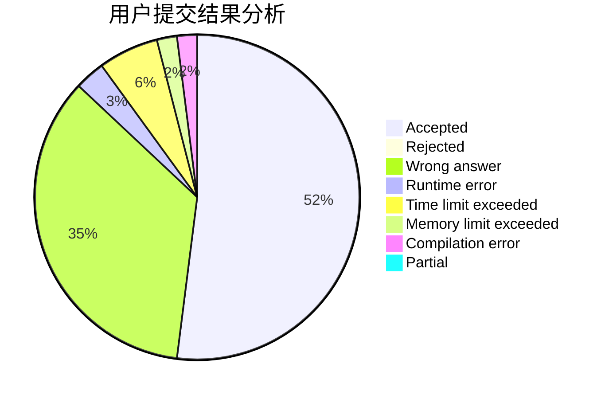
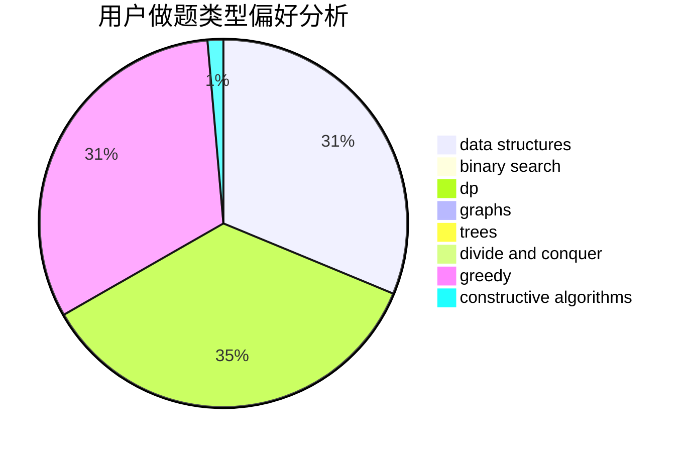
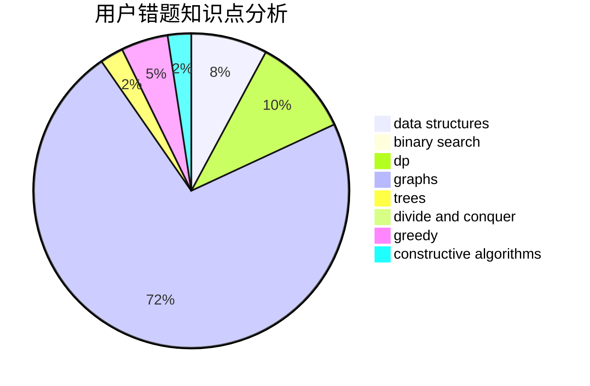

# LMOliver

<!-- tabs:start -->

#### **用户提交结果分析**

#### **用户做题类型偏好分析**

#### **用户错题知识点分析**

<!-- tabs:end -->
# 推荐题目
[965E](https://codeforces.com/contest/965/problem/E)		data structures,
                        dp,
                        greedy,
                        strings,
                        trees		  
[218B](https://codeforces.com/contest/218/problem/B)		implementation		  
[835C](https://codeforces.com/contest/835/problem/C)		dp,
                        implementation		  
[393C](https://codeforces.com/contest/393/problem/C)		dsu,graphs,sortings,trees		  
[424B](https://codeforces.com/contest/424/problem/B)		binary search,
                        greedy,
                        implementation,
                        sortings		  
[418A](https://codeforces.com/contest/418/problem/A)		dsu,graphs,sortings,trees		  
[771E](https://codeforces.com/contest/771/problem/E)		dp,
                        greedy		  
[75D](https://codeforces.com/contest/75/problem/D)		data structures,
                        dp,
                        greedy,
                        implementation,
                        math,
                        trees		  
[1500E](https://codeforces.com/contest/1500/problem/E)		binary search,
                        data structures		  
[550C](https://codeforces.com/contest/550/problem/C)		brute force,
                        dp,
                        math		  
