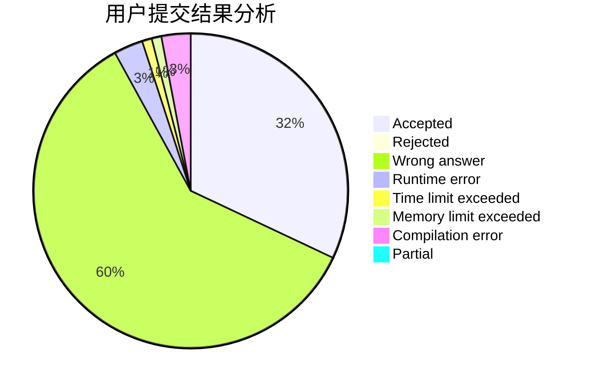
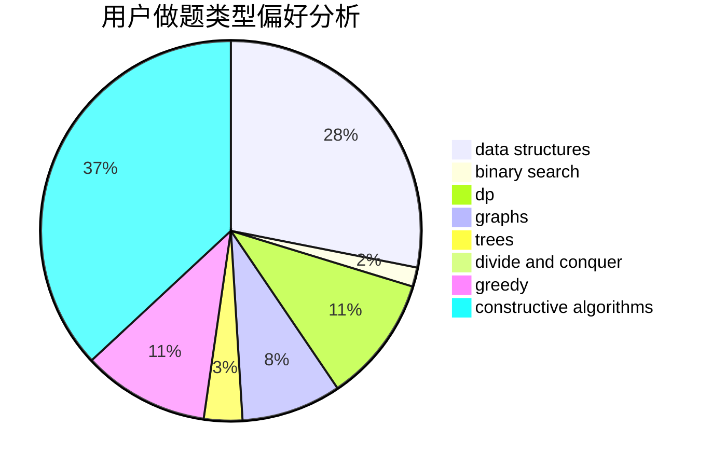
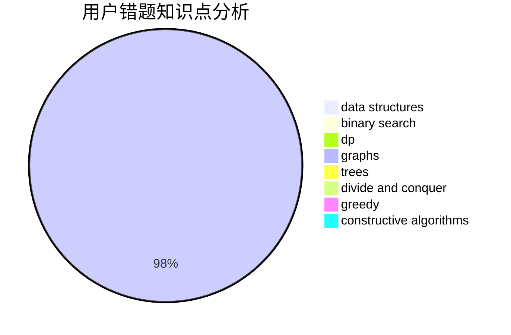

# LMessi

<!-- tabs:start -->

#### **用户提交结果分析**

#### **用户做题类型偏好分析**

#### **用户错题知识点分析**

<!-- tabs:end -->
# 推荐题目
[674F](https://codeforces.com/contest/674/problem/F)		dsu,graphs,sortings,trees		  
[641E](https://codeforces.com/contest/641/problem/E)		data structures		  
[816C](https://codeforces.com/contest/816/problem/C)		dsu,graphs,sortings,trees		  
[484C](https://codeforces.com/contest/484/problem/C)		implementation,
                        math		  
[804D](https://codeforces.com/contest/804/problem/D)		binary search,
                        brute force,
                        dfs and similar,
                        dp,
                        sortings,
                        trees		  
[816D](https://codeforces.com/contest/816/problem/D)		dsu,graphs,sortings,trees		  
[190C](https://codeforces.com/contest/190/problem/C)		dfs and similar		  
[1303D](https://codeforces.com/contest/1303/problem/D)		bitmasks,
                        greedy		  
[301E](https://codeforces.com/contest/301/problem/E)		dp		  
[300D](https://codeforces.com/contest/300/problem/D)		dp,
                        fft		  
