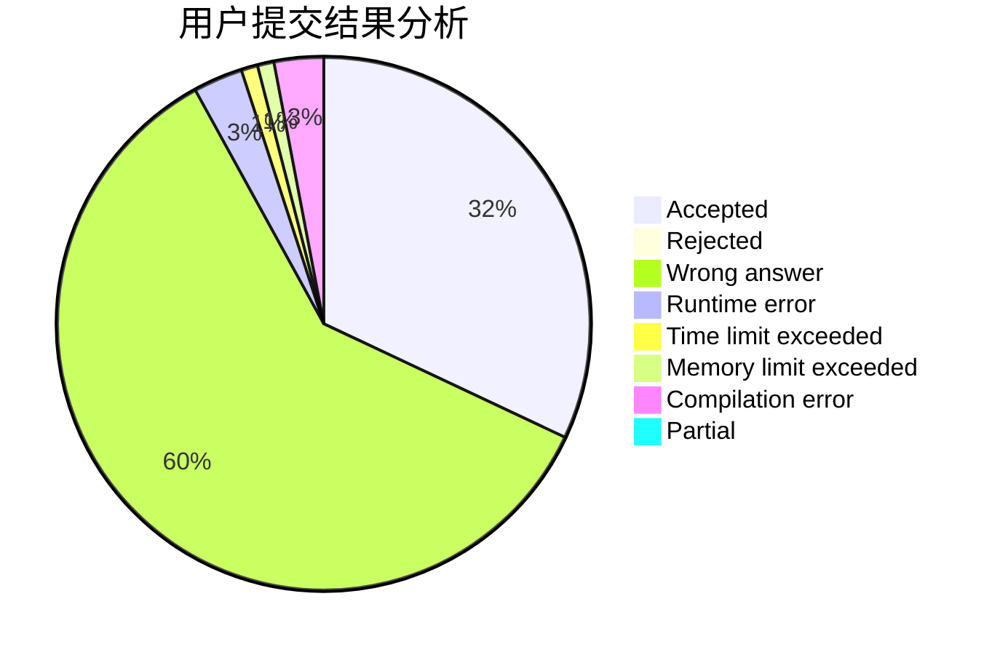
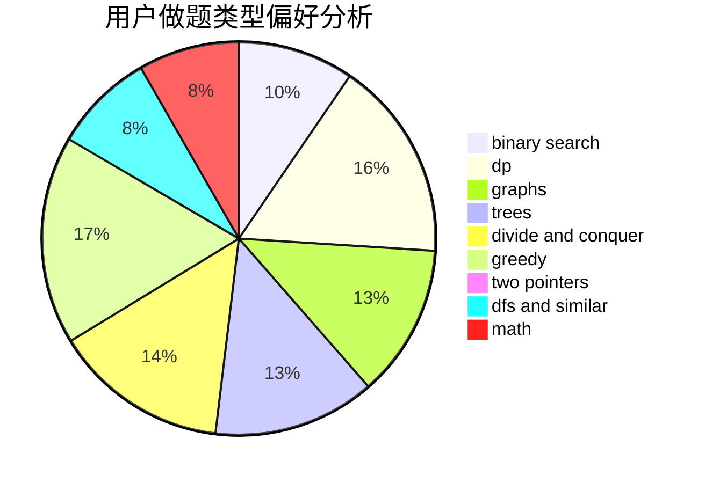

# LMessi

<!-- tabs:start -->

#### **用户提交结果分析**

#### **用户做题类型偏好分析**

<!-- tabs:end -->
# 推荐题目
[699C](https://codeforces.com/contest/699/problem/C)
[6702](https://codeforces.com/contest/670/problem/2)
[835D](https://codeforces.com/contest/835/problem/D)
[505D](https://codeforces.com/contest/505/problem/D)
[820C](https://codeforces.com/contest/820/problem/C)
[835E](https://codeforces.com/contest/835/problem/E)
[215D](https://codeforces.com/contest/215/problem/D)
[1312B](https://codeforces.com/contest/1312/problem/B)
[321A](https://codeforces.com/contest/321/problem/A)
[319B](https://codeforces.com/contest/319/problem/B)
