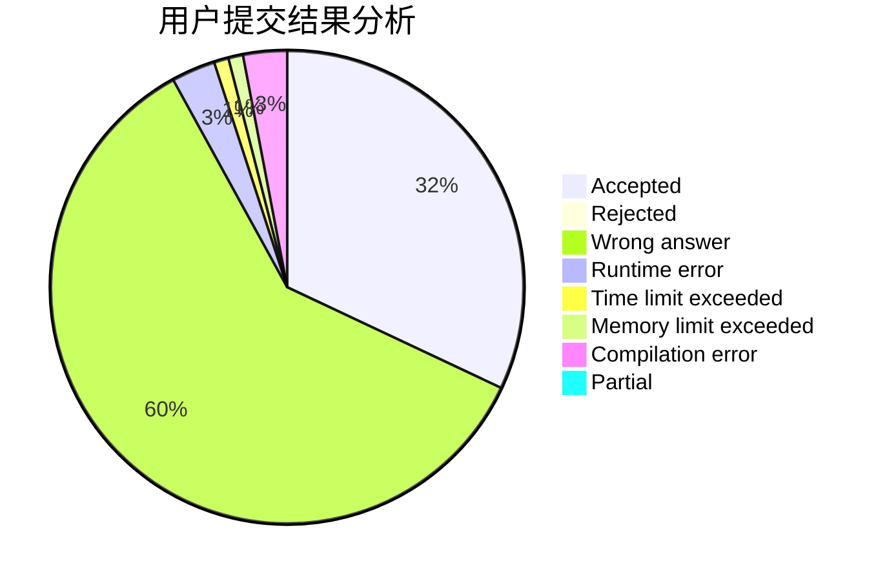
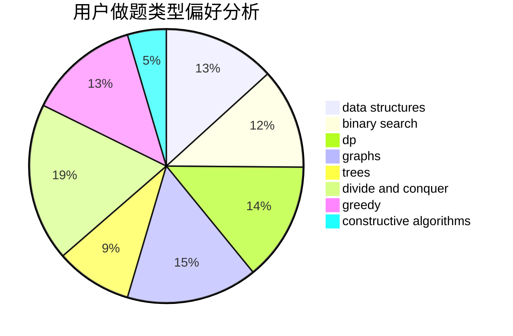

# LMessi

<!-- tabs:start -->

#### **用户提交结果分析**

#### **用户做题类型偏好分析**

#### **用户错题知识点分析**

<!-- tabs:end -->
# 推荐题目
[699C](https://codeforces.com/contest/699/problem/C)		dsu,graphs,sortings,trees		  
[6702](https://codeforces.com/contest/670/problem/2)		dsu,graphs,sortings,trees		  
[835D](https://codeforces.com/contest/835/problem/D)		brute force,
                        dp,
                        hashing,
                        strings		  
[505D](https://codeforces.com/contest/505/problem/D)		dfs and similar		  
[820C](https://codeforces.com/contest/820/problem/C)		dsu,graphs,sortings,trees		  
[835E](https://codeforces.com/contest/835/problem/E)		binary search,
                        constructive algorithms,
                        interactive		  
[215D](https://codeforces.com/contest/215/problem/D)		greedy		  
[1312B](https://codeforces.com/contest/1312/problem/B)		constructive algorithms,
                        sortings		  
[321A](https://codeforces.com/contest/321/problem/A)		binary search,
                        implementation,
                        math		  
[319B](https://codeforces.com/contest/319/problem/B)		data structures,
                        implementation		  
