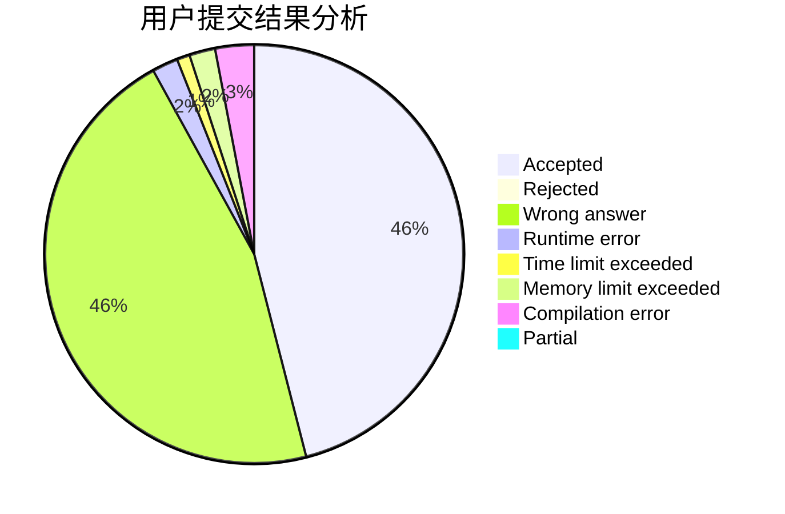
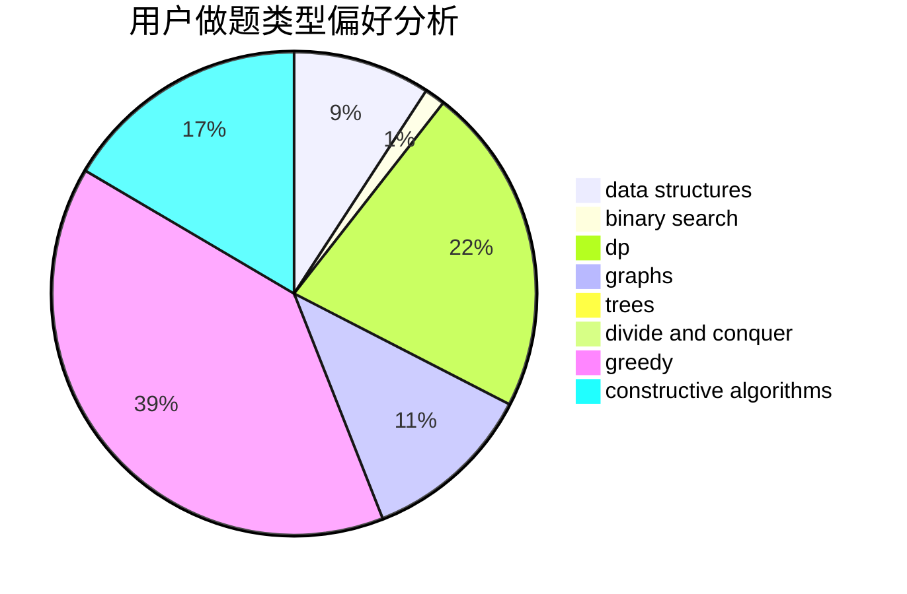
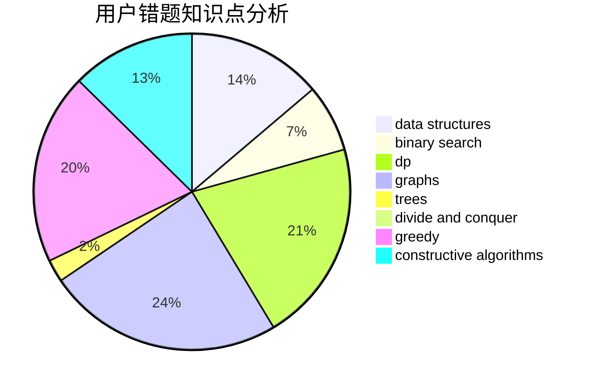

# LOVE_YJZ

<!-- tabs:start -->

#### **用户提交结果分析**

#### **用户做题类型偏好分析**

#### **用户错题知识点分析**

<!-- tabs:end -->
# 推荐题目
[11411](https://codeforces.com/contest/1141/problem/1)		dsu,graphs,sortings,trees		  
[644B](https://codeforces.com/contest/644/problem/B)		*special problem,
                        constructive algorithms,
                        data structures,
                        two pointers		  
[1023C](https://codeforces.com/contest/1023/problem/C)		greedy		  
[554A](https://codeforces.com/contest/554/problem/A)		brute force,
                        math,
                        strings		  
[950A](https://codeforces.com/contest/950/problem/A)		implementation,
                        math		  
[118A](https://codeforces.com/contest/118/problem/A)		implementation,
                        strings		  
[463B](https://codeforces.com/contest/463/problem/B)		brute force,
                        implementation,
                        math		  
[702B](https://codeforces.com/contest/702/problem/B)		brute force,
                        data structures,
                        implementation,
                        math		  
[701E](https://codeforces.com/contest/701/problem/E)		dsu,graphs,sortings,trees		  
[729A](https://codeforces.com/contest/729/problem/A)		implementation,
                        strings		  
