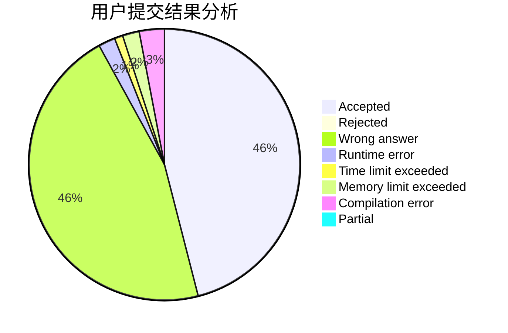
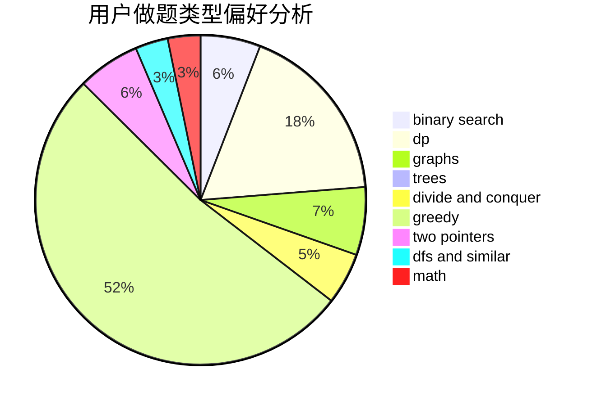

# LOVE_YJZ

<!-- tabs:start -->

#### **用户提交结果分析**

#### **用户做题类型偏好分析**

<!-- tabs:end -->
# 推荐题目
[11411](https://codeforces.com/contest/1141/problem/1)
[644B](https://codeforces.com/contest/644/problem/B)
[1023C](https://codeforces.com/contest/1023/problem/C)
[554A](https://codeforces.com/contest/554/problem/A)
[950A](https://codeforces.com/contest/950/problem/A)
[118A](https://codeforces.com/contest/118/problem/A)
[463B](https://codeforces.com/contest/463/problem/B)
[702B](https://codeforces.com/contest/702/problem/B)
[701E](https://codeforces.com/contest/701/problem/E)
[729A](https://codeforces.com/contest/729/problem/A)
