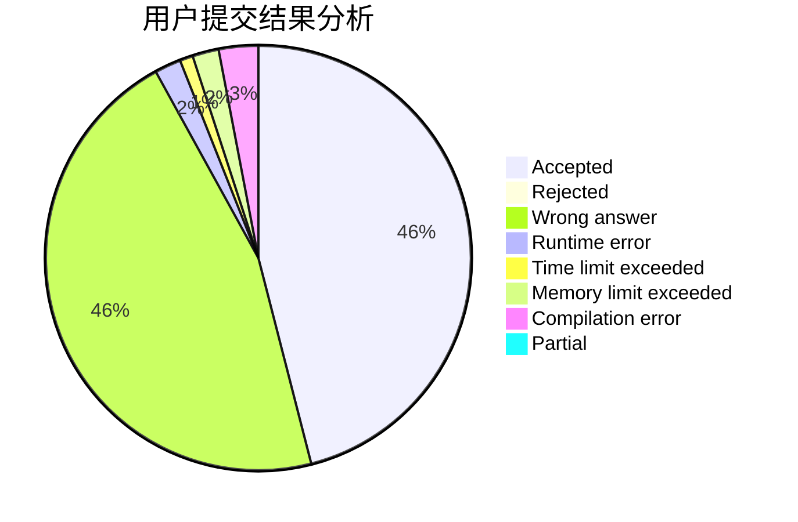
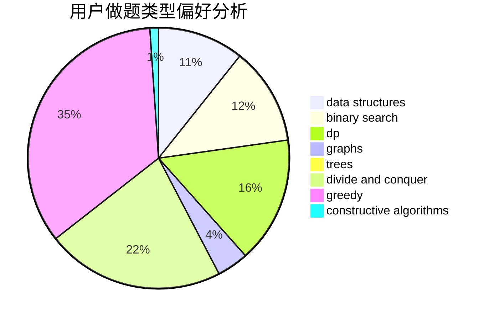
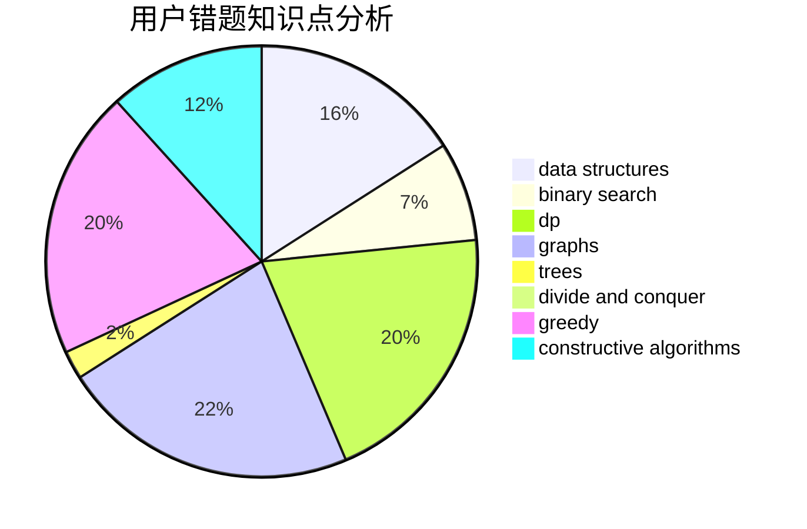

# LOVE_YJZ

<!-- tabs:start -->

#### **用户提交结果分析**

#### **用户做题类型偏好分析**

#### **用户错题知识点分析**

<!-- tabs:end -->
# 推荐题目
[1139D](https://codeforces.com/contest/1139/problem/D)		dp,
                        math,
                        number theory,
                        probabilities		  
[620F](https://codeforces.com/contest/620/problem/F)		data structures,
                        strings,
                        trees		  
[1020E](https://codeforces.com/contest/1020/problem/E)		dsu,graphs,sortings,trees		  
[533B](https://codeforces.com/contest/533/problem/B)		dfs and similar,
                        dp,
                        graphs,
                        strings,
                        trees		  
[930B](https://codeforces.com/contest/930/problem/B)		implementation,
                        probabilities,
                        strings		  
[1185F](https://codeforces.com/contest/1185/problem/F)		bitmasks,
                        brute force		  
[442D](https://codeforces.com/contest/442/problem/D)		data structures,
                        trees		  
[678D](https://codeforces.com/contest/678/problem/D)		math,
                        number theory		  
[678A](https://codeforces.com/contest/678/problem/A)		implementation,
                        math		  
[708E](https://codeforces.com/contest/708/problem/E)		dp,
                        math		  
