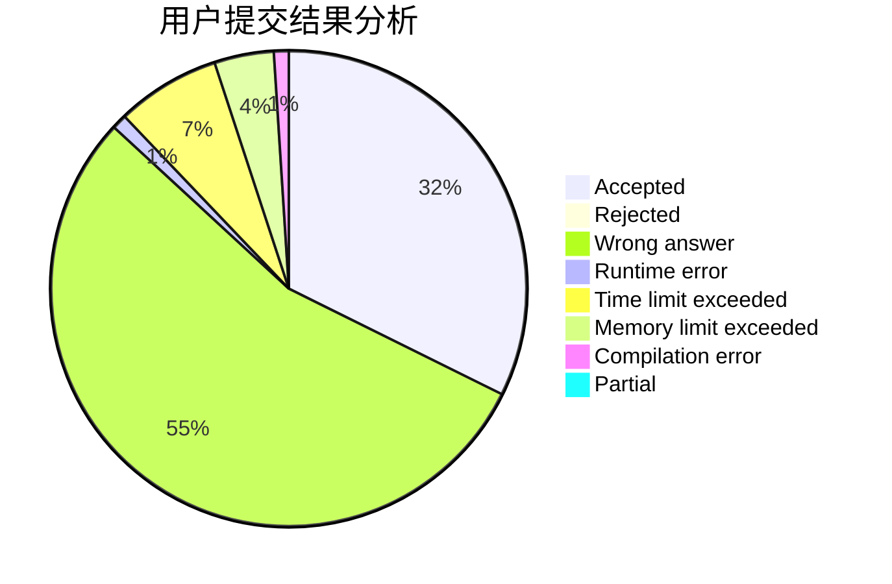
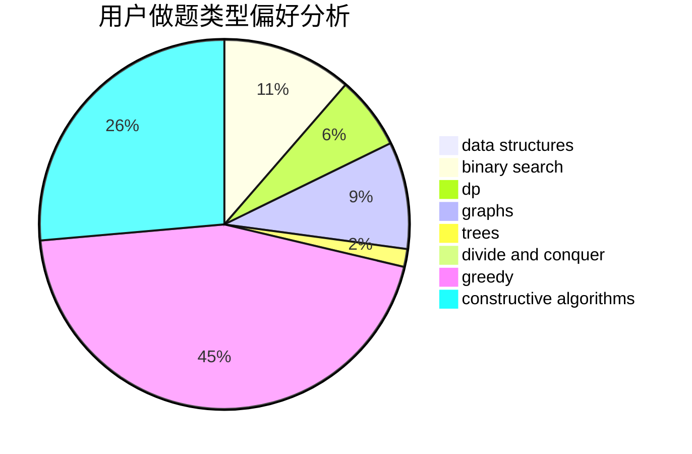
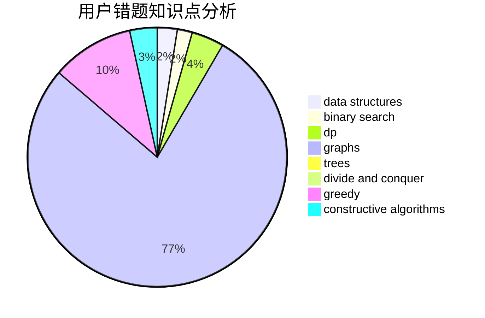

# LQL

<!-- tabs:start -->

#### **用户提交结果分析**

#### **用户做题类型偏好分析**

#### **用户错题知识点分析**

<!-- tabs:end -->
# 推荐题目
[1493B](https://codeforces.com/contest/1493/problem/B)		brute force,
                        implementation		  
[738D](https://codeforces.com/contest/738/problem/D)		dsu,graphs,sortings,trees		  
[1013B](https://codeforces.com/contest/1013/problem/B)		greedy		  
[19E](https://codeforces.com/contest/19/problem/E)		dfs and similar,
                        divide and conquer,
                        dsu		  
[1152E](https://codeforces.com/contest/1152/problem/E)		constructive algorithms,
                        dfs and similar,
                        graphs		  
[1028E](https://codeforces.com/contest/1028/problem/E)		constructive algorithms		  
[1163B2](https://codeforces.com/contest/1163B/problem/2)		data structures,
                        implementation		  
[702B](https://codeforces.com/contest/702/problem/B)		brute force,
                        data structures,
                        implementation,
                        math		  
[621C](https://codeforces.com/contest/621/problem/C)		combinatorics,
                        math,
                        number theory,
                        probabilities		  
[1510K](https://codeforces.com/contest/1510/problem/K)		brute force,
                        graphs,
                        implementation		  
